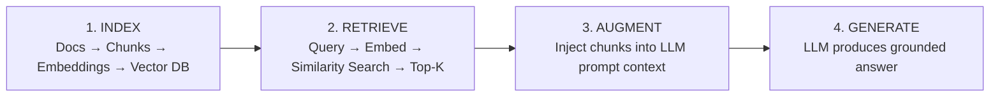
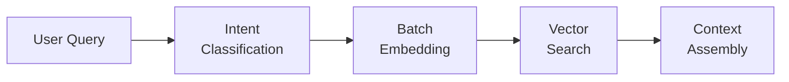

# Jarvis

## RAG-Powered AI Assistant for medavis

**Team Demo & Introduction**

Rong Yin | May 2026

---

## Agenda

| # | Topic | Time |
|---|-------|------|
| 01 | What is Jarvis? | 5 min |
| 02 | RAG 101 for LLM Users | 8 min |
| 03 | Jarvis Architecture | 5 min |
| 04 | **Live Demo: Medavis Features** | 15 min |
| 05 | How Auto-RAG Works | 5 min |
| 06 | **Live Demo: Daily Fetch** | 12 min |
| 07 | Lessons & Takeaways | 5 min |
| 08 | Q & A | 5 min |

---

## What is Jarvis?

- AI-powered assistant built for the **medavis P4M team**
- Runs **100% locally** — Ollama + Qdrant on your machine
- **18,000+** indexed knowledge chunks
- **Auto-RAG**: retrieves context before *every* LLM call
- Integrates with Jira, Confluence, Git, codebase
- Daily briefing pipeline: AI news, world news, audio podcasts
- Learning modes: AI, English, AWS certification

**Tech Stack:**
`Ollama (qwen3.5:4b)` · `MiniLM-L6 (384d)` · `Qdrant` · `Flask/SSE` · `Edge TTS`

---

## RAG 101: The Problem LLMs Have

### LLM Alone ❌

- Knowledge frozen at training cutoff
- No access to your company data
- Hallucinations on domain questions
- Generic answers, not grounded in facts

### LLM + RAG ✅

- Always up-to-date with your knowledge base
- Grounded answers with source citations
- Reduced hallucinations via evidence
- Domain-specific, accurate responses

> **RAG = Retrieval-Augmented Generation**
> *"Don't just think — look it up first, then answer."*

---

## RAG 101: How It Works



**Key insight:** The LLM never answers from memory alone — it always has evidence to reference.

---

## RAG Key Concepts

### Embeddings
Convert text to 384-dim vectors that capture **semantic meaning**.
Similar meaning = close vectors.

### Vector Search
Find the most similar chunks by **cosine similarity**.
Fast even with 18K+ chunks (~35ms).

### Hybrid Search
Combine **vector** (semantic) + **BM25** (keyword) search.
**RRF fusion** for best of both.

### Chunking
Split documents into digestible pieces (200-500 tokens).
Overlap preserves context across boundaries.

---

## Jarvis Architecture Overview

```text
┌────────────────────┐  ┌───────────────────┐  ┌──────────────────┐
│  Web UI (:18889)   │  │ Flask + Blueprints │  │ Agent Loop       │
│  Chat + SSE stream │  │ toolbar_bp         │  │ ReAct pattern    │
│  Image upload      │  │ daily_fetch_bp     │  │ Multi-iteration  │
│  Model selector    │  │ Intent routing     │  │ Tool calls       │
└────────────────────┘  └───────────────────┘  └──────────────────┘

┌────────────────────┐  ┌───────────────────┐  ┌──────────────────┐
│  Auto-RAG Engine   │  │ Tool System       │  │ Infrastructure   │
│  Qdrant vector     │  │ Jira (PowerShell) │  │ Ollama LLM       │
│  BM25 + RRF        │  │ Git commits       │  │ Qdrant (in-mem)  │
│  Entity filters    │  │ Confluence wiki   │  │ MiniLM-L6        │
│  Query rewrite     │  │ Project graph     │  │ Edge TTS, ffmpeg │
└────────────────────┘  └───────────────────┘  └──────────────────┘

┌──────────────────────────────────────────────────────────────────┐
│  Knowledge Sources (18,000+ chunks)                              │
│  AI Briefings · Confluence · Java Codebase · Git · Jira · Docs  │
└──────────────────────────────────────────────────────────────────┘
```

---

<!-- .slide: data-background="#0a0a1a" -->

# 🔴 LIVE DEMO

## Medavis Features

Jira · Confluence · Commit Summary · Codebase · Project Graph

---

## Medavis Features: What We'll Demo

| Feature | Description |
|---------|-------------|
| **Jira Daily Report** | Open tickets, sprint activity, team workload — auto-generated |
| **Confluence Wiki** | Indexed wiki pages, version diffs — searchable in chat |
| **Commit Summary** | Multi-repo git log, author aliases, Bitbucket links |
| **Codebase Indexing** | Java/MD/config indexed, project-scoped search |
| **Project Graph** | pom.xml → dependency graph, "what depends on X?" |

*Switch to browser for live demo →*

---

## Auto-RAG: Under the Hood



**What makes Jarvis different from basic RAG:**

- **Always-on**: RAG runs on every query — no LLM decision needed
- **Hybrid search**: Vector + BM25 keyword with RRF fusion
- **Entity-aware**: Filters by author, wiki type, project
- **Vague query rewrite**: LLM rewrites unclear questions
- **Parallel execution**: RAG + tools run concurrently
- **Project graph expansion**: Follow dependency chains
- **Adaptive prompting**: Compact vs full system prompt
- **Confidence scoring**: Disclaimers on low-confidence answers

---

## Query Pipeline: End-to-End

```text
User Query
    │
    ├─── [Thread 1] Auto-RAG Search
    │       1. Vague query? → LLM rewrite (~0.5s)
    │       2. Batch-encode query + entities (24ms)
    │       3. Qdrant vector search (35ms)
    │       4. BM25 keyword search + RRF fusion
    │       5. Entity/wiki/project filters → top 5
    │
    ├─── [Thread 2] Auto-Tool: commit_summary
    ├─── [Thread 3] Auto-Tool: jira_report
    │
    └─── Assemble Prompt → Ollama Streaming → SSE
                                    │
              Tool calls needed? → execute → loop
```

---

<!-- .slide: data-background="#0a0a1a" -->

# 🔴 LIVE DEMO

## Daily Fetch Pipeline

AI Briefing · News Sources · Audio Generation · Knowledge Search

---

## Daily Fetch: Full Pipeline

| Step | Description |
|------|-------------|
| **1. Fetch Sources** | 16 parallel fetchers scrape AI news |
| **2. Topic Dedup** | LLM-based deduplication of overlapping stories |
| **3. Commit Report** | Multi-repo git log summary |
| **4. Jira Daily** | Open tickets, sprint activity report |
| **5. Wiki Fetch** | Confluence page changes per team member |
| **6. Audio Gen** | Edge TTS: AI news, world news, China news MP3s |

**Output:** Daily briefing PDF + 3 audio podcasts + indexed KB + learning guide

*Switch to browser for live demo →*

---

## Lessons & Takeaways

### ✅ What Worked Well

- **Auto-RAG**: Always retrieve, never rely on LLM memory alone
- **Hybrid search**: Vector + BM25 catches semantic AND keyword
- **Local LLM**: Full privacy, no API costs, works offline
- **Incremental indexing**: Only re-embed changed documents

### ⚠️ Challenges

- Small local LLM (4B params) has quality limits vs GPT-4
- Tool calling reliability depends on model capability
- Embedding model is English-focused; Chinese is secondary
- In-memory Qdrant requires snapshot management

> **Key insight:** RAG is the practical bridge between generic LLMs and your team's specific knowledge. A small model + great retrieval goes a long way. The real engineering is in the retrieval pipeline.

---

<!-- .slide: data-background="#0a0a1a" -->

# Thank You!

## Questions & Discussion

---

Jarvis Agent: `http://localhost:18889`

Search UI: `http://localhost:18888`
