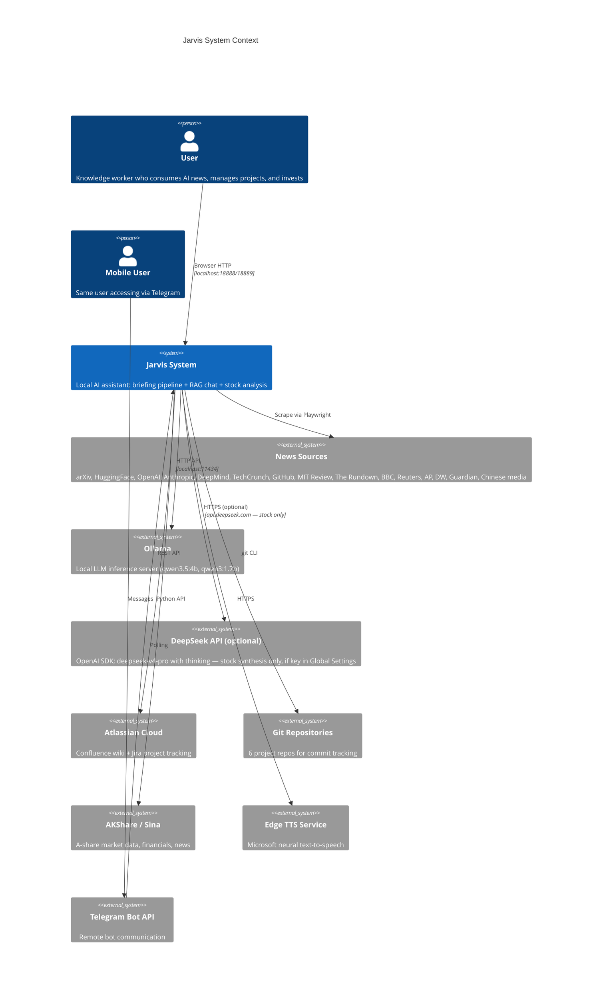
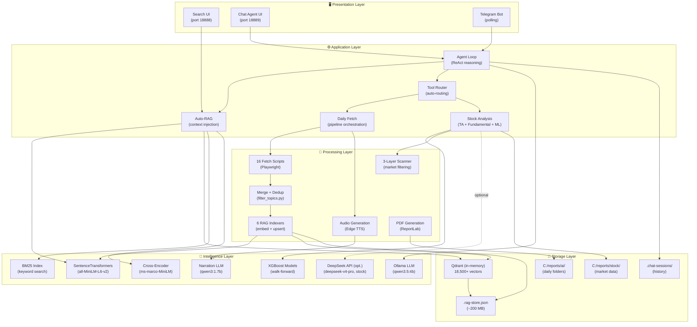
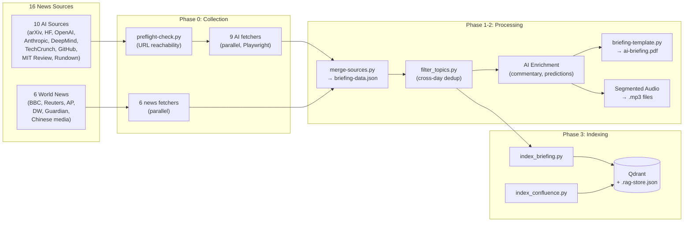
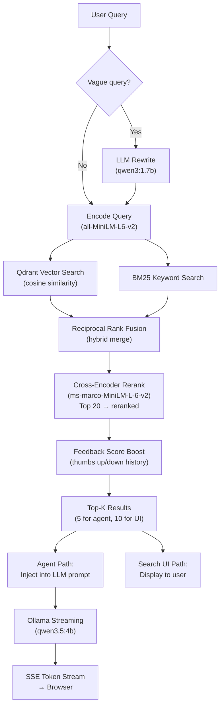
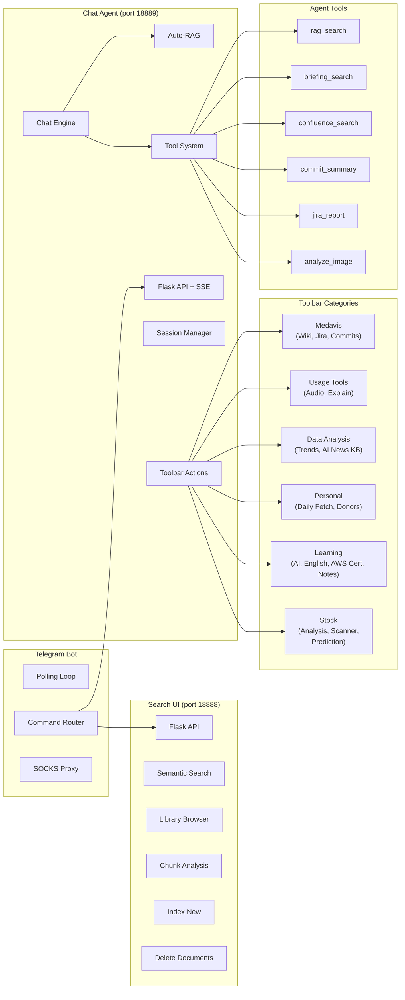
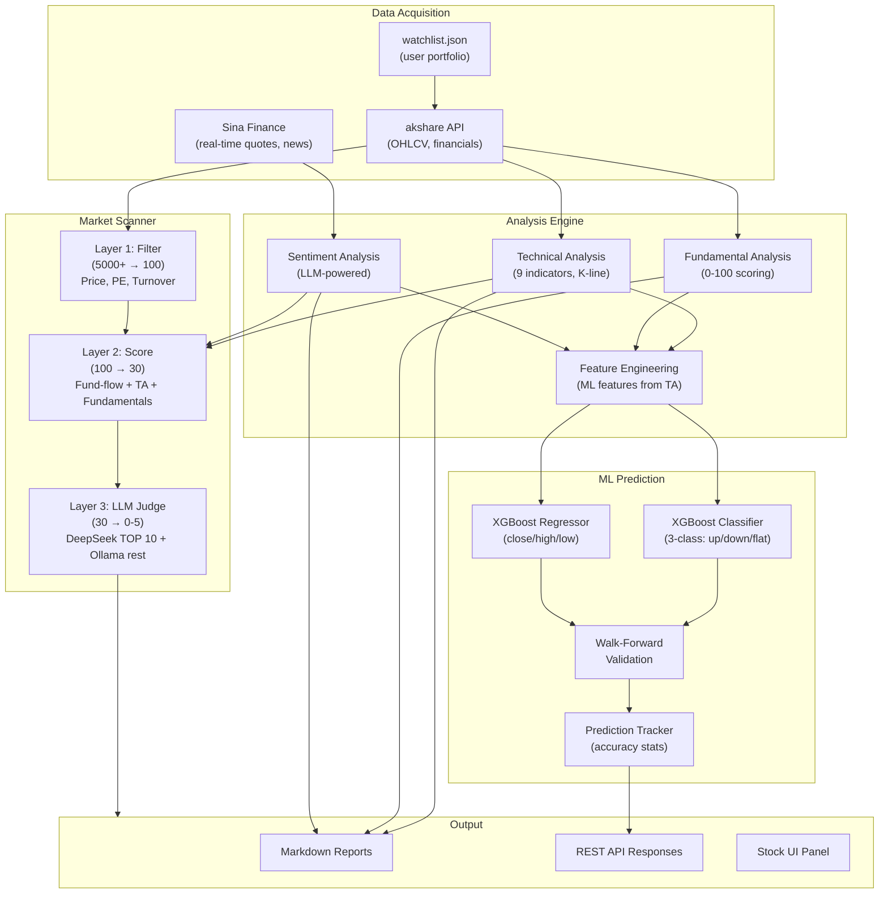
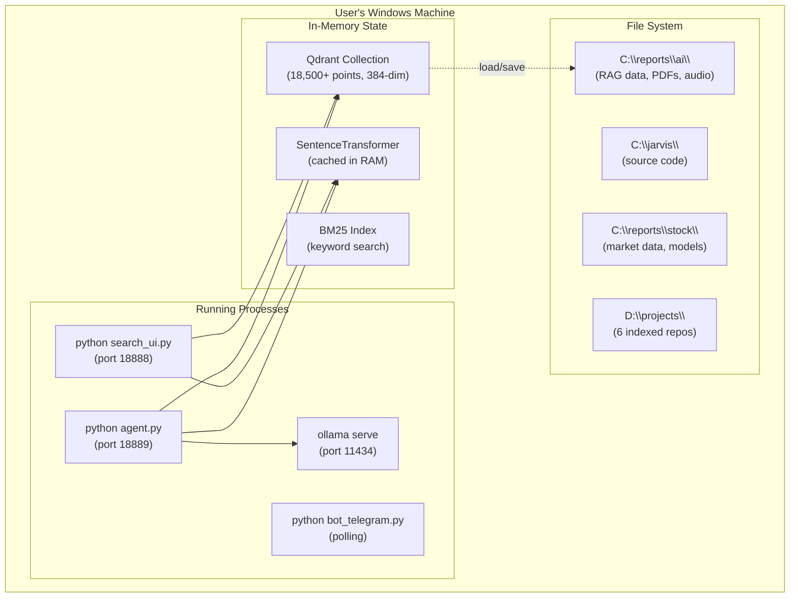
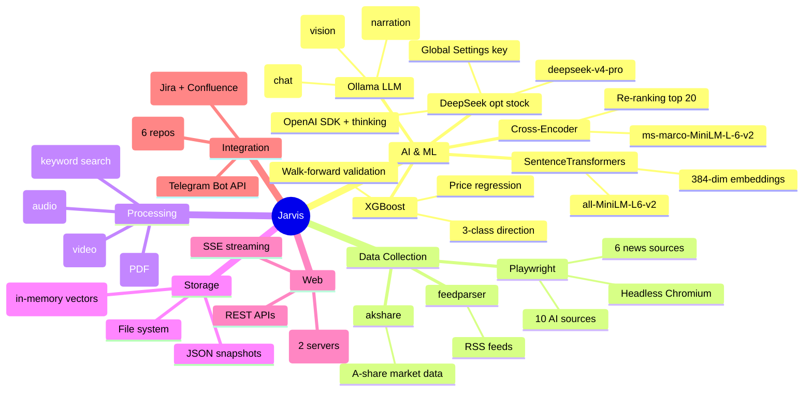
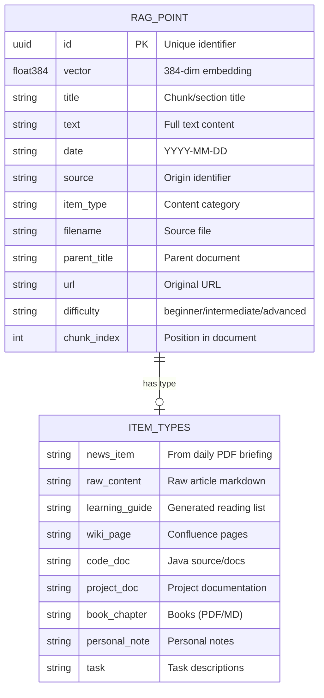
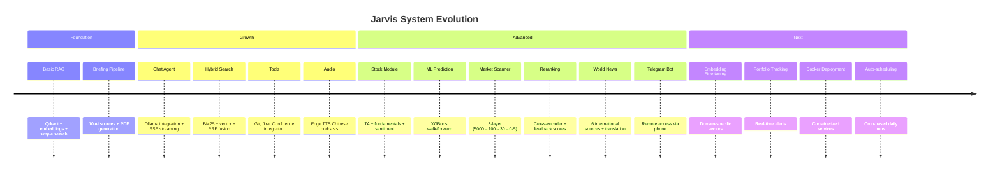

---
tags:
  - architecture
  - design
  - system-overview
category: design
status: current
last-updated: 2026-04-23
---

# Jarvis — System Architecture

> A comprehensive architecture document describing the Jarvis personal AI assistant system: components, data flow, integration points, and deployment topology.

**Last updated:** 2026-04-23

---

## Executive Summary

Jarvis is a **privacy-first** personal AI assistant (RAG, briefing, and most stock **compute** stay local) that combines:

- **Daily intelligence briefing** — automated collection from 16 news sources, PDF/audio generation
- **RAG-powered chat** — AI answers grounded in 18,000+ knowledge chunks
- **Stock market analysis** — ML-powered A-share prediction with XGBoost and LLM reasoning
- **Remote access** — Telegram bot for on-the-go interaction

By default, processing runs on-premise. RAG chat and the daily briefing pipeline stay fully local. For **stock analysis only**, an optional **DeepSeek API (deepseek-v4-pro with thinking) for stock analysis via Global Settings** can perform the final narrative synthesis: technical, fundamental, ML, and fund-flow computation remain local; only that last step may call the cloud if a key is configured.

---

## System Context Diagram

Shows Jarvis in relation to external systems and users.



### ASCII Fallback

```
┌─────────────────────────────────────────────────────────────────────────────────┐
│                              EXTERNAL SYSTEMS                                    │
│                                                                                 │
│  ┌──────────┐ ┌──────────┐ ┌──────────┐ ┌──────────┐ ┌──────────┐ ┌────────┐  │
│  │16 News   │ │ Ollama   │ │ DeepSeek │ │Atlassian │ │ 6 Git    │ │ AKShare  │ │Edge TTS│  │
│  │Sources   │ │ LLM      │ │ (opt.)   │ │Confluence│ │ Repos    │ │ (A-share)│ │        │  │
│  │(web)     │ │ :11434   │ │ API      │ │+ Jira    │ │          │ │ + Sina   │ │        │  │
│  └────┬─────┘ └────┬─────┘ └────┬─────┘ └────┬─────┘ └────┬─────┘ └────┬─────┘ └───┬────┘  │
└───────┼─────────────┼────────────┼────────────┼────────────┼────────────┼───────────┼────────┘
        │ Playwright  │ HTTP API   │ HTTPS*     │ REST API   │ git CLI    │ Python   │ HTTPS
        * DeepSeek: optional stock-only final synthesis
        ▼             ▼            ▼            ▼            ▼            ▼          ▼
┌─────────────────────────────────────────────────────────────────────────────────┐
│                           JARVIS SYSTEM (localhost)                              │
│                                                                                 │
│   ┌───────────────┐  ┌───────────────┐  ┌─────────────┐  ┌──────────────────┐  │
│   │ Briefing      │  │ RAG Search UI │  │ Chat Agent  │  │ Telegram Bot     │  │
│   │ Pipeline      │  │ :18888        │  │ :18889      │  │ (polling)        │  │
│   └───────────────┘  └───────────────┘  └─────────────┘  └──────────────────┘  │
│                                                                                 │
│   ┌───────────────┐  ┌───────────────────────────────────────────────────────┐  │
│   │ Stock Module  │  │ Shared Infrastructure                                 │  │
│   │ (Analysis +   │  │ • Qdrant in-memory (384-dim vectors)                  │  │
│   │  ML + Scanner)│  │ • SentenceTransformers (all-MiniLM-L6-v2)            │  │
│   └───────────────┘  │ • JSON snapshot (.rag-store.json)                     │  │
│                       └───────────────────────────────────────────────────────┘  │
└─────────────────────────────────────────────────────────────────────────────────┘
        ▲                       ▲
        │ Browser :18888/18889  │ Telegram (SOCKS proxy)
        │                       │
   ┌────┴────┐            ┌────┴─────┐
   │  User   │            │  Mobile  │
   │(Browser)│            │  User    │
   └─────────┘            └──────────┘
```

---

## Layered Architecture Diagram

Jarvis is organized into 5 horizontal layers, each with clear responsibilities.



---

## Data Flow Diagram

### Daily Briefing Pipeline



### RAG Query Pipeline



---

## Component Architecture

### Serving Layer Detail



### Stock Module Architecture



---

## Deployment View



### ASCII Deployment View

```
┌──────────────────────────────────────────────────────────────────────────┐
│                    SINGLE WINDOWS MACHINE                                 │
│                                                                          │
│  PROCESSES                                                               │
│  ┌─────────────────┐ ┌─────────────────┐ ┌──────────────┐ ┌──────────┐ │
│  │ search_ui.py    │ │ agent.py        │ │bot_telegram.py│ │ ollama   │ │
│  │ :18888          │ │ :18889          │ │ (polling)    │ │ :11434   │ │
│  │                 │ │                 │ │              │ │          │ │
│  │ • Semantic srch │ │ • AI Chat (SSE) │ │ • /fetch cmd │ │ • qwen   │ │
│  │ • Library view  │ │ • Auto-RAG      │ │ • /search    │ │   3.5:4b │ │
│  │ • Chunk stats   │ │ • Tools         │ │ • /ask       │ │ • qwen   │ │
│  │ • Query rewrite │ │ • Daily Fetch   │ │ • /stock     │ │   3:1.7b │ │
│  │                 │ │ • Stock module  │ │ • Owner-only │ │ • qwen3  │ │
│  │                 │ │ • Audio gen     │ │              │ │   -vl:8b │ │
│  └────────┬────────┘ └────────┬────────┘ └──────┬───────┘ └────┬─────┘ │
│           │                   │                  │              │        │
│           └─────────┬─────────┘                  │              │        │
│                     │                            │              │        │
│  IN-MEMORY          ▼                            │              │        │
│  ┌──────────────────────────────┐                │              │        │
│  │ Qdrant (in-memory)           │                │              │        │
│  │ • Collection: ai_briefings   │◄───────────────┘              │        │
│  │ • 18,500+ points (384-dim)   │                               │        │
│  │ • Cosine similarity          │                               │        │
│  ├──────────────────────────────┤                               │        │
│  │ SentenceTransformer (cached) │                               │        │
│  │ • all-MiniLM-L6-v2           │                               │        │
│  ├──────────────────────────────┤                               │        │
│  │ BM25 Index (keyword search)  │                               │        │
│  └──────────────────────────────┘                               │        │
│                     │                                            │        │
│  FILE SYSTEM        ▼                                            │        │
│  ┌──────────────────────────────────────────────────────────────┐│        │
│  │ C:\reports\ai\                                                ││        │
│  │ ├── .rag-store.json  (~200 MB, vector snapshot)              ││        │
│  │ ├── .chat-sessions/  (persistent chat history)               ││        │
│  │ ├── .rag-feedback.json (user feedback scores)                ││        │
│  │ ├── .ai-news-kb.json (AI news knowledge base)               ││        │
│  │ ├── topic-index.json (cross-day deduplication)               ││        │
│  │ ├── YYYY-MM-DD/      (daily: PDF, MP3, JSON, raw/)          ││        │
│  │ └── knowledge/       (custom: books, notes, tasks)           ││        │
│  ├──────────────────────────────────────────────────────────────┤│        │
│  │ C:\reports\stock\                                             ││        │
│  │ ├── data/{symbol}/   (OHLCV, news, analysis results)        ││        │
│  │ ├── models/{symbol}/ (persisted XGBoost models)              ││        │
│  │ ├── scans/           (daily scanner results)                 ││        │
│  │ └── watchlist.json   (user stock portfolio)                  ││        │
│  ├──────────────────────────────────────────────────────────────┤│        │
│  │ C:\jarvis\           (project source code)                    ││        │
│  │ D:\projects\         (6 indexed Java/infra repos)            ││        │
│  └──────────────────────────────────────────────────────────────┘│        │
└──────────────────────────────────────────────────────────────────────────┘
```

---

## Technology Stack Map



---

## Key Design Decisions

| Decision | Choice | Rationale |
|----------|--------|-----------|
| LLM hosting | Ollama (local); optional **DeepSeek API (deepseek-v4-pro with thinking) for stock analysis via Global Settings** | Default privacy and offline chat; users may opt in to cloud for stock narrative only (not RAG/briefing) |
| Vector DB | Qdrant in-memory + JSON snapshot | Simple deployment (no server), fast queries, portable |
| Embedding model | all-MiniLM-L6-v2 (384-dim) | Small, fast, good quality-to-speed ratio for CPU |
| Web framework | Flask | Lightweight, easy SSE streaming, minimal overhead |
| Web scraping | Playwright | Handles JS-heavy pages, reliable across sources |
| ML model | XGBoost | Fast training, interpretable, works well on tabular data |
| Audio TTS | Edge TTS | Neural quality voices, free, supports Chinese/English |
| Search strategy | Hybrid (vector + BM25 + RRF + reranking) | Best retrieval quality from combining approaches |
| Persistence | File-based JSON | No database server to manage, human-readable |
| Architecture | Monolithic scripts | Simplicity for single-user, single-machine deployment |

---

## Data Model

### RAG Store Schema

Each point in the vector store has this structure:



### Content Sources → Item Types

```
┌─────────────────────────┐     ┌──────────────────────┐     ┌────────────────────┐
│     Content Sources      │     │      Indexers         │     │    Item Types       │
├─────────────────────────┤     ├──────────────────────┤     ├────────────────────┤
│ Daily briefing PDFs      │────→│ index_briefing.py    │────→│ news_item          │
│ Raw article markdown     │────→│                      │────→│ raw_content        │
│ Learning guides          │────→│                      │────→│ learning_guide     │
│ Confluence wiki          │────→│ index_confluence.py  │────→│ wiki_page          │
│ Java source code         │────→│ index_codebase.py    │────→│ code_doc           │
│ Project docs             │────→│                      │────→│ project_doc        │
│ Books (knowledge/)       │────→│ index_custom.py      │────→│ book_chapter       │
│ Notes (knowledge/)       │────→│                      │────→│ personal_note      │
│ Tasks (knowledge/)       │────→│                      │────→│ task               │
└─────────────────────────┘     └──────────────────────┘     └────────────────────┘
```

---

## Network & Port Map

```
localhost
    │
    ├── :11434  ─── Ollama LLM API (always running)
    │
    ├── (outbound) ── api.deepseek.com — optional **DeepSeek API (deepseek-v4-pro with thinking) for stock analysis via Global Settings** (not used by RAG or briefing)
    │
    ├── :18888  ─── Search UI (Flask, no LLM required for search)
    │                 GET  /              → Web interface
    │                 GET  /api/search    → Semantic + hybrid search
    │                 GET  /api/library   → Document browser
    │                 POST /api/delete    → Remove documents
    │
    ├── :18889  ─── Chat Agent (Flask, requires Ollama)
    │                 POST /api/agent     → SSE chat stream
    │                 GET  /api/health    → System status
    │                 *    /api/sessions  → Chat history CRUD
    │                 *    /api/toolbar/* → Tools & pipelines
    │                 *    /api/stock/*   → Stock analysis & scanner
    │
    └── (outbound) ── Telegram Bot (polling, SOCKS proxy optional)
                       Receives: /start, /fetch, /search, /ask, /stock
                       Calls: agent.py + search_ui.py APIs internally
```

---

## Security & Privacy Model

```
┌──────────────────────────────────────────────────────────────┐
│                    TRUST BOUNDARY                              │
│                    (localhost only)                            │
│                                                              │
│  • All servers bind to localhost (127.0.0.1)                 │
│  • No authentication (single-user system)                    │
│  • No data leaves the machine except:                        │
│    ─ Playwright scraping (outbound HTTP to news sites)        │
│    ─ Ollama model pull (one-time download)                    │
│    ─ Edge TTS (text sent for speech synthesis)                │
│    ─ Atlassian API calls (if configured)                     │
│    ─ Telegram Bot API (messages, SOCKS proxy supported)       │
│    ─ AKShare (market data fetch)                              │
│    ─ DeepSeek API (optional; stock final synthesis only, if key set) │
│  • Telegram bot: owner-only access (single user ID check)    │
│  • No credentials stored in code (env vars / config files)   │
└──────────────────────────────────────────────────────────────┘
```

---

## Evolution & Maturity



---

## Cross-Reference

| Area | Detailed Documentation |
|------|----------------------|
| Getting started | [Getting Started](../getting-started.md) |
| Full backend reference | [Backend Overview](../backend-overview.md) |
| Agent internals | [RAG Agent Design](rag-agent-design.md) |
| Stock module | [Stock Implementation](../implementation/stock/README.md) |
| RAG implementation | [RAG Implementation](../implementation/rag/) |
| Pipeline implementation | [Briefing Pipeline](../implementation/briefing-pipeline/) |
| Technology details | [Tech Stack Overview](../implementation/tech-stack-overview.md) |
| Enhancement roadmap | [Jarvis Next](../plans/2026-04-17-jarvis-next.md) |
| Telegram guide | [Telegram Bot Guide](../guides/telegram-bot-guide.md) |
