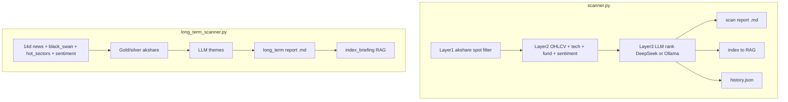

---
tags:
  - implementation
  - data-analysis
  - market-scanner
category: data-analysis
status: current
last-updated: 2026-04-28
---

# Market Scanner

> **Category**: DATA ANALYSIS | **Source**: `scripts/stock/scanner.py`, `scripts/stock/long_term_scanner.py`

## Overview

**Short-term scanner** (`scanner.py`): a three-layer funnel over the A-share universe—realtime filter → batched technical/fundamental/sentiment scoring → LLM “buyability” ranking—with progress files, optional DeepSeek judges, Markdown reports, **Qdrant RAG indexing**, and **history.json** performance tracking. **Long-term scanner** (`long_term_scanner.py`): multi-step thematic workflow (news signals, precious metals, theme LLM, stock mapping, upside assessment, final LLM picks) with Markdown reports and RAG indexing.

## Architecture & Design

### System Context



### Data Flow

**Short-term** (`scanner.py` module docstring, `_layer1_quick_filter`, `_layer2_analyze_batch`, `_layer3_llm_rank`):

1. **Layer 1**: `ak.stock_zh_a_spot_em` (fallback Eastmoney) → exclude ST, extreme limits, low liquidity; score PE/change/turnover; cap `LAYER2_CANDIDATE_CAP` (100); optional hot-sector bonus via `get_hot_stock_set` pattern (imports from `hot_sectors`).
2. **Layer 2**: For each batch: `fetch_daily_ohlcv`, `evaluate_signals`, `fetch_fundamentals` / `score_fundamentals`, light sentiment; compute buyability score vs. `MIN_BUYABILITY_SCORE` (60).
3. **Layer 3**: `_layer3_llm_rank` splits candidates between `_layer3_deepseek_judge` and `_layer3_local_judge` (Ollama); respects `LAYER3_CAP` (30), `TOP_N` (5).
4. **Persistence**: `scan_progress.json`; `_generate_scan_report` → `.md`; `_index_scan_to_rag`; `_save_history_entry` / `update_history_performance`.

**Long-term** (`long_term_scanner.py`):

1. `_collect_signals`: 14-day world + AI news JSON under `JARVIS_REPORTS_ROOT`, `black_swan_detector`, `hot_sectors.fetch_hot_sectors`, `market_sentiment.fetch_all_sentiment`.
2. `_analyze_precious_metals`: Shanghai gold/silver benchmarks, gold/silver ratio signal.
3. LLM steps identify themes, map to tickers, industry-adaptive upside, final ≤`MAX_PICKS` (5).
4. `_save_results`: `_generate_report` → `{date}-report.md`; `_index_report_to_rag` via `index_briefing` helpers.

### Key Design Decisions

- **Buyability over momentum**: Scanner doc states recommendations may be zero if nothing passes cheapness/safety checks.
- **Checkpointing**: `PROGRESS_FILE` / `lt_progress.json` for resume and UI polling (`get_scan_status`, `get_lt_status`).
- **Threading**: `_scan_thread` / `_lt_thread` with `_stop_event` for cooperative cancel.

## Implementation Details

### Core Components

| Symbol | Role |
|--------|------|
| `_layer1_quick_filter` | Universe → ~100 scored candidates. |
| `_layer2_analyze_batch` | Per-stock deep scores; uses `fetch_market_data`, `technical_analysis`, `fundamental_analysis`. |
| `_layer3_llm_rank`, `_layer3_deepseek_judge`, `_layer3_local_judge` | Final ranking. |
| `_generate_scan_report`, `_index_scan_to_rag` | RAG-ready Markdown + Qdrant chunks. |
| `_save_history_entry`, `update_history_performance`, `get_history` | Scan history audit. |
| `_collect_signals`, `_analyze_precious_metals`, theme/pick LLM stages | Long-term pipeline. |
| `_index_report_to_rag` (long-term) | `item_type` e.g. `stock_scan_long`. |

### API Surface

- **Status**: `get_scan_status()`, `get_lt_status()` for progress + `running` flag.
- **Agent**: Stock modules loaded through `agent.py` (`scanner`, `long_term_scanner` in `_STOCK_MODULES`).

### Configuration

- `STOCK_REPORTS_ROOT`, `SCAN_DIR` = `{STOCK_REPORTS_ROOT}/scans`, `LONG_TERM_DIR` = `.../long_term`.
- Constants: `TOP_N=5`, `LAYER2_BATCH=20`, `LAYER2_CANDIDATE_CAP=100`, `LAYER3_CAP=30`, `MIN_BUYABILITY_SCORE=60`, `SIGNAL_WINDOW_DAYS=14`, `MAX_PICKS=5`.
- `_use_deepseek` module flag toggles DeepSeek path in layer 3 (set by runner).

### Error Handling & Edge Cases

- Layer 1 returns `[], 0` if both akshare and fallback fail (`scanner.py` 132–134).
- Layer 3 falls back to local judge when DeepSeek errors (`_layer3_deepseek_judge` pattern around 504–507).
- Long-term signal files missing: debug logs, partial signal set (`_collect_signals`).

## Code Walkthrough

- **Layer 1 mask** (illustrative)

```138:146:scripts/stock/scanner.py
    mask = (
        df["名称"].apply(lambda x: "ST" not in str(x))
        & df["涨跌幅"].between(-7, 8)
        & (df["换手率"] >= 0.5)
        & (df["成交额"] >= 30_000_000)
        & (df["市盈率-动态"] > 0)
        & (df["市盈率-动态"] < 80)
        & (df["涨跌幅"] < 9.5)
    )
```

- **Progress + layer transition** (short scan): `scanner.py` sets progress `status` to `layer3` and calls `_layer3_llm_rank` (see ~1348–1353).

- **Long-term signal collection**

```97:116:scripts/stock/long_term_scanner.py
def _collect_signals() -> dict:
    """Collect all signal sources from the past 14 days."""
    log.info("Step 1: 收集近 %d 天信号...", SIGNAL_WINDOW_DAYS)
    signals = {
        "world_news": [],
        "ai_tech_news": [],
        "black_swan": None,
        "hot_sectors": [],
        "market_sentiment": None,
        "collection_window": f"{SIGNAL_WINDOW_DAYS} days",
    }

    today = datetime.now()
    for i in range(SIGNAL_WINDOW_DAYS):
        date = today - timedelta(days=i)
        date_str = date.strftime("%Y-%m-%d")

        wn_path = os.path.join(
            _REPORTS_AI_ROOT, date_str, "world-news", "world-news-data.json"
        )
```

- **RAG index hook (long-term)**

```1097:1108:scripts/stock/long_term_scanner.py
def _index_report_to_rag(report_path: str, date_str: str, item_type: str, title: str):
    """Index the Markdown report into RAG store for search/retrieval."""
    ...
        from index_briefing import _get_model, _get_client, _save_snapshot, _chunk_text, COLLECTION
```

## Improvement Ideas

### Short-term

- Configurable scan templates (YAML) for Layer 1 thresholds without code edits.

### Medium-term

- Sector-specific Layer 1 priors; alert webhooks when `TOP_N` changes materially vs. prior run.

### Long-term

- Benchmark Layer 3 decisions against realized forward returns in `history.json`; A/B local vs. DeepSeek judges.

## References

- `scripts/stock/scanner.py`, `scripts/stock/long_term_scanner.py`
- `scripts/stock/hot_sectors.py`, `scripts/stock/black_swan_detector.py`, `scripts/stock/market_sentiment.py`
- `scripts/stock/fetch_market_data.py`, `scripts/rag/agent.py` (stock integration)
