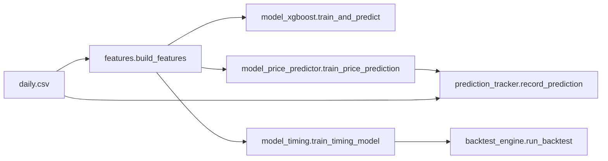

---
tags:
  - implementation
  - data-analysis
  - stock-prediction
category: data-analysis
status: current
last-updated: 2026-04-28
---

# Stock Prediction Engine

> **Category**: DATA ANALYSIS | **Source**: `scripts/stock/model_xgboost.py`, `scripts/stock/model_price_predictor.py`, `scripts/stock/model_timing.py`, `scripts/stock/backtest_engine.py`, `scripts/stock/features.py`, `scripts/stock/prediction_tracker.py`

## Overview

The stock prediction stack turns per-symbol OHLCV and derived features into three complementary ML outputs: a **walk-forward XGBoost direction classifier** (5-day up/flat/down), **three XGBoost regressors** for next-day close/high/low with A-share limit clamping, and **dual timing classifiers** (buy opportunity vs. drawdown risk). A **backtest engine** simulates timing-driven trades under T+1 and limit rules, while **prediction_tracker** logs regression outputs and backfills realized prices for accuracy stats.

## Architecture & Design

### System Context

Upstream: `technical_analysis.load_ohlcv` / `compute_indicators` and `features.build_features` feed matrices. Downstream: JSON artifacts under `STOCK_DATA_DIR` / `STOCK_MODELS_DIR` (from `scripts/stock/config.py`: `STOCK_REPORTS_ROOT`, default `C:/reports/stock`), consumed by UI, reports, and `llm_reasoning`.



### Data Flow

1. **Features**: `build_features(symbol)` loads CSV, computes indicators, adds return/momentum/volatility/China-specific columns, and sets `target` / `target_ret` for classification (`features.py` `build_features`, `_add_target`).
2. **Direction**: `train_and_predict` walks forward: train window (up to 500 rows), test blocks of 5, median-impute per fold from train only; final model retrains on the latest window; predicts latest row probabilities (`model_xgboost.py` `train_and_predict`, `_impute_fold`).
3. **Prices**: `_build_price_features` merges OHLCV, adds `price_seq_*` and optional `sent_*` from cached sentiment on the **last row only**; targets are next-day % vs. today’s close; three regressors; outputs clamped by board limit (`model_price_predictor.py`).
4. **Timing**: `_build_timing_targets` labels buy (3-day high vs. T+1 open ≥3%) and exit (5-day max drawdown ≥5%); separate `XGBClassifier` models with `scale_pos_weight` (`model_timing.py`).
5. **Tracking**: After price training, callers can `record_prediction`; `backfill_actuals` maps `prediction_date` to the next bar from `load_ohlcv` (`prediction_tracker.py`).

### Key Design Decisions

- **Anti-leakage**: Fold-wise median imputation; fundamentals and some sentiment only on the latest row (`features._add_fundamental_features`, `model_price_predictor._add_sentiment_features`).
- **Walk-forward**: Repeated out-of-sample slices instead of a single random split; aggregates `overall_accuracy` across rounds (`model_xgboost.py` lines 131–188).
- **Class imbalance**: Inverse-frequency `sample_weight` for direction; `scale_pos_weight` for timing (`model_xgboost.py` 160–163, `model_timing.py` 161–163).

## Implementation Details

### Core Components

| Module | Role |
|--------|------|
| `features.build_features` / `get_feature_names` | Feature matrix + auto column selection (`_get_feature_columns`). |
| `model_xgboost.train_and_predict` | `XGBClassifier` multi:softprob, saves `prediction.json`, `model.json`, `features.json`, mirrors to `xgb_prediction.json`. |
| `model_price_predictor.train_price_prediction` | Three `XGBRegressor`s; `_compute_confidence` from MAE / direction accuracy; `price_prediction.json`. |
| `model_timing.train_timing_model` / `predict_timing` | Buy/exit models under `{STOCK_MODELS_DIR}/{symbol}/timing/`. |
| `backtest_engine.run_backtest` | Strategies `timing` or `simple_ma`; `_simulate` with T+1, limits, slippage, commissions. |
| `prediction_tracker` | `predictions_log.json`; `get_accuracy_stats`, `get_aggregate_stats`, `_calc_model_health`. |

### API Surface

- **CLI**: `python model_xgboost.py [symbol]`, `model_price_predictor.py`, `model_timing.py <symbol> [train|predict]`, `backtest_engine.py`, `features.py`, `prediction_tracker` (imported by other modules).
- **HTTP**: Stock stack is wired through `scripts/rag/agent.py` (`_STOCK_MODULES` includes these modules) rather than standalone routes in the prediction files.

### Configuration

- `STOCK_DATA_DIR`, `STOCK_MODELS_DIR`, `STOCK_REPORTS_ROOT` (`scripts/stock/config.py`).
- Tunables: e.g. `_TRAIN_WINDOW` 500 (XGB direction), 400 (timing); `_TEST_WINDOW` 5; direction `threshold` 2% in `build_features` default; timing `_BUY_THRESHOLD_PCT` 3, `_EXIT_DRAWDOWN_PCT` 5.

### Error Handling & Edge Cases

- Early exit with `{"error": ...}` when rows &lt; minimum or single-class folds skipped (`model_xgboost.py` 98–108, 156–158).
- Timing `predict_timing` requires ≥70% of trained feature columns present (`model_timing.py` 349–351).
- Backtest falls back to MA signals if timing model files missing (`backtest_engine.py` 175–177, 211–213).

## Code Walkthrough

- **Direction + walk-forward**

```62:91:scripts/stock/model_xgboost.py
def train_and_predict(symbol: str, feature_df: pd.DataFrame = None,
                      feature_cols: list[str] = None) -> dict:
    ...
    for rnd in range(n_rounds):
        ...
        X_train, X_test = _impute_fold(X_train_raw, X_test_raw, feature_cols)
        ...
        model.fit(X_train, y_train_enc, sample_weight=sample_weights,
                  eval_set=[(X_test, le.transform(y_test))], verbose=False)
    ...
    proba = last_model.predict_proba(latest_X)[0]
```

- **Regression + limit clamp**

```386:396:scripts/stock/model_price_predictor.py
    if current_close and current_close > 0:
        for k in list(predictions.keys()):
            raw_pct = predictions[k]  # model output is % return
            clamped_pct = max(-limit * 100, min(limit * 100, raw_pct))
            change_pct[k] = round(clamped_pct, 2)
            pred_price = current_close * (1 + clamped_pct / 100)
            predictions[k] = round(pred_price, 2)
```

- **Timing targets**

```52:99:scripts/stock/model_timing.py
def _build_timing_targets(df: pd.DataFrame) -> pd.DataFrame:
    ...
        future_max_high = max(highs[i + 1: i + 1 + _BUY_HORIZON])
        gain_pct = (future_max_high / t1_open - 1) * 100
        buy_t[i] = 1 if gain_pct >= _BUY_THRESHOLD_PCT else 0
        ...
            max_drawdown = (entry_price - min(future_lows)) / entry_price * 100
            exit_t[i] = 1 if max_drawdown >= _EXIT_DRAWDOWN_PCT else 0
```

- **Prediction log backfill**

```107:136:scripts/stock/prediction_tracker.py
        mask = ohlcv["date_str"] > pred_date
        next_rows = ohlcv[mask]
        ...
        pred_dir = 1 if entry["predicted_close"] > curr else -1 if entry["predicted_close"] < curr else 0
        actual_dir = 1 if entry["actual_close"] > curr else -1 if entry["actual_close"] < curr else 0
        entry["direction_correct"] = pred_dir == actual_dir
```

## Improvement Ideas

### Short-term

- Align backtest signal generation with the same feature availability assumptions as live `predict_timing` (full-history vs. bar-by-bar consistency).
- Expose `prediction_tracker.backfill_actuals` on a schedule from the agent.

### Medium-term

- Ensembles (stacking direction + regression) or calibration of `predict_proba`.
- Automated retraining triggers from `get_accuracy_stats` / `_calc_model_health` grades.

### Long-term

- Deep learning sequence models on OHLCV; real-time inference pipeline; online learning with drift detection.

## References

- `scripts/stock/features.py`, `scripts/stock/technical_analysis.py`
- `scripts/stock/model_xgboost.py`, `scripts/stock/model_price_predictor.py`, `scripts/stock/model_timing.py`
- `scripts/stock/backtest_engine.py`, `scripts/stock/prediction_tracker.py`, `scripts/stock/config.py`
