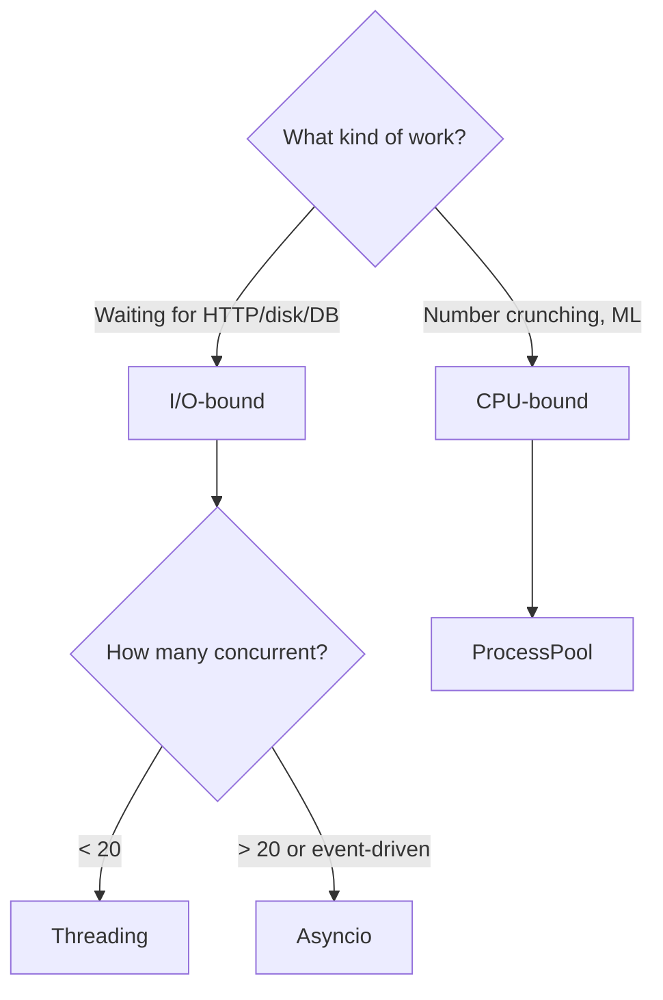

# Know-How: Async & Concurrency in Python

A beginner-friendly guide to **asynchronous programming**, **threading**, and **concurrency** patterns as used in Jarvis. No prior concurrent programming background required.

## Why concurrency?

Jarvis does many things that **wait** — waiting for Ollama to generate text, waiting for web pages to load, waiting for TTS to render audio. Without concurrency, each wait blocks everything else.

| Without concurrency | With concurrency |
|--------------------|-----------------|
| Fetch BBC → wait 5s → fetch AP → wait 5s → fetch DW → wait 5s = **15s** | Fetch BBC + AP + DW in parallel → wait 5s total = **5s** |
| Generate 5 narrations sequentially → 10 min | Could generate in parallel (if model supports) |

Python offers three concurrency models, each suited to different situations.

## Three concurrency models

### 1. Threading (`threading` module)

**What:** Multiple threads share the same memory space, running interleaved by the OS.

**Best for:** I/O-bound tasks where you're waiting for external responses (HTTP calls, file I/O, database queries).

**Limitation:** Python's GIL (Global Interpreter Lock) means only one thread runs Python code at a time. But while one thread waits for I/O, others can run.

```python
import threading

def fetch_news(source):
    # Makes HTTP request (I/O-bound — releases GIL while waiting)
    response = requests.get(source["url"])
    return response.json()

threads = []
for source in news_sources:
    t = threading.Thread(target=fetch_news, args=(source,))
    t.start()
    threads.append(t)

for t in threads:
    t.join()  # wait for all to finish
```

**Jarvis usage:** Daily Fetch runs `_run_daily_fetch` in a **daemon thread** to avoid blocking the Flask HTTP server. Stock scanner uses threads for parallel analysis batches.

### 2. Asyncio (`asyncio` module)

**What:** Single-threaded cooperative multitasking. Functions voluntarily yield control at `await` points, letting other tasks run.

**Best for:** Many concurrent I/O operations (hundreds of HTTP requests, WebSocket connections).

**Advantage over threading:** Lower overhead (no OS thread switching), no race conditions on shared data, scales to thousands of concurrent tasks.

```python
import asyncio
import aiohttp

async def fetch_news(session, url):
    async with session.get(url) as resp:
        return await resp.json()

async def fetch_all():
    async with aiohttp.ClientSession() as session:
        tasks = [fetch_news(session, url) for url in urls]
        results = await asyncio.gather(*tasks)
    return results

results = asyncio.run(fetch_all())
```

**Jarvis usage:**
- `run-world-news.py` and `run-all-sources.py` use `asyncio` to run 6-9 fetcher scripts in parallel
- Edge TTS uses `asyncio` internally (`edge_tts.Communicate` is async)
- Playwright scraping is async

### 3. ProcessPoolExecutor (`concurrent.futures`)

**What:** Spawns separate Python processes, each with its own GIL.

**Best for:** CPU-bound tasks (number crunching, ML training) where the GIL is a bottleneck.

```python
from concurrent.futures import ProcessPoolExecutor

def train_model(symbol):
    # CPU-intensive XGBoost training
    return train_and_predict(symbol)

with ProcessPoolExecutor(max_workers=4) as pool:
    futures = {pool.submit(train_model, s): s for s in symbols}
    for future in as_completed(futures):
        result = future.result()
```

**Jarvis usage:** `ThreadPoolExecutor` in `agent.py` for parallel auto-RAG search, commit summary, and Jira report during query processing.

## Choosing the right model



| Model | Best for | GIL issue? | Jarvis example |
|-------|----------|-----------|----------------|
| **Threading** | Few I/O tasks, background jobs | Not a problem (I/O releases GIL) | Daily Fetch background thread, parallel tools |
| **Asyncio** | Many I/O tasks, event loops | Not applicable (single thread) | News fetching, TTS, Playwright |
| **ProcessPool** | CPU-heavy computation | Bypassed (separate processes) | Batch ML training (potential) |

## Patterns in Jarvis

### Background job pattern

Flask can't run long tasks in request handlers (HTTP timeout). Jarvis uses daemon threads:

```python
@app.route("/api/toolbar/daily-fetch", methods=["POST"])
def api_daily_fetch():
    job_id = str(uuid.uuid4())[:8]
    _daily_fetch_jobs[job_id] = {"status": "starting", "step": "..."}
    t = threading.Thread(target=_run_daily_fetch, args=(job_id,), daemon=True)
    t.start()
    return jsonify({"job_id": job_id})

# Frontend polls: GET /api/toolbar/daily-fetch/<job_id>
```

**Key:** The `daemon=True` flag means the thread dies when the main process exits — no zombie threads.

### Parallel auto-work pattern

When a user asks a question, Jarvis runs multiple searches simultaneously:

```python
from concurrent.futures import ThreadPoolExecutor, as_completed

with ThreadPoolExecutor(max_workers=3) as pool:
    futures = {
        pool.submit(_auto_rag_search, query): "rag",
        pool.submit(tool_commit_summary, hours=48): "commits",
        pool.submit(_jira_report): "jira",
    }
    for future in as_completed(futures):
        name = futures[future]
        result = future.result()
        # merge results into context
```

### Async subprocess pattern

Running external scripts in parallel:

```python
async def run_script(script_path, output_dir):
    proc = await asyncio.create_subprocess_exec(
        sys.executable, script_path, output_dir,
        stdout=asyncio.subprocess.PIPE,
        stderr=asyncio.subprocess.PIPE,
    )
    stdout, stderr = await asyncio.wait_for(
        proc.communicate(), timeout=120
    )
    return proc.returncode, stdout.decode()

# Run 9 fetchers in parallel
tasks = [run_script(s, out_dir) for s in scripts]
results = await asyncio.gather(*tasks)
```

### SSE streaming pattern

Server-Sent Events for real-time token streaming:

```python
def generate():
    for chunk in ollama.chat(model=MODEL, messages=msgs, stream=True):
        token = chunk["message"]["content"]
        yield f"data: {json.dumps({'token': token})}\n\n"

return Response(generate(), mimetype="text/event-stream",
                headers={"Cache-Control": "no-cache"})
```

The generator **yields** each token as it arrives from Ollama, and Flask streams it to the browser via SSE.

## Common pitfalls

| Pitfall | Problem | Prevention |
|---------|---------|-----------|
| **Race condition** | Two threads modify the same dict simultaneously | Use `threading.Lock`, or structure as read-only + append-only |
| **Deadlock** | Two threads each waiting for a lock the other holds | Always acquire locks in the same order; use timeouts |
| **Event loop conflicts** | Calling `asyncio.run()` inside an existing event loop | Use `loop.run_until_complete()` or `nest_asyncio` |
| **Memory sharing** | Threads share memory — mutation bugs are subtle | Prefer immutable data or thread-local storage |
| **Thread-unsafe libraries** | Some libraries (e.g. SQLite) aren't thread-safe | Use one connection per thread, or serialize access |
| **Zombie processes** | `ProcessPoolExecutor` workers that hang | Set timeouts, use `daemon=True` for threads |

## Concepts to know

| Concept | What it means |
|---------|---------------|
| **GIL** | Global Interpreter Lock — only one thread executes Python bytecode at a time. I/O operations release it. |
| **Daemon thread** | A background thread that's killed when the main program exits |
| **`await`** | Suspends the current coroutine, letting other coroutines run until the awaited result is ready |
| **`asyncio.gather`** | Run multiple coroutines concurrently and collect all results |
| **`as_completed`** | Iterator that yields futures as they complete (not in submission order) |
| **Coroutine** | A function defined with `async def` that can be suspended and resumed |
| **Event loop** | The scheduler that manages which coroutine runs when |

## Further reading

- [Python asyncio docs](https://docs.python.org/3/library/asyncio.html)
- [concurrent.futures](https://docs.python.org/3/library/concurrent.futures.html)
- [Real Python: Async IO](https://realpython.com/async-io-python/)
- Jarvis usage: [`scripts/rag/agent.py`](../../../scripts/rag/agent.py) (threading), [`scripts/pipeline/run-all-sources.py`](../../../scripts/pipeline/run-all-sources.py) (asyncio)
