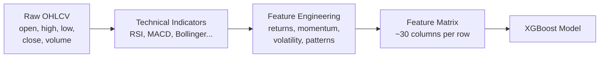

# Know-How: Feature Engineering & Technical Analysis

A beginner-friendly guide to **feature engineering**, **technical indicators**, and how Jarvis transforms raw stock data into ML-ready inputs. No prior quant finance background required.

## What is feature engineering?

Feature engineering is the process of transforming **raw data** into **meaningful inputs** that an ML model can learn from. It is often the single most impactful step in any ML pipeline.

Raw stock data (OHLCV — Open, High, Low, Close, Volume) tells you **what happened** each day, but not in a form a model can easily learn from. Feature engineering derives signals like *"how fast is the price moving?"*, *"is volume unusually high?"*, or *"how far is the price from its average?"*.



**Garbage in = garbage out.** Good features capture *"what just happened"* without leaking *"what will happen."*

## What is technical analysis?

Technical analysis (TA) studies price and volume patterns to forecast future price movements. It is not ML itself, but it provides **features** for ML models.

Core belief: all publicly known information is already reflected in the price, so price patterns contain predictive signals.

## Key technical indicators

### RSI (Relative Strength Index)

**What it measures:** Speed and magnitude of recent price changes on a 0–100 scale.

| RSI value | Interpretation |
|-----------|---------------|
| > 70 | **Overbought** — price may have risen too fast |
| < 30 | **Oversold** — price may have fallen too far |
| 40–60 | Neutral zone |

**Intuition:** If a stock has gone up 13 of the last 14 days, RSI is very high — statistically, a pullback becomes more likely.

### MACD (Moving Average Convergence Divergence)

**What it measures:** Trend momentum and direction changes.

- **MACD line** = 12-day EMA − 26-day EMA
- **Signal line** = 9-day EMA of MACD line
- **Histogram** = MACD − Signal

| Signal | Meaning |
|--------|---------|
| MACD crosses above Signal | Bullish momentum shift |
| MACD crosses below Signal | Bearish momentum shift |
| Histogram growing | Trend strengthening |

### Bollinger Bands

**What it measures:** Volatility — how much the price deviates from its average.

- **Middle band** = 20-day SMA
- **Upper band** = SMA + 2 × standard deviation
- **Lower band** = SMA − 2 × standard deviation

**Bollinger width** (upper − lower) / middle tells you if the market is quiet (narrow bands) or volatile (wide bands). Narrow bands often precede big moves.

### KDJ (Stochastic Oscillator)

Popular in Chinese markets. Measures where the current close sits relative to the recent high-low range.

- **K line** (fast), **D line** (slow), **J line** (momentum)
- J > 100: overbought; J < 0: oversold
- K crossing above D: bullish signal

### Moving Averages (SMA, EMA)

**SMA** (Simple Moving Average) = average of the last N closing prices.
**EMA** (Exponential Moving Average) = weighted average giving more weight to recent prices.

Common periods: 5, 10, 20, 60, 120, 250 days.

**Distance from MA** is a key feature — if the price is 5% above the 20-day SMA, it may be overextended.

### Volume indicators

- **Volume ratio** = today's volume / average volume — spikes signal unusual activity
- **OBV (On-Balance Volume)** = cumulative volume with direction — rising OBV with rising price confirms a trend

## pandas-ta library

**pandas-ta** is a Python library providing 130+ technical indicators that integrate directly with pandas DataFrames.

```python
import pandas_ta as ta

df = pd.read_csv("stock_data.csv")
df.ta.rsi(length=14, append=True)       # adds RSI_14 column
df.ta.macd(fast=12, slow=26, append=True)  # adds MACD columns
df.ta.bbands(length=20, append=True)     # adds Bollinger Bands
```

Jarvis uses pandas-ta via `compute_indicators()` in `technical_analysis.py`, which adds all standard indicators to the OHLCV DataFrame in one call.

## How Jarvis builds features

### The pipeline

```python
# From features.py
def build_features(symbol, forward_days=5, threshold=2.0):
    df = load_ohlcv(symbol)            # raw price data
    df = compute_indicators(df)         # ~20 pandas-ta indicators
    _add_return_features(df)            # past returns
    _add_momentum_features(df)          # RSI, MACD, KDJ values
    _add_volatility_features(df)        # Bollinger width, ATR, range
    _add_ma_distance_features(df)       # distance from key MAs
    _add_volume_features(df)            # volume ratio, OBV slope
    _add_pattern_features(df)           # candlestick pattern flags
    _add_target(df, forward_days, threshold)  # label: 涨/平/跌
    return df
```

### Feature categories

| Group | Function | Features | What they capture |
|-------|----------|----------|-------------------|
| **Returns** | `_add_return_features` | `ret_1d`, `ret_3d`, `ret_5d`, `ret_10d`, `ret_20d` | How much the price changed over various lookback windows |
| **Momentum** | `_add_momentum_features` | `rsi_14`, `macd_val`, `macd_signal`, `macd_hist`, `kdj_k`, `kdj_d`, `kdj_j` | Current momentum indicators as direct features |
| **Volatility** | `_add_volatility_features` | `bb_width`, `atr_14`, `intraday_range`, `gap` | Market turbulence and price dispersion |
| **MA Distance** | `_add_ma_distance_features` | `dist_sma5`, `dist_sma10`, `dist_sma20`, `dist_sma60` | How far the price is from its moving averages (% deviation) |
| **Volume** | `_add_volume_features` | `vol_ratio_5`, `vol_ratio_20`, `obv_slope` | Unusual trading activity |
| **Patterns** | `_add_pattern_features` | `doji`, `hammer`, `engulfing`, ... | Binary flags for recognized candlestick patterns |

### Target variable

The target is what the model learns to predict:

```python
def _add_target(df, forward_days=5, threshold=2.0):
    future_return = df["close"].shift(-forward_days) / df["close"] - 1
    df["target_ret"] = future_return * 100  # percentage

    df["target"] = 0                              # flat by default
    df.loc[df["target_ret"] > threshold, "target"] = 1    # 涨 (up)
    df.loc[df["target_ret"] < -threshold, "target"] = -1  # 跌 (down)
```

| Target | Condition | Meaning |
|--------|-----------|---------|
| 1 (涨) | 5-day return > +2% | Stock will rise meaningfully |
| 0 (平) | Between −2% and +2% | Sideways movement |
| −1 (跌) | 5-day return < −2% | Stock will drop meaningfully |

## Support and resistance

`calc_support_resistance` in `technical_analysis.py` identifies price levels where the stock historically reversed direction:

- **Support:** A price floor where buying pressure tends to halt declines
- **Resistance:** A price ceiling where selling pressure tends to halt advances

Calculated from **pivot points** (high + low + close) / 3 and standard R1/R2/S1/S2 formulas.

## Why feature engineering matters

| Approach | Result |
|----------|--------|
| Feed raw OHLCV directly to XGBoost | Model struggles — raw prices are non-stationary and scale-dependent |
| Add returns (percentage changes) | Better — model sees **relative** movements, not absolute prices |
| Add indicators + derived features | Best — model sees **momentum**, **volatility**, **relative position** |

**Key principle:** Features should be **stationary** (their statistical properties don't change over time). Raw prices grow over time, but *returns* and *indicator values* oscillate around stable ranges.

## Concepts to know

| Concept | What it means |
|---------|---------------|
| **Stationarity** | A time series whose statistical properties (mean, variance) don't change over time. Returns are roughly stationary; prices are not. |
| **Lookback window** | The number of past days used to calculate a feature (e.g. 14-day RSI) |
| **Forward window** | The number of future days the target predicts (Jarvis: 5 days) |
| **Threshold** | The percentage boundary that separates "up" from "flat" from "down" (Jarvis: ±2%) |
| **Multicollinearity** | When features are highly correlated (e.g. SMA5 and SMA10). Not fatal for XGBoost but can reduce interpretability. |
| **Non-stationary** | Data whose distribution shifts over time. Raw stock prices are non-stationary because they trend upward over decades. |

## Further reading

- [pandas-ta documentation](https://github.com/twopirllc/pandas-ta)
- [Investopedia: Technical Indicators](https://www.investopedia.com/terms/t/technicalindicator.asp)
- Jarvis implementation: [`scripts/stock/features.py`](../../../scripts/stock/features.py), [`scripts/stock/technical_analysis.py`](../../../scripts/stock/technical_analysis.py)
