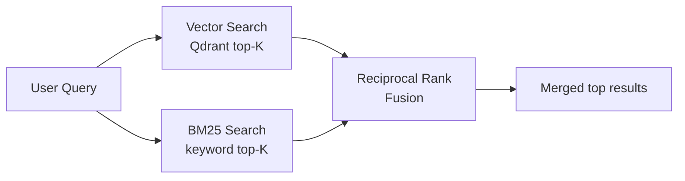
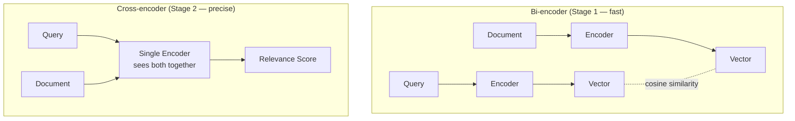

# Know-How: Hybrid Search & Reranking

A beginner-friendly guide to **keyword search**, **vector search**, **hybrid retrieval**, and **cross-encoder reranking** as used in Jarvis. No prior information retrieval background required.

## The search quality problem

Neither pure keyword search nor pure vector search is perfect alone:

| Method | Strengths | Weaknesses |
|--------|-----------|------------|
| **Keyword (BM25)** | Exact matches, names, acronyms, IDs | Misses synonyms, paraphrases, semantic meaning |
| **Vector (embeddings)** | Semantic similarity, meaning-based | Can miss exact terms, sensitive to rare words |

Searching for *"DICOM routing"* with vectors might return documents about *"medical image transfer"* (great!) but miss a document that literally says *"DICOM routing"* in its title (bad). Keyword search would nail the exact match but miss the paraphrase.

**Solution:** Combine both — **hybrid search**.

## BM25: keyword search

**BM25** (Best Matching 25) is the standard algorithm behind most keyword search engines. It scores documents based on **term frequency** and **inverse document frequency**:

- **TF:** How often the query term appears in a document (more = better match)
- **IDF:** How rare the term is across all documents (rare terms are more discriminating)
- **Length normalization:** Shorter documents aren't penalized for having fewer word occurrences

Jarvis uses the `rank_bm25` Python library with `BM25Okapi`:

```python
from rank_bm25 import BM25Okapi

def _tokenize(text):
    return re.findall(r"[a-z0-9]+", text.lower())

corpus = [_tokenize(doc["text"]) for doc in documents]
bm25 = BM25Okapi(corpus)
scores = bm25.get_scores(_tokenize("DICOM routing"))
```

## Dense vector search

Embeds both the query and documents into the same vector space, then finds the **nearest neighbors** by cosine similarity. See [sentence-transformers.md](./sentence-transformers.md) and [qdrant-vector-db.md](./qdrant-vector-db.md) for details.

Key property: *"How does image transfer work?"* and *"DICOM routing protocol"* land near each other because they **mean** similar things, even though they share no words.

## Hybrid search

Hybrid search runs **both** retrieval methods in parallel and merges the results:



A document that appears in **both** result sets gets a stronger combined score than one that appears in only one.

## Reciprocal Rank Fusion (RRF)

RRF is a simple, effective algorithm for merging ranked lists from different search methods:

```
RRF_score(doc) = Σ  1 / (k + rank_i)
```

Where `rank_i` is the document's position in result list `i`, and `k` is a constant (typically 60).

**Example:** A document ranked #1 in vector search and #3 in BM25:

```
RRF = 1/(60+1) + 1/(60+3) = 0.0164 + 0.0159 = 0.0323
```

A document ranked #1 in vector search but absent from BM25:

```
RRF = 1/(60+1) + 0 = 0.0164
```

The document found by **both** systems scores higher. RRF works because:

- It doesn't require normalizing scores across different systems
- Rank-based, so incompatible score scales don't matter
- A document confirmed by multiple signals is more likely relevant

## Cross-encoder reranking

Hybrid retrieval is fast but approximate. **Cross-encoder reranking** adds a precision stage.

### Bi-encoder vs cross-encoder



| | Bi-encoder | Cross-encoder |
|---|---|---|
| **Input** | Query and document encoded **separately** | Query and document encoded **together** |
| **Speed** | Fast (pre-compute document vectors) | Slow (must run for each query-doc pair) |
| **Quality** | Good | Better (sees word interactions) |
| **Use case** | Retrieve 100 candidates | Rerank top 20 → top 5 |

### How Jarvis uses cross-encoder reranking

```python
# From reranker.py
from sentence_transformers import CrossEncoder

model = CrossEncoder("cross-encoder/ms-marco-MiniLM-L-6-v2")

def rerank(query, documents, top_k=5):
    pairs = [(query, doc["text"]) for doc in documents]
    scores = model.predict(pairs)
    ranked = sorted(zip(documents, scores), key=lambda x: x[1], reverse=True)
    return [doc for doc, score in ranked[:top_k]]
```

The cross-encoder sees the query and document **as a single input**, allowing it to detect fine-grained relevance that bi-encoders miss (like negation, qualification, or partial matches).

## How Jarvis implements hybrid search

### BM25 index (`bm25_index.py`)

- Loads from the same JSON snapshot as Qdrant (`C:/reports/ai/.rag-store.json`)
- Tokenizes with `re.findall(r"[a-z0-9]+", text.lower())`
- Auto-reloads when snapshot file modification time changes
- Thread-safe with a `Lock`

### Agent RAG pipeline (`agent.py`)

`_auto_rag_search` orchestrates:

1. **Vector search** via Qdrant (cosine, top K)
2. **BM25 search** on the same corpus (optional, for keyword reinforcement)
3. **RRF merge** of both result sets
4. **Entity boosting** — recognized names trigger additional filtered searches
5. **Wiki bias** — documentation queries add `item_type == wiki_page` filter
6. **Deduplication** by title
7. Top **5 chunks** become the RAG context

### Search UI (`search_ui.py`)

Similar hybrid path with optional Ollama query rewriting for vague queries.

## When to use what

| Method | Quality | Speed | Best for |
|--------|---------|-------|----------|
| Keyword only (BM25) | Moderate | Fast | Exact term lookups, known names |
| Vector only | Good | Fast | Semantic questions, paraphrases |
| Hybrid (BM25 + vector) | Better | Medium | General-purpose search |
| Hybrid + rerank | Best | Slower | High-stakes retrieval (RAG context) |

## Concepts to know

| Concept | What it means |
|---------|---------------|
| **Precision** | Of the results returned, how many are actually relevant? |
| **Recall** | Of all relevant documents, how many did we find? |
| **Top-K** | Return only the K highest-scoring results |
| **ANN (Approximate Nearest Neighbors)** | Trade exact search for speed — finds "close enough" neighbors. Qdrant uses HNSW internally. |
| **HNSW** | Hierarchical Navigable Small World — the graph algorithm Qdrant uses for fast vector search |
| **Payload filtering** | Combining vector search with metadata conditions (e.g. `item_type == "wiki_page"`) |

## Further reading

- [BM25 explained](https://en.wikipedia.org/wiki/Okapi_BM25)
- [Reciprocal Rank Fusion paper](https://plg.uwaterloo.ca/~gvcormac/cormacksigir09-rrf.pdf)
- [Cross-encoders — SBERT docs](https://www.sbert.net/examples/applications/cross-encoder/README.html)
- Jarvis implementation: [`scripts/rag/bm25_index.py`](../../../scripts/rag/bm25_index.py), [`scripts/rag/reranker.py`](../../../scripts/rag/reranker.py)
