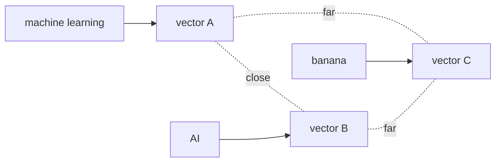

# Know-How: Sentence Transformers & Text Embeddings

This guide explains how Jarvis turns text into searchable numbers using **Sentence Transformers** and **embeddings**. No prior ML background is required.

## What are embeddings?

Embeddings are a way to represent text as a **list of numbers** (a **vector**) that tries to capture **meaning**, not just spelling.

- **Text → vector:** Each piece of text becomes a fixed-length list of floating-point numbers.
- **Similar meaning → similar vectors:** Phrases that mean similar things end up with vectors that are **close together** in a mathematical sense.
- **Example:** *"machine learning"* and *"AI"* tend to have vectors that are nearer to each other than either is to *"banana"*, which should be **far away** in that same space.
- **Dimension in Jarvis:** For the model Jarvis uses, each text chunk becomes a vector of **384 numbers**.

Think of it as a coordinate system for “meaning”: nearby points = related ideas.



## What is SentenceTransformer?

**Sentence Transformers** is a **Python library** from the Hugging Face ecosystem (installable as the `sentence-transformers` package). It wraps **pre-trained neural networks** whose job is to convert text into embedding vectors.

**Model used in Jarvis:** `all-MiniLM-L6-v2`

| Property | Value |
|----------|--------|
| Size | ~22M parameters (small, fast) |
| Output size | 384 dimensions |
| Training | 1B+ sentence pairs (semantic similarity style) |
| Role in Jarvis | Good balance of **speed** vs **quality** for semantic search |
| Typical CPU speed | Roughly **~35ms per query** encode (order of magnitude; varies by hardware) |

Official library and model hub:

- [Sentence Transformers documentation](https://www.sbert.net/)
- [Hugging Face: sentence-transformers](https://huggingface.co/sentence-transformers)

## How Jarvis uses it

```python
from sentence_transformers import SentenceTransformer
model = SentenceTransformer("all-MiniLM-L6-v2")
vector = model.encode("How does DICOM routing work?")
```

`vector` is a sequence of **384 floats**, e.g. `[0.12, -0.45, ...]`.

**Indexing:** Every indexer script calls `model.encode(texts)` (often in **batches**) to turn document **chunks** into vectors.

**Search:** At query time, the **same model** encodes the user’s question the same way.

**Matching:** **Cosine similarity** compares the query vector to every stored chunk vector to find the closest matches (see concepts below).

## Offline mode

Jarvis sets:

- `HF_HUB_OFFLINE=1`
- `TRANSFORMERS_OFFLINE=1`

That tells Hugging Face libraries **not to download** models from the internet at runtime. The model must already exist in the **local cache** (typically under `~/.cache/huggingface/` on Unix-like systems, or the equivalent Windows Hugging Face cache path).

If offline mode is on and the model is missing locally, encoding will fail until you download the model once while online.

## Installation

```bash
pip install sentence-transformers
```

The **first** run with `all-MiniLM-L6-v2` downloads the model (on the order of **~80MB**). After that, the same cache works **offline** (with the env vars above).

## Key concepts to understand

### Embedding space

All 384-dimensional vectors live in one continuous **embedding space**. Distance and angle in that space are used as proxies for **semantic relatedness**.

### Semantic similarity

Two texts are “semantically similar” if their embeddings are **close** in that space—again, as an approximation learned from data, not a perfect human judgment.

### Cosine similarity

Cosine similarity measures the **angle** between two vectors (treating length separately). Intuition:

- **1.0** — same direction (very aligned; often identical normalized direction).
- **0.0** — orthogonal (unrelated in this geometric sense).
- Lower / negative values — different directions (less related).

Jarvis uses this style of comparison when retrieving chunks from the vector store.

### Batch encoding

Instead of calling `encode()` once per string, you can pass **many texts at once**. The model and hardware can process batches more efficiently than many tiny single-string calls.

## Practical tips

- Keep chunk sizes consistent with how you indexed (same model, similar text granularity).
- For large corpora, prefer **batched** `encode()` over one string at a time.
- Verify the model is cached before relying on **offline** runs in automation or air-gapped setups.

## Further reading

- [Sentence Transformers documentation](https://www.sbert.net/)
- [Pretrained models (SBERT)](https://www.sbert.net/docs/pretrained_models.html)
- [Hugging Face Hub](https://huggingface.co/docs/hub/index)
