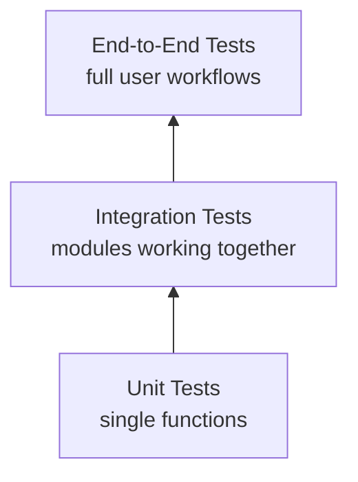

# Know-How: Testing Python Applications

A beginner-friendly guide to **automated testing** in Python — why it matters, how it works, and how to apply it to a project like Jarvis. No prior testing background required.

## Why test?

Every time you change code, you risk breaking something that used to work. **Automated tests** catch regressions before users do.

| Without tests | With tests |
|---------------|-----------|
| "I think it works" | "I know it works — 47 tests pass" |
| Afraid to refactor | Refactor confidently |
| Bugs found by users | Bugs found in seconds |
| Manual verification every time | One command: `pytest` |

## Types of tests



| Type | What it tests | Speed | Example for Jarvis |
|------|-------------|-------|--------------------|
| **Unit** | A single function in isolation | Very fast (ms) | `_tokenize("Hello World")` returns `["hello", "world"]` |
| **Integration** | Multiple components together | Medium (seconds) | Feature pipeline → XGBoost → produces valid prediction JSON |
| **End-to-end** | Full user workflow | Slow (minutes) | Start Daily Fetch → verify all output files exist |

**Start with unit + integration.** They give the most value per effort.

## pytest basics

**pytest** is the standard Python testing framework. Install: `pip install pytest`

### Test file structure

```
jarvis/
├── scripts/
│   ├── rag/
│   │   └── agent.py
│   └── stock/
│       └── features.py
└── tests/
    ├── conftest.py          # shared fixtures
    ├── test_bm25.py         # unit tests for BM25
    ├── test_features.py     # unit tests for feature engineering
    ├── test_history.py      # integration tests for history endpoint
    └── test_stock_pipeline.py  # integration tests for stock ML
```

### Writing a test

```python
# tests/test_bm25.py
from scripts.rag.bm25_index import _tokenize

def test_tokenize_basic():
    assert _tokenize("Hello World") == ["hello", "world"]

def test_tokenize_special_chars():
    assert _tokenize("DICOM-routing v2.1") == ["dicom", "routing", "v2", "1"]

def test_tokenize_empty():
    assert _tokenize("") == []
```

Run: `pytest tests/test_bm25.py -v`

### Fixtures — shared setup

```python
# tests/conftest.py
import pytest
import pandas as pd

@pytest.fixture
def sample_ohlcv():
    """Create a minimal OHLCV DataFrame for testing."""
    return pd.DataFrame({
        "date": pd.date_range("2025-01-01", periods=300),
        "open": [100 + i * 0.1 for i in range(300)],
        "high": [101 + i * 0.1 for i in range(300)],
        "low": [99 + i * 0.1 for i in range(300)],
        "close": [100.5 + i * 0.1 for i in range(300)],
        "volume": [1000000 + i * 1000 for i in range(300)],
    })
```

Use it in tests:

```python
# tests/test_features.py
def test_build_features_shape(sample_ohlcv, monkeypatch):
    monkeypatch.setattr("features.load_ohlcv", lambda s: sample_ohlcv)
    result = build_features("000001")
    assert result is not None
    assert "target" in result.columns
    assert len(result) > 0
```

### Mocking external dependencies

Tests should not call real APIs, Ollama, or touch the filesystem unpredictably.

```python
# tests/test_sentiment.py
from unittest.mock import patch, MagicMock

@patch("sentiment.requests.post")
def test_sentiment_positive(mock_post):
    mock_post.return_value = MagicMock(
        status_code=200,
        json=lambda: {"message": {"content": '{"score": 0.8, "reasoning": "positive"}'}}
    )
    result = analyze_sentiment_single("Stock surges 10%", "000001")
    assert result["score"] > 0
```

### Parametrize — test many inputs at once

```python
import pytest

@pytest.mark.parametrize("text,expected_count", [
    ("hello world", 2),
    ("", 0),
    ("one", 1),
    ("hello-world v2.0", 3),
])
def test_tokenize_lengths(text, expected_count):
    assert len(_tokenize(text)) == expected_count
```

## Testing patterns for Jarvis

### Flask endpoint testing

```python
import pytest
from agent import app

@pytest.fixture
def client():
    app.config["TESTING"] = True
    with app.test_client() as c:
        yield c

def test_history_endpoint(client):
    resp = client.get("/api/toolbar/daily-fetch/history?date=2026-04-15")
    assert resp.status_code == 200
    data = resp.get_json()
    assert "stats" in data
    assert "missing_steps" in data
```

### Snapshot testing for reports

Verify that generated reports match expected structure:

```python
def test_wiki_report_format(tmp_path):
    report = tmp_path / "wiki-fetch-2026-04-17.md"
    report.write_text("# Wiki Fetch Report\n\n**Total: 5 pages, 20 chunks indexed**\n")
    content = report.read_text()
    assert "**Total:" in content
    assert "pages" in content
```

### Test markers for slow tests

```python
@pytest.mark.slow
def test_full_daily_fetch_pipeline():
    """Integration test that takes minutes — skip in fast CI."""
    ...

# Run fast tests only: pytest -m "not slow"
# Run everything: pytest
```

## Coverage

Track which code lines are tested:

```bash
pip install pytest-cov
pytest --cov=scripts --cov-report=html
# Open htmlcov/index.html to see coverage map
```

**Target:** Start with critical paths (stock predictions, history endpoint, BM25 tokenizer) → expand to 60%+.

## Concepts to know

| Concept | What it means |
|---------|---------------|
| **Regression** | A bug introduced by a change that breaks previously-working functionality |
| **Fixture** | Reusable test setup (database connection, sample data, mock server) |
| **Mocking** | Replacing real dependencies with controlled fakes for testing |
| **Parametrize** | Running the same test logic with different inputs |
| **Coverage** | Percentage of code lines executed by tests |
| **CI** | Continuous Integration — running tests automatically on every code change |
| **Test isolation** | Each test should be independent — not affected by other tests' side effects |

## Further reading

- [pytest documentation](https://docs.pytest.org/)
- [pytest-cov](https://pytest-cov.readthedocs.io/)
- [unittest.mock](https://docs.python.org/3/library/unittest.mock.html)
