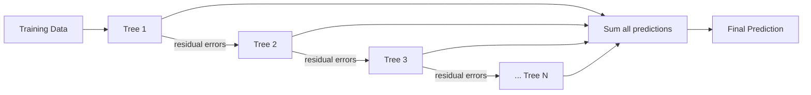
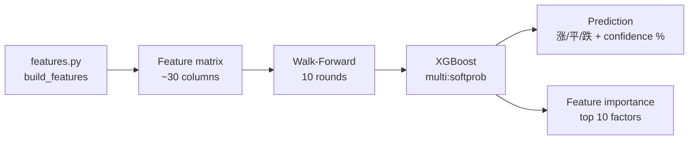

# Know-How: XGBoost & Gradient Boosting

A beginner-friendly guide to **machine learning**, **gradient boosting**, and how Jarvis uses **XGBoost** for stock prediction. No prior ML background required.

## What is supervised machine learning?

Supervised ML learns patterns from **labeled examples** to make predictions on new data.

| Concept | Meaning | Stock example |
|---------|---------|---------------|
| **Features** (X) | Input measurements | RSI, MACD, volume ratio, 5-day return |
| **Labels** (y) | What you want to predict | "涨" (up), "平" (flat), "跌" (down) |
| **Training** | Feeding features + labels so the model learns patterns | 250 trading days of historical data |
| **Prediction** | Applying the learned model to new, unseen features | "Given today's indicators, will the stock rise?" |

Two main tasks:

- **Classification:** Predict a category (Jarvis: 涨/平/跌 three-class direction)
- **Regression:** Predict a number (Jarvis: tomorrow's close/high/low prices)

## What is gradient boosting?

Gradient boosting builds a **team of weak learners** (typically small decision trees) that each fix the mistakes of the previous ones.



**Key intuition:**

1. Train Tree 1 on the original data — it makes mistakes.
2. Train Tree 2 on **the errors** of Tree 1 — it corrects some mistakes.
3. Train Tree 3 on the remaining errors — corrections get finer.
4. Repeat N rounds. The final prediction is the **sum** of all trees.

Each tree is intentionally kept **shallow** (weak) so the ensemble stays general and avoids memorizing noise.

**Boosting vs Bagging:**

| | Boosting (XGBoost) | Bagging (Random Forest) |
|---|---|---|
| Trees built | Sequentially, each corrects errors | In parallel, independently |
| Focus | Hard-to-predict examples | Reducing variance |
| Risk | Can overfit if too many rounds | More robust but less precise |

## What is XGBoost?

**XGBoost** (eXtreme Gradient Boosting) is a highly optimized gradient boosting library that adds:

- **Regularization** (L1/L2) to prevent overfitting
- **Built-in handling** of missing values
- **Parallel tree construction** for speed
- **Early stopping** — stop training when validation error stops improving

Install: `pip install xgboost`

## Walk-forward validation

Stock data is **time-ordered** — you cannot randomly split it because future data would leak into training.

**Walk-forward** slides a window through time:

```text
|--- Train (250 days) ---|-- Test (5 days) --|
                          |--- Train (250 days) ---|-- Test (5) --|
                                                    |--- Train ---...
```



```mermaid
gantt
  title Walk-Forward Validation (10 rounds)
  dateFormat X
  axisFormat %s
  section Round 1
    Train :0, 250
    Test  :250, 255
  section Round 2
    Train :5, 255
    Test  :255, 260
  section Round 3
    Train :10, 260
    Test  :260, 265
```

Jarvis parameters:

```python
_TRAIN_WINDOW = 250   # ~1 year of trading days
_TEST_WINDOW = 5      # predict 1 week ahead
_N_ROUNDS = 10        # 10 walk-forward folds
_MIN_DATA_ROWS = 300  # need at least this much history
```

Each round trains on the most recent 250 days and predicts the next 5, then slides forward. This simulates real trading: you only ever train on **past** data.

## Data leakage prevention

**Leakage** = accidentally using future information during training, making results look great but fail in production.

Common leak: filling missing values with the **global median** of the entire dataset (which includes future data).

Jarvis prevents this with **per-fold imputation**:

```python
def _impute_fold(X_train, X_test, feature_cols):
    """Fill NaN using only training-set statistics."""
    train_df = pd.DataFrame(X_train, columns=feature_cols)
    test_df = pd.DataFrame(X_test, columns=feature_cols)
    medians = train_df.median()        # stats from train only
    train_df.fillna(medians, inplace=True)
    test_df.fillna(medians, inplace=True)  # apply to test
    return train_df.values, test_df.values
```

Each fold computes medians **only from its training portion**, then applies them to both train and test sets.

## How Jarvis uses XGBoost

### Direction classifier (`model_xgboost.py`)

Predicts **5-day direction** as one of three classes:

| Label | Meaning | Condition |
|-------|---------|-----------|
| 1 (涨) | Up | 5-day forward return > +2% |
| 0 (平) | Flat | Between −2% and +2% |
| −1 (跌) | Down | 5-day forward return < −2% |

Pipeline:



### Price predictor (`model_price_predictor.py`)

Trains **three separate regressors** for next-day:

- **Close price** prediction
- **High price** prediction
- **Low price** prediction

Uses the same walk-forward approach but with `reg:squarederror` objective.

### Feature pipeline (`features.py`)

```python
def build_features(symbol, forward_days=5, threshold=2.0):
    df = load_ohlcv(symbol)           # raw price data
    df = compute_indicators(df)        # pandas-ta indicators
    _add_return_features(df)           # 1/3/5/10/20-day returns
    _add_momentum_features(df)         # RSI, MACD, KDJ
    _add_volatility_features(df)       # Bollinger width, ATR
    _add_ma_distance_features(df)      # distance from SMA 5/10/20/60
    _add_volume_features(df)           # volume ratio, OBV slope
    _add_pattern_features(df)          # candlestick pattern flags
    _add_target(df, forward_days, threshold)
    return df
```

### Model persistence

Models and predictions are saved to `C:/reports/stock/models/{symbol}/`:

- `xgb_model.json` — Trained model
- `xgb_prediction.json` — Latest prediction with confidence
- `price_prediction.json` — Price forecasts

## Key XGBoost parameters

| Parameter | Jarvis value | Purpose |
|-----------|-------------|---------|
| `objective` | `multi:softprob` (classifier) / `reg:squarederror` (regressor) | Task type |
| `max_depth` | 4 | Tree depth limit — prevents overfitting |
| `eta` (learning rate) | 0.05 | How much each tree contributes — smaller = more conservative |
| `subsample` | 0.8 | Random 80% of rows per tree — reduces overfitting |
| `colsample_bytree` | 0.8 | Random 80% of features per tree |
| `early_stopping_rounds` | 15 | Stop if validation error hasn't improved in 15 rounds |
| `num_boost_round` | 200 | Maximum trees to build (early stopping usually triggers first) |

## Feature importance

XGBoost tracks how much each feature contributed to predictions. Jarvis reports the **top 10 most important features** in the prediction output, helping you understand *why* the model made its call.

Example output:
```
Top features: ret_5d (0.15), rsi_14 (0.12), macd_signal (0.09), ...
```

Higher importance = the model relied more on that feature for splitting decisions.

## Concepts to know

| Concept | What it means |
|---------|---------------|
| **Overfitting** | Model memorizes training data but fails on new data. Walk-forward + regularization fight this. |
| **Regularization** | Penalizing model complexity (`lambda`, `alpha` in XGBoost). Keeps trees simple. |
| **Early stopping** | Stop adding trees when validation loss stops improving. Automatic overfitting prevention. |
| **Confusion matrix** | Table showing how many predictions were correct per class (涨/平/跌). Reveals if the model is biased toward one class. |
| **Class imbalance** | If 60% of days are "flat", the model might always predict flat. Walk-forward averaging across folds helps. |
| **Ensemble** | Combining multiple models. XGBoost itself is an ensemble of trees. |

## Further reading

- [XGBoost documentation](https://xgboost.readthedocs.io/)
- [Walk-forward validation explained](https://machinelearningmastery.com/backtest-machine-learning-models-time-series-forecasting/)
- Jarvis implementation: [`scripts/stock/model_xgboost.py`](../../../scripts/stock/model_xgboost.py), [`scripts/stock/features.py`](../../../scripts/stock/features.py)
