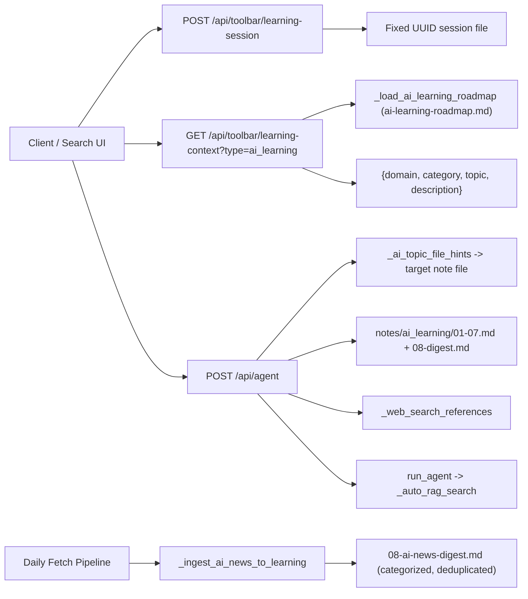

---
tags:
  - implementation
  - learning
  - ai-learning
category: learning
status: current
last-updated: 2026-05-07
---

# AI Learning Mode

> **Category**: LEARNING | **Source**: `scripts/rag/agent.py`, `scripts/rag/routes/daily_fetch.py`

## Overview

AI Learning Mode is a comprehensive tutor covering 8 domains of AI/ML engineering, from LLM foundations to production systems. It uses structured study notes synthesized from 5 authoritative books and papers, supplemented by auto-ingested daily AI news. The roadmap lives in `docs/ai-learning-roadmap.md` and the knowledge base under `C:\reports\ai\knowledge\notes\ai_learning\`.

### Knowledge Sources

| # | Source | Focus |
|---|--------|-------|
| 1 | Hands-On Large Language Models (Alammar & Grootendorst) | Architecture, embeddings, search, fine-tuning |
| 2 | AI Engineering (Chip Huyen) | End-to-end AI apps, evaluation, RAG, agents |
| 3 | LLM Engineer's Handbook (Iusztin & Labonne) | Production LLM systems, MLOps, deployment |
| 4 | RAG Survey (arXiv 2312.10997v5) | RAG paradigms: naive, advanced, modular |
| 5 | RAG Architecture Survey (arXiv 2506.00054v1) | RAG taxonomy, robustness, benchmarks |

### Learning Domains (8)

| Domain | File | Focus |
|--------|------|-------|
| 1. LLM Foundations & Architecture | `01-llm-foundations.md` | Transformers, model types, scaling |
| 2. Tokens, Embeddings & Representations | `02-tokens-embeddings.md` | Tokenization, SBERT, clustering |
| 3. Prompt Engineering & Text Generation | `03-prompt-engineering.md` | CoT, sampling, defensive prompting |
| 4. RAG - Retrieval-Augmented Generation | `04-rag.md` | Pipeline, retrieval, reranking, agents |
| 5. Fine-Tuning & Alignment | `05-fine-tuning.md` | LoRA, DPO, RLHF, dataset engineering |
| 6. AI Engineering & Production Systems | `06-ai-engineering.md` | Inference, deployment, MLOps |
| 7. Evaluation, Safety & Responsible AI | `07-evaluation-safety.md` | Benchmarks, AI-as-judge, security |
| 8. AI Industry & Recent Developments | `08-ai-news-digest.md` | Auto-populated from daily AI briefings |

## Architecture & Design

### System Context



### Data Flow

1. Client creates/loads session via `POST /api/toolbar/learning-session` with `type: ai_learning`.
2. Client loads roadmap via `GET /api/toolbar/learning-context?type=ai_learning` returns `{domain, category, topic, description}` hierarchy.
3. User sends message to `/api/agent` with the AI learning `session_id`.
4. Content retrieval follows one of three paths (see **Content Retrieval Strategy** below).
5. `SYSTEM_PROMPT_AI_LEARNING` guides the tutor to use the 8-domain structure.
6. Daily fetch pipeline runs `_ingest_ai_news_to_learning` which extracts AI news, categorizes by topic, deduplicates by title hash, and appends to `08-ai-news-digest.md`.

### Content Retrieval Strategy: Notes + Books

The AI Learning feature uses a two-layer knowledge architecture: **structured notes** (primary) backed by **indexed books** (secondary), all searchable through the RAG vector store.

#### Knowledge Layers

| Layer | Source | Chunks | Purpose |
|-------|--------|--------|---------|
| **Primary: Notes** | `notes/ai_learning/01-08.md` (9 files) | ~487 | Structured, domain-organized teaching content synthesized from all 5 books |
| **Secondary: Books** | Original PDFs in `knowledge/books/` (5 books + 2 papers) | ~98 | Raw book content, less structured but provides additional depth and direct quotes |

Both layers are indexed in the same Qdrant collection via `index_custom.py scan`, making them searchable together during auto-RAG.

#### Three Content Retrieval Paths

| Query Type | Example | Method | Source |
|------------|---------|--------|--------|
| **Topic resolution** | User picks numbered topic from list | `_fetch_article_content` with `_ai_topic_file_hints` | Reads MD note file directly (~100 keyword mappings) |
| **Domain request** | "Domain 4" or "teach Domain 1" | `_fetch_article_content` with `_ai_domain_file_map` | Reads mapped domain file directly (e.g., `04-rag.md`) |
| **Free-form query** | "teach me RAG", "what is LoRA?", any question | `_auto_rag_search` (Qdrant vector search) | Searches ALL indexed chunks (notes + books + briefings) |

#### Why This Works

- **Topic/Domain requests** (Paths 1 & 2): Content comes directly from the structured MD note files. These contain synthesized, teaching-oriented content with clear headings, comparison tables, exam tips, and practice questions. The keyword hints ensure fast, accurate file selection without scanning all files.
- **Free-form queries** (Path 3): The RAG vector search finds relevant chunks from **both** notes and books. Notes provide structured teaching content while original book chunks add depth, alternative explanations, and direct quotes. The LLM can draw from both to construct a comprehensive answer.
- **Books complement notes**: Even though the notes synthesize the best parts of all 5 books, the original PDF chunks provide additional context, examples, and details that the synthesis may have condensed. Both are available to the RAG pipeline.

#### Indexing

Both notes and books must be indexed in Qdrant for Path 3 to work:

```bash
python scripts/rag/index_custom.py scan          # Indexes entire knowledge/ folder
python scripts/rag/index_custom.py add <file>     # Index a specific file
python scripts/rag/index_custom.py list           # Show what's indexed
```

The `reindex-all.py` script also covers custom content during full reindexing.

### Key Design Decisions

- **Domain/Category hierarchy** - Mirrors the AWS cert pattern for consistency. 7 structured domains + 1 auto-populated news domain.
- **Keyword-to-file hints** - ~100 keyword mappings route queries directly to the relevant note file without scanning all files.
- **Two-layer knowledge** - Structured notes (primary teaching source) + original book chunks (secondary depth) both indexed in the same Qdrant collection for comprehensive retrieval.
- **News auto-ingestion** - Daily fetch pipeline automatically enriches the knowledge base. Deduplication uses MD5 hash of lowercase title.
- **News categorization** - 7 topic categories (LLM releases, agents, RAG, safety, infrastructure, products, research) via keyword matching.

## Implementation Details

### Core Components

| Piece | Location | Role |
|--------|----------|------|
| `SYSTEM_PROMPT_AI_LEARNING` | `scripts/rag/prompts.py` | Tutor persona with 8-domain curriculum |
| `_load_ai_learning_roadmap` | `scripts/rag/routes/daily_fetch.py` | Loads `docs/ai-learning-roadmap.md` (fallback to legacy) |
| `api_learning_context` | `scripts/rag/routes/daily_fetch.py` | Parses roadmap into `{domain, category, topic, description}` |
| `_fetch_article_content` | `scripts/rag/agent.py` | Routes queries to note files via `_ai_topic_file_hints` |
| `_ai_topic_file_hints` | `scripts/rag/agent.py` | ~100 keyword -> file mappings |
| `_ai_domain_file_map` | `scripts/rag/agent.py` | Domain number -> file mapping (1-8) |
| `_ingest_ai_news_to_learning` | `scripts/rag/routes/daily_fetch.py` | Daily news -> categorized digest with dedup |
| `_categorize_ai_news` | `scripts/rag/routes/daily_fetch.py` | Keyword-based news categorization |
| `openAILearning()` | `scripts/rag/templates/index.html` | Frontend: domain/category/topic display |

### Knowledge Notes Structure

```
C:\reports\ai\knowledge\notes\ai_learning\
+-- 00-overview.md          # Master index, domain map, source references
+-- 01-llm-foundations.md    # Domain 1: Transformers, model types, scaling
+-- 02-tokens-embeddings.md  # Domain 2: BPE, SBERT, clustering, classification
+-- 03-prompt-engineering.md # Domain 3: CoT, sampling, chains, defenses
+-- 04-rag.md                # Domain 4: Pipeline, retrieval, advanced RAG, agents
+-- 05-fine-tuning.md        # Domain 5: LoRA, DPO, RLHF, dataset engineering
+-- 06-ai-engineering.md     # Domain 6: Inference, deployment, MLOps
+-- 07-evaluation-safety.md  # Domain 7: Benchmarks, AI-as-judge, responsible AI
+-- 08-ai-news-digest.md     # Domain 8: Auto-populated from daily briefings
```

### API Surface

- `POST /api/toolbar/learning-session` - body `{"type": "ai_learning"}`
- `GET /api/toolbar/learning-context?type=ai_learning` - domain/category/topic hierarchy
- `POST /api/agent` - `session_id`, `query`, `history`; SSE stream

### Configuration

- Roadmap path: `docs/ai-learning-roadmap.md` (loaded by `_load_ai_learning_roadmap`)
- Notes directory: `C:\reports\ai\knowledge\notes\ai_learning\` (via `KNOWLEDGE_ROOT`)
- Daily news ingestion: runs as `ai_learning_knowledge` step in daily fetch pipeline

### Error Handling

- Roadmap read failures fall back to legacy path (`docs/learning/rag/ch8-learning-roadmap.md`).
- Note file read failures silently skip; teaching relies on RAG and model knowledge.
- News ingestion failures are logged as step errors but don't block the pipeline.
- Deduplication prevents same article from appearing twice across multiple fetch runs.

## Improvement Ideas

### Short-term
- Add progress tracking per domain (mirroring AWS cert completion percentages).
- Add quiz mode for each domain with practice questions from the notes.

### Medium-term
- **Adaptive difficulty** - Detect user level and adjust explanations.
- **Spaced repetition** - Schedule topic reviews based on timestamps.

### Long-term
- **Custom roadmaps** - User-configurable learning paths.
- **News quality filtering** - Use LLM to rate news relevance before ingestion.

## References

- `scripts/rag/agent.py` - `_fetch_article_content`, `_ai_topic_file_hints`, learning session handling
- `scripts/rag/routes/daily_fetch.py` - `_load_ai_learning_roadmap`, `api_learning_context`, `_ingest_ai_news_to_learning`
- `scripts/rag/prompts.py` - `SYSTEM_PROMPT_AI_LEARNING`
- `scripts/rag/templates/index.html` - `openAILearning()` frontend function
- `docs/ai-learning-roadmap.md` - 8-domain curriculum roadmap
- `C:\reports\ai\knowledge\notes\ai_learning\` - Comprehensive study notes (9 files)
