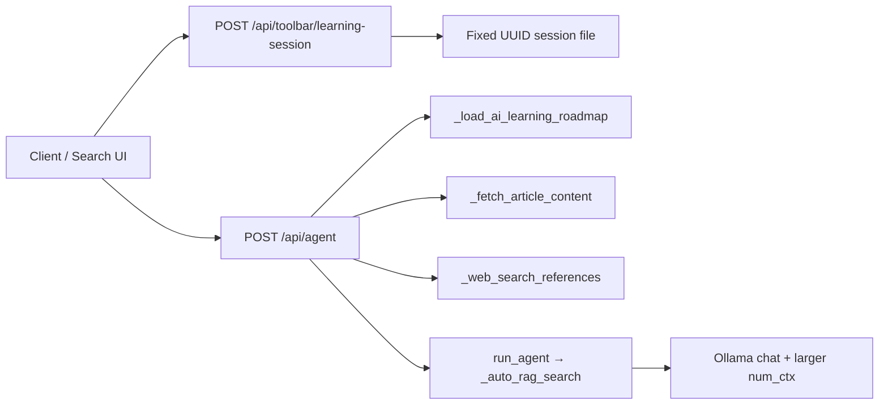

---
tags:
  - implementation
  - learning
  - ai-learning
category: learning
status: current
last-updated: 2026-04-28
---

# AI Learning Mode

> **Category**: LEARNING | **Source**: `scripts/rag/agent.py`

## Overview

AI Learning Mode is a fixed-session tutor that teaches RAG, LLM, and Hugging Face concepts to a Java developer, using a roadmap from `docs/ch8-learning-roadmap.md`, optional DuckDuckGo “learn more” links, and the same auto-RAG pipeline as the main agent so answers can draw on indexed books and docs. It exists to give structured, beginner-friendly lessons that generalize first and only then tie back to the Jarvis stack.

## Architecture & Design

### System Context

Learning sessions are first-class chat sessions with stable UUIDs. The Flask `/api/agent` handler detects `session_id == _LEARNING_SESSION_IDS["ai_learning"]`, injects `SYSTEM_PROMPT_AI_LEARNING`, and may resolve numbered topic picks, enrich prompts with roadmap/doc excerpts, and append web references.

### Data Flow

1. Client obtains or creates the persistent session via `api_learning_session` with `type: ai_learning` (`5138–5171`, `5405–5413`).
2. Optional: client loads structured roadmap topics via `GET /api/toolbar/learning-context?type=ai_learning` (`5416–5437`).
3. User sends a message to `/api/agent` with `session_id` set to `00000000-0000-0000-0000-000000000001`.
4. `api_agent` sets `learning_prompt = SYSTEM_PROMPT_AI_LEARNING` (`2034–2036`).
5. If the user message is a topic number (e.g. `16`, `topic 16`), `_resolve_topic_from_history` maps it to a title from the latest assistant list (`1466–1493`, `2288–2321`).
6. `_fetch_article_content` loads matching sections from the roadmap and, if needed, scans `docs/*.md` for the topic string (`1877–1902`).
7. For free-text queries (not “more topics”), `_web_search_references` may add DuckDuckGo links (`2322–2323`, `1677–1734`).
8. `run_agent` runs with `system_prompt_override`, `rag_query_override` when resolved, auto-RAG on the override/query, and an expanded `num_ctx` (8192 or 16384) when a system prompt override is active (`1147–1148`, `1173`).

### Key Design Decisions

- **Fixed UUID session** — Same session file for all AI Learning chats enables continuity and a single “classroom” without the client managing IDs (`5138–5143`, `5146–5171`).
- **Roadmap-first content** — `_fetch_article_content` prefers roadmap sections before scanning generic `docs/` markdown, keeping lessons aligned with `ch8-learning-roadmap.md` (`1877–1902`).
- **Web references without API keys** — HTML scraping of Duckduckgo via `httpx` and optional `BRIEFING_PROXY` matches other Jarvis fetchers (`1674–1734`).
- **Teaching prompt contract** — The system prompt enforces order: plain English → depth → Jarvis example (`1249–1277`).

## Implementation Details

### Core Components

| Piece | Role |
|--------|------|
| `SYSTEM_PROMPT_AI_LEARNING` | Defines tutor persona, lesson structure, and citation style (`1249–1277`). |
| `_LEARNING_SESSION_IDS["ai_learning"]` | Constant UUID `...0001` (`5138–5139`). |
| `_get_or_create_learning_session` / `api_learning_session` | Create or load session JSON under `CHAT_SESSIONS_DIR` (`5146–5171`, `5405–5413`). |
| `_load_ai_learning_roadmap` | Reads `docs/ch8-learning-roadmap.md` relative to repo (`5174–5184`). |
| `api_learning_context` | Parses roadmap into `{track, level, topic}` for UIs (`5416–5437`). |
| `_resolve_topic_from_history` | Numeric topic disambiguation from assistant numbered lists (`1466–1493`). |
| `_fetch_article_content` | Roadmap + `docs/` excerpt for AI learning (`1877–1902`). |
| `_web_search_references` | DuckDuckGo HTML results → markdown link list (`1677–1734`). |
| `api_agent` branch | Sets learning prompt, resolves topics, builds `effective_query`, appends `web_refs` (`2034–2036`, `2288–2338`, `2340–2351`). |
| `run_agent` | `num_ctx` 8192/16384 with `system_prompt_override`; RAG + optional tools (`1105–1173`). |

### API Surface

- `POST /api/toolbar/learning-session` — body `{"type": "ai_learning"}` (`5405–5413`).
- `GET /api/toolbar/learning-context?type=ai_learning` — roadmap-derived topic list (`5416–5437`).
- `POST /api/agent` — `session_id`, `query`, `history`; SSE stream (`2020–2351`).

### Configuration

- Roadmap path: `scripts/rag/agent.py` → `../../docs/ch8-learning-roadmap.md` (`5176–5178`).
- Web search proxy: `BRIEFING_PROXY` (default `socks5://localhost:10808`) (`1674`, `1718–1719`).
- Chat sessions: `CHAT_SESSIONS_DIR` from `scripts/config.py` (`REPORTS_ROOT/.chat-sessions`).
- Stack hints embedded in system prompt: Qdrant, MiniLM, BM25, reranker, Ollama models (`1276–1277`).

### Error Handling & Edge Cases

- Roadmap or file read failures yield empty strings; teaching may rely on RAG and model knowledge only (`5181–5184`, `1901–1902`).
- `_resolve_topic_from_history` skips bold list lines and requires topic-selection markers in assistant text (`1476–1490`).
- `_web_search_references` catches exceptions, logs, returns `""` (`1732–1734`).
- “More topics” for non–AI-learning channels uses `_fetch_fresh_topics`; AI learning uses web search when not asking for more topics (`2322–2332`).

## Code Walkthrough

- **System prompt and session binding** — `SYSTEM_PROMPT_AI_LEARNING` and `session_id` check in `api_agent` (`1249–1277`, `2034–2036`).
- **Roadmap load** — `_load_ai_learning_roadmap` normalizes path and reads markdown (`5174–5184`).
- **Topic by number** — Regex on user query, walk history newest-first, match numbered lines (`1466–1493`).
- **Article / doc excerpt** — Split roadmap by `##`, match `title_lower`, cap length 3000; fallback scan `docs/*.md` (`1877–1902`).
- **Web enrichment** — For resolved AI topics, `"{resolved} tutorial guide"`; for general queries, `"{query} AI machine learning tutorial"` (`2296–2297`, `2322–2323`).
- **Prompt assembly** — `effective_query` includes article when present; `web_refs` appended with instruction to copy URLs verbatim (`2334–2347`).
- **Context window** — When `system_prompt_override` is set, `num_ctx` is 8192 or 16384 based on estimated `ctx_len` (`1144–1148`).

## Improvement Ideas

### Short-term

- Surface roadmap progress in the UI (last completed topic) using session history or a small JSON progress file (mirroring AWS cert).
- Cache `_load_ai_learning_roadmap()` per process to avoid disk IO every request.

### Medium-term

- **Adaptive difficulty** — Pass a user level (beginner/intermediate) into `effective_query` or a slim system prompt suffix.
- **Quiz mode** — Reuse AWS-style structured quiz prompts for roadmap sections.

### Long-term

- **Spaced repetition** — Schedule topic reviews based on `_update_*`-style progress and timestamps.
- **Custom roadmaps** — Parameterize roadmap path (env or user profile) instead of a single `ch8-learning-roadmap.md`.

## References

- `scripts/rag/agent.py` — prompts, `_load_ai_learning_roadmap`, `_fetch_article_content`, `_web_search_references`, `api_agent`, learning APIs (`1249–1277`, `1466–1734`, `1877–1902`, `2020–2351`, `5138–5467`).
- `docs/ch8-learning-roadmap.md` — curriculum source.
- `scripts/config.py` — `REPORTS_ROOT`, `CHAT_SESSIONS_DIR`, paths.
