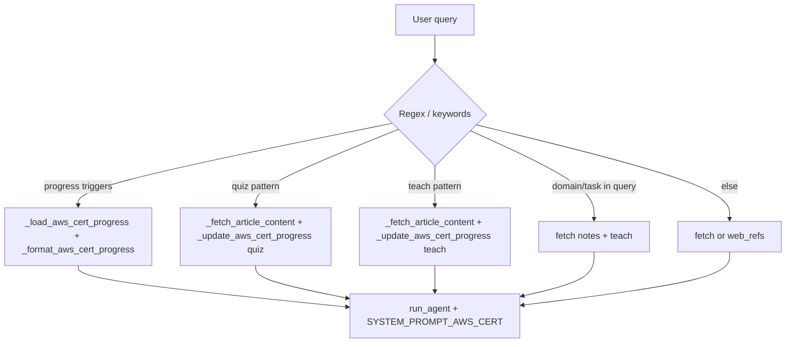

---
tags:
  - implementation
  - learning
  - aws-certification
category: learning
status: current
last-updated: 2026-04-28
---

# AWS AIF-C01 Certification Prep

> **Category**: LEARNING | **Source**: `scripts/rag/agent.py`

## Overview

The AWS cert channel prepares users for **AWS Certified AI Practitioner (AIF-C01)** using a dedicated system prompt (TEACH / QUIZ / PROGRESS modes), a markdown roadmap, per-domain study notes under `KNOWLEDGE_ROOT/notes/aws_ai_p1`, and a persisted progress file at `REPORTS_ROOT/.aws-cert-progress.json`. `api_agent` detects regex-shaped requests to rewrite `effective_query`, attach note excerpts, update progress, and optionally call `_web_search_references` when no local notes match.

## Architecture & Design

### System Context

Fixed session `...0004`. The roadmap mirrors exam domains; `_fetch_article_content` maps topics to note files via domain/task regex or keyword buckets.

### Data Flow

1. `session_id` triggers `SYSTEM_PROMPT_AWS_CERT` (`2043–2045`).
2. `query_lower` checked against `_progress_triggers` → progress summary injected into `effective_query` (`2057–2085`).
3. `_quiz_pattern` → `rag_query_override`, `_fetch_article_content`, `_update_aws_cert_progress(..., "quiz")`, QUIZ MODE instructions (`2086–2100`).
4. `_teach_pattern` → teach mode with reference material and `_update_aws_cert_progress(..., "teach")` (`2101–2114`).
5. Domain/task regex in generic query → teach with progress update (`2116–2128`).
6. Else → fetch article; if empty, `web_refs` from DuckDuckGo for `AWS AIF-C01 {query} certification` (`2129–2142`).
7. `_fetch_article_content` for AWS: roadmap section grep, then markdown files `01-ai-ml-fundamentals.md` … `05-security-compliance.md` with section splits and length caps (`1805–1876`).

### Key Design Decisions

- **Regex-first routing** — Avoids an extra LLM call for mode detection (`2060–2075`).
- **Keyword domain inference** — `_update_aws_cert_progress` maps free-text topics to domains 1–5 for scoring (`5233–5268`).
- **Weighted readiness** — `completion_pct` per domain and `overall_readiness` weighted by official exam percentages (`5284–5293`).
- **Notes path convention** — Files under `KNOWLEDGE_ROOT/notes/aws_ai_p1` align with domain numbers (`1833–1846`).

## Implementation Details

### Core Components

| Piece | Role |
|--------|------|
| `SYSTEM_PROMPT_AWS_CERT` | Domains, TEACH/QUIZ/PROGRESS behavior, exam facts (`1390–1447`). |
| `_load_aws_cert_roadmap` | Reads `docs/aws-cert-learning-roadmap.md` (`5187–5197`). |
| `_load_aws_cert_progress` / `_save_aws_cert_progress` | JSON at `_AWS_CERT_PROGRESS_PATH` (`5200–5225`). |
| `_update_aws_cert_progress` | Append taught/quizzed topics, quiz scores, recompute pct (`5228–5295`). |
| `_format_aws_cert_progress` | Markdown summary with bars and tips (`5298–5335`). |
| `_fetch_article_content` (AWS) | Roadmap slice + multi-file note sections (`1805–1876`). |
| `api_agent` `is_aws_cert` block | Full mode routing (`2057–2142`). |
| `api_learning_context` | Parsed domains/tasks + progress payload (`5444–5467`). |

### API Surface

- `POST /api/toolbar/learning-session` — `type: aws_cert` (`5408–5412`).
- `GET /api/toolbar/learning-context?type=aws_cert` — domains + `progress` (`5444–5467`).
- `POST /api/agent` — `session_id` `00000000-0000-0000-0000-000000000004`.

### Configuration

- Roadmap: `../../docs/aws-cert-learning-roadmap.md` (`5188–5195`).
- Progress file: `REPORTS_ROOT/.aws-cert-progress.json` (`5200`).
- Notes dir: `os.path.join(KNOWLEDGE_ROOT, "notes", "aws_ai_p1")` (`1833`).
- Default progress skeleton: domains 1–5 with empty lists and 0 readiness (`5209–5215`).
- Web search when notes missing: 3 results (`2140–2141`).

### Error Handling & Edge Cases

- Progress save failures logged; in-memory progress still returned from update (`5224–5225`).
- Domain match defaults to `"1"` if no keyword hit (`5264–5268`).
- Quiz scores recorded only when `total > 0` in append path (`5279–5283`) — `api_agent` calls `_update_aws_cert_progress(quiz_topic, "quiz")` without score; scoring likely happens on a later turn (not in this block).
- Note file read errors continue to next file (`1874–1875`).

## Code Walkthrough

- **Progress triggers** — Tuple of phrases → formatted markdown for LLM (`2060–2085`).
- **Quiz regex** — `_quiz_pattern` alternation for `quiz`/`test`/`practice` forms (`2062–2066`).
- **Teach regex** — `^teach (me )?(about )?(.+)$` (`2067–2069`).
- **Article assembly** — Domain file map `01`…`05`; task `Task n.m` section extraction (`1826–1871`).
- **Progress update** — Dedup `topics_taught` / `topics_quizzed`; `completion_pct = min(100, taught*8 + quizzed*12)` (`5273–5291`).
- **Formatted output** — Unicode bar, per-domain avg quiz, readiness tips (`5308–5334`).

## Improvement Ideas

### Short-term

- Record quiz scores when the user submits answers (parse assistant/user exchange or add dedicated API).
- Link `_format_aws_cert_progress` output to dashboard charts.

### Medium-term

- **Mock exams** — Timed multi-domain question sets drawn from weak domains (using `completion_pct`).
- **Weak area detection** — Use `quiz_scores` trends to suggest tasks.

### Long-term

- **Multi-cert** — Generalize `_AWS_CERT_PROGRESS_PATH` and prompts by cert code.
- **Study scheduling** — Spaced reminders based on `last_activity`.
- **Confidence scoring** — Per-topic self-rating stored alongside teach events.

## References

- `scripts/rag/agent.py` — `SYSTEM_PROMPT_AWS_CERT`, AWS branch of `_fetch_article_content`, `_load/_save/_update/_format_aws_cert_progress`, `api_agent` AWS block, `api_learning_context` (`1390–1447`, `1805–1876`, `2057–2142`, `5187–5335`, `5444–5467`).
- `docs/aws-cert-learning-roadmap.md` — curriculum.
- `scripts/config.py` — `REPORTS_ROOT`, `KNOWLEDGE_ROOT`.
