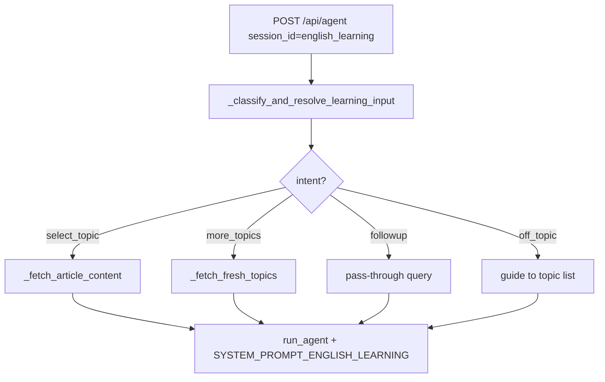

---
tags:
  - implementation
  - learning
  - tech-english
category: learning
status: current
last-updated: 2026-04-28
---

# Tech English Learning

> **Category**: LEARNING | **Source**: `scripts/rag/agent.py`

## Overview

Tech English Learning helps a non-native Java developer practice professional English using **AI/tech news** as the corpus. The backend classifies whether the user is picking a topic, asking for more topics, following up, or off-topic; resolves titles from briefing JSON or the AI KB; injects full article text into the prompt; and drives the model with `SYSTEM_PROMPT_ENGLISH_LEARNING` to produce a long, sectioned analysis (summary, vocabulary, patterns, native-style explanation, grammar, discussion questions).

## Architecture & Design

### System Context

This channel uses fixed session UUID `...0002`. It shares classification helpers with Casual English but loads topics from `_load_recent_ai_news_titles()` (briefing JSON under `REPORTS_ROOT` or `_load_ai_kb()`).

### Data Flow

1. `api_agent` sets `learning_prompt = SYSTEM_PROMPT_ENGLISH_LEARNING` when `session_id` matches (`2037–2039`).
2. `_classify_and_resolve_learning_input` runs (`2145–2148`):
   - Numeric-only queries → `_resolve_topic_from_history` (`1595–1597`).
   - Phrases matching `_wants_more_topics` → `more_topics` (`1598–1599`).
   - Heuristic name match via `_resolve_english_topic_by_name` (strip command prefixes, match against AI news titles or KB items) (`1610–1612`, `1560–1586`).
   - Otherwise → `_classify_learning_channel_intent` (fast Ollama model, JSON intent + topic) (`1614–1627`).
3. On `select_topic` with `resolved_topic`, `_fetch_article_content` scans last 7 days of `briefing-data-filtered.json` / `briefing-data.json`, then falls back to `_load_ai_kb()` (`1943–2016`).
4. `effective_query` instructs the model to output all six mandated sections at 500+ words (`2150–2167`).
5. `run_agent` uses `rag_query_override = eng_topic` for retrieval and enlarged `num_ctx` with system override (`2151`, `1147–1148`).

### Key Design Decisions

- **LLM intent classification** reduces brittle keyword coverage for messy user phrasing (`1512–1557`).
- **Dual source for titles** — KB first in `_load_recent_ai_news_titles`, then briefing JSON (`5338–5372`).
- **Rich article payload** — Summary, body (truncated), commentary, predictions, key points when present (`1989–2016`).
- **Off-topic path** returns early SSE from a nested `generate()` without `rag_query_override` (`2194–2214`).

## Implementation Details

### Core Components

| Piece | Role |
|--------|------|
| `SYSTEM_PROMPT_ENGLISH_LEARNING` | Six-section output contract, 500+ words, grammar help on free text (`1279–1331`). |
| `_classify_learning_channel_intent` | Ollama `OLLAMA_MODEL_FAST`, `num_ctx` 1024, parses JSON from model output (`1512–1557`). |
| `_classify_and_resolve_learning_input` | Orchestrates heuristics + classifier for tech vs casual (`1589–1629`). |
| `_resolve_english_topic_by_name` | Prefix stripping and fuzzy match against news titles + KB (`1560–1586`). |
| `_load_recent_ai_news_titles` | Up to 50 titles from KB or briefing files (`5338–5372`). |
| `_fetch_fresh_topics` | Excludes titles already shown in assistant numbered lists (`1650–1671`). |
| `_fetch_article_content` (english branch) | Full article assembly for matched title (`1943–2016`). |
| `api_agent` | English branch and special-case streaming for off-topic (`2145–2214`). |
| `api_learning_context` | Exposes `news_titles` for UIs (`5438–5440`). |

### API Surface

- `POST /api/toolbar/learning-session` with `type: english_learning` (`5408–5412`).
- `GET /api/toolbar/learning-context?type=english_learning` (`5438–5440`).
- `POST /api/agent` with `session_id` `00000000-0000-0000-0000-000000000002`.

### Configuration

- Briefing JSON locations: `REPORTS_ROOT/{date}/briefing-data-filtered.json` or `briefing-data.json` (`5350–5355`, `1949–1953`).
- Fast model: `OLLAMA_MODEL_FAST` + `OLLAMA_HOST` for classifier (`1520–1523`).
- English channel description string passed to classifier (`1604`).

### Error Handling & Edge Cases

- Classifier exceptions → `{"intent": "off_topic", "topic": ""}` (`1555–1557`).
- Missing article content → prompt still demands six sections using RAG + model knowledge (`2169–2177`).
- `_fetch_article_content` returns `""` if no match (`2017`).
- Follow-up intent (`followup`) does not rewrite `effective_query` in the English branch (`2192–2193`) — the base user query goes through with history and learning system prompt.

## Code Walkthrough

- **Prompt** — `SYSTEM_PROMPT_ENGLISH_LEARNING` defines sections 1–6 and output rules (`1279–1331`).
- **Intent JSON** — `_classify_learning_channel_intent` builds topic list sample (first 20) in system message (`1518–1535`).
- **Resolution** — `_classify_and_resolve_learning_input` switches data source with `is_tech` (`1601–1608`).
- **Article fetch** — Nested loops over date offsets and `per_source_data` / `sections` (`1946–1978`), then KB fallback (`1979–1988`).
- **Main teach prompt** — `effective_query` embeds full article and enumerates section requirements (`2154–2167`).
- **Fresh topics** — Regex scans assistant messages for `^\s*\d{1,2}\.\s+` lines to build `already_shown` (`1652–1658`, `1661–1665`).

## Improvement Ideas

### Short-term

- Persist “last selected topic” in session metadata for clearer follow-up routing without relying on history alone.
- Log classifier raw output when JSON parse fails to tune prompts.

### Medium-term

- **Vocabulary tracking** — Store extracted terms from responses or a structured JSON block in `.learning-notes.json` with tags.
- **Level assessment** — Short placement quiz branch in `api_agent` with a dedicated system prompt.

### Long-term

- **Pronunciation / writing** — Integrate TTS/STT or external APIs; add writing prompts with rubric scoring.
- **Cultural context expansion** — Region-specific business English variants as a prompt modifier.

## References

- `scripts/rag/agent.py` — `SYSTEM_PROMPT_ENGLISH_LEARNING`, `_classify_*`, `_fetch_article_content` (english), `_load_recent_ai_news_titles`, `api_agent`, `api_learning_context` (`1279–1331`, `1512–1671`, `1943–2017`, `2145–2214`, `5338–5372`, `5438–5440`).
