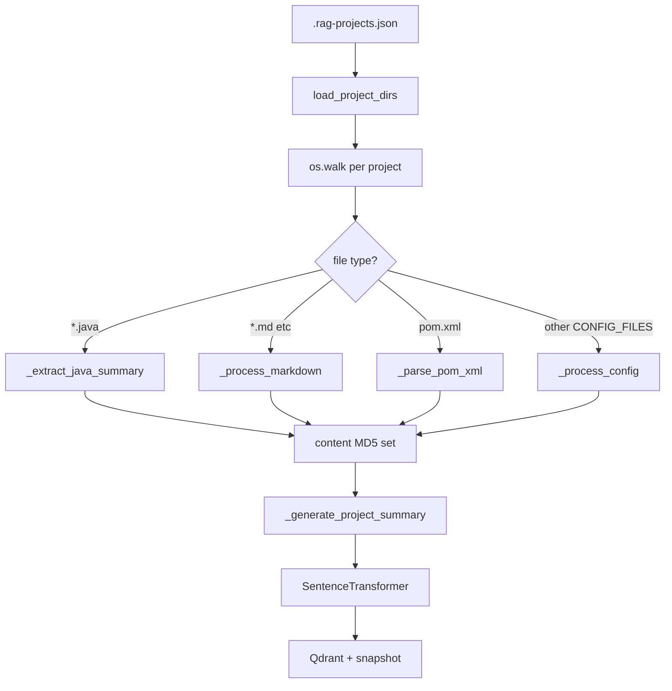

---
tags:
  - implementation
  - medavis
  - codebase-indexing
category: medavis
status: current
last-updated: 2026-04-28
---

# Codebase Indexing

> **Category**: MEDAVIS | **Source**: `scripts/rag/index_codebase.py`

## Overview

The codebase indexer walks projects declared in `.rag-projects.json`, extracts searchable chunks from Java sources, Markdown/docs, and selected config files, deduplicates identical file contents across projects via MD5 hashes, embeds with `all-MiniLM-L6-v2`, and upserts into the shared `ai_briefings` collection with `source` payloads like `project:{name}`. A synthesized **project summary** chunk is prepended per project from aggregated metadata.

## Architecture & Design

### System Context



### Data Flow

1. `load_project_dirs` merges `base_dirs` (each subfolder = project) and `explicit_projects`.
2. `main` optionally replaces list with a single CLI path argument.
3. For each project, `index_project`:
   - Deletes existing points where `source == project:{name}` via scroll + delete.
   - Walks files; skips `SKIP_DIRS`.
   - **Java**: read if length ≥ 50; `_content_hash`; skip if hash seen; `_extract_java_summary`.
   - **Docs/config**: length ≥ 20; same dedup; Markdown → `_process_markdown`; `pom.xml` → `_parse_pom_xml`; else `_process_config`.
4. Inserts `_generate_project_summary` at index 0 when chunks exist.
5. Batch `model.encode`, build payloads with `parent_title=project_name`, `item_type` per chunk, UUID4 point ids, upsert in batches of 100.
6. `_save_snapshot` after all projects if any chunks indexed.

### Key Design Decisions

- **Signature-oriented Java chunks**: Whole-file regex extraction (not full AST) keeps chunks small and robust to syntax noise; REST/Javadoc-gated method chunks reduce noise.
- **Shared dedup set across projects**: `seen_hashes` passed through `main` so duplicate vendored files index once.
- **Destructive refresh per project**: Delete-by-filter before re-index ensures stale chunks removed.

## Implementation Details

### Core Components

| Symbol | Role |
|--------|------|
| `load_project_dirs` | Read `.rag-projects.json` |
| `_extract_java_summary` | Package, imports, class signature, AI/notable imports, method list; optional per-method `rest_endpoint` / `code_doc` chunks |
| `_process_markdown` | Heading-split sections + `_chunk_text`; README/changelog `item_type` |
| `_process_config` | Feature regex header for YAML/properties; `config_analysis` vs `code_doc` |
| `_parse_pom_xml` | Identity chunk, dependency chunks with technology buckets, dependencyManagement |
| `_generate_project_summary` | Aggregates identity, file counts, classes, REST, AI, tech stack |
| `index_project` | Delete old, walk, dedup, summarize, embed, upsert |

### API Surface

- **CLI**: `python index_codebase.py` or `python index_codebase.py <project-path>`.

### Configuration

- `PROJECT_DIRS_PATH`, `SNAPSHOT_PATH` from `scripts/config.py`.
- `COLLECTION = "ai_briefings"`, `VECTOR_SIZE = 384`, `MAX_CHUNK_CHARS = 600`.
- `CONFIG_FILES`, `JAVA_EXTENSIONS`, `DOC_EXTENSIONS`, `SKIP_DIRS` as module constants.

### Error Handling & Edge Cases

- Delete filter failure: warning print, continues.
- Per-file errors in walk: bare `except Exception: continue`.
- `ET.ParseError` on POM: fallback `_process_config`.
- Empty project: message + optional deduped-only note.

## Code Walkthrough

- Config loading: ```55:114:scripts/rag/index_codebase.py
def load_project_dirs() -> list[dict]:
    """Load project directories from .rag-projects.json.
```

- Content-hash dedup: ```664:676:scripts/rag/index_codebase.py
def index_project(
    project_name: str,
    project_path: str,
    model,
    client,
    seen_hashes: set[str] | None = None,
) -> tuple[int, int]:
    ...
    If a file's content hash is already in the set, it is skipped.
```

- Java class + method extraction (REST detection): ```231:371:scripts/rag/index_codebase.py
def _extract_java_summary(content: str, filepath: str) -> list[dict]:
```

- Project summary generation: ```593:657:scripts/rag/index_codebase.py
def _generate_project_summary(
    project_name: str,
    project_path: str,
    all_chunks: list[dict],
) -> dict:
```

- Payload shape for Qdrant: ```779:797:scripts/rag/index_codebase.py
            payload={
                "date": today,
                "source": f"project:{project_name}",
                "title": chunk["title"],
                "item_type": chunk.get("item_type", "code_doc"),
                ...
            },
```

## Improvement Ideas

### Short-term

- Incremental indexing using file mtime + stored manifest (avoid full delete/embed).

### Medium-term

- AST-based Java chunking (Tree-sitter) for methods/bodies.
- Cross-project links in payloads (same `groupId:artifactId` across repos).

### Long-term

- Code-aware embeddings (e.g. dedicated code models) for API-heavy repos.
- Graph integration: align POM identity chunks with `project_graph.json`.

## References

- `scripts/rag/index_codebase.py`
- `scripts/config.py` — `PROJECT_DIRS_PATH`, `SNAPSHOT_PATH`
- `scripts/rag/agent.py` — `_auto_rag_search` filters on codebase `item_type`s; `SYSTEM_PROMPT_PROJECT_ADDON`
