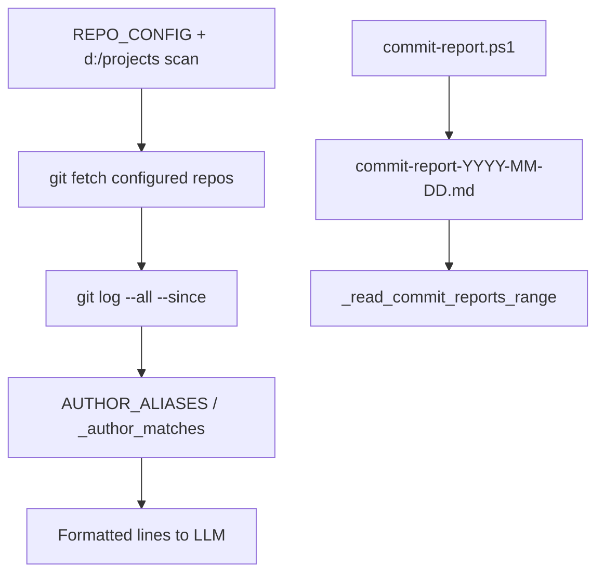

---
tags:
  - implementation
  - medavis
  - commit-summary
category: medavis
status: current
last-updated: 2026-04-28
---

# Commit Summary

> **Category**: MEDAVIS | **Source**: `scripts/rag/agent.py` (`tool_commit_summary`, `REPO_CONFIG`, `AUTHOR_ALIASES`), `scripts/tools/commit-report.ps1`, daily fetch worker in `agent.py`

## Overview

`tool_commit_summary` gathers recent commits across a configured repo list plus auto-discovered git folders under `d:/projects`, optionally `git fetch` for configured paths, filters by author aliases, and returns a plain-text summary for the LLM. The daily pipeline prefers `commit-report.ps1`, which produces a Markdown report with **Bitbucket Server-style commit links** derived from `remote.origin.url`. The agent auto-invokes commit aggregation when user messages match git-related keywords (72-hour window for auto path).

## Architecture & Design

### System Context



### Data Flow

**Live tool (`tool_commit_summary`):**

1. Build `since_str` from `hours` (default 24) or `since_date`/`until_date` ISO boundaries.
2. Start from `REPO_CONFIG` copy; add any `d:/projects/*` with `.git` not already in config.
3. For repos whose path is in `configured_paths`, run `git fetch --all --prune` (30s timeout), count successes.
4. For each existing repo path, `git log --all --since=...` with format `%h|%an|%s|%ci`; optional `--until`.
5. Deduplicate by short hash per repo; filter authors via `_author_matches` (exact + `AUTHOR_ALIASES` values).
6. Return scan stats + up to 200 lines: `[RepoName] hash by Author: subject (timestamp)`.

**Daily pipeline (`commit_report` step):**

- Runs `scripts/tools/commit-report.ps1` with `-Hours 48 -OutputDir REPORTS_ROOT` (300s timeout).
- Parses stdout between `---DATA_START---` / `---DATA_END---` for job summary; if script missing, falls back to `tool_commit_summary(hours=48)`.

**PowerShell report (`commit-report.ps1`):**

- Iterates a hardcoded `$repos` list (mirrors `REPO_CONFIG` coverage), `git fetch`, `git log` with full hash and stats (`git show --shortstat`).
- Builds Bitbucket URL when `remote.origin.url` matches `scm/([^/]+)/([^/.]+)` → `https://git.medavis.local/projects/{PROJECT}/repos/{slug}/commits/{hash}`.
- Writes `commit-report-{date}.md` under `{OutputDir}/{today}/`.

### Key Design Decisions

- **Python tool stays simple**: No link enrichment in `tool_commit_summary`; rich report is the PS1 + markdown artifact.
- **Author aliasing**: Central dict maps canonical names to git author strings (handles `rong yin` vs `rong.yin`, umlauts, etc.).
- **Auto-injection**: Keyword match triggers 72h window (`_auto_tool_commit`) to surface recent activity without explicit tool call.

## Implementation Details

### Core Components

| Symbol | Role |
|--------|------|
| `REPO_CONFIG` | List of `{name, path}` for MEDAVIS repos |
| `AUTHOR_ALIASES` | Lowercase key → list of git author strings |
| `_author_matches` | Filter `git log` lines by optional `authors` list |
| `tool_commit_summary` | Fetch, log, format |
| `_auto_tool_commit` | `tool_commit_summary(hours=72)` |
| `_read_commit_reports_range` | Trend analysis: reads `commit-report-*.md` across date range |

### API Surface

- **Agent tool**: `commit_summary` — `hours`, `authors`, `since_date`, `until_date`.
- **Shell**: `commit-report.ps1` parameters `-Hours`, `-OutputDir`.

### Configuration

- Repo paths in `agent.py` `REPO_CONFIG` (local dev paths); PowerShell duplicates list for report generation.
- `REPORTS_ROOT` for daily output and trend readers.

### Error Handling & Edge Cases

- Missing repo directory: skipped.
- Fetch/log failures: per-repo `except Exception: continue`.
- No commits after filter: returns informative empty message with period/author info.
- Auto parallel task: failures may be swallowed in `run_agent` futures handler like Jira path.

## Code Walkthrough

- Repo list and fetch: ```404:429:scripts/rag/agent.py
    repos = list(REPO_CONFIG)
    known_paths = {os.path.normpath(r["path"]).lower() for r in repos}
    projects_root = "d:/projects"
    if os.path.isdir(projects_root):
        for entry in os.listdir(projects_root):
            ...
                    repos.append({"name": entry, "path": full})
    ...
        if os.path.normpath(repo_path).lower() in configured_paths:
            try:
                subprocess.run(
                    ["git", "-C", repo_path, "fetch", "--all", "--prune"],
```

- Author aliases: ```363:388:scripts/rag/agent.py
AUTHOR_ALIASES = {
    "rong yin": ["rong yin", "rong.yin"],
    ...
}
```

- Git log and formatting: ```431:466:scripts/rag/agent.py
            git_cmd = ["git", "-C", repo_path, "log", "--all",
                       f"--since={since_str}", "--format=%h|%an|%s|%ci"]
            ...
                        all_commits.append(
                            f"[{repo['name']}] {parts[0]} by {parts[1]}: {parts[2]} ({parts[3]})"
                        )
```

- Bitbucket URL in PowerShell: ```84:90:scripts/tools/commit-report.ps1
            $remoteUrl = git config --get remote.origin.url 2>$null
            $commitUrl = ""
            if ($remoteUrl -match 'scm/([^/]+)/([^/.]+)') {
                $project = $matches[1].ToUpper()
                $repoSlug = $matches[2]
                $commitUrl = "https://git.medavis.local/projects/$project/repos/$repoSlug/commits/$hash"
            }
```

- Daily fetch step: ```4446:4467:scripts/rag/agent.py
        if _should_run("commit_report"):
            job["step"] = "Running commit report (48h)..."
            try:
                commit_script = os.path.join(scripts_dir, "tools", "commit-report.ps1")
                if os.path.exists(commit_script):
                    rc = sp.run(
                        ["powershell", "-ExecutionPolicy", "Bypass", "-File", commit_script,
                         "-Hours", "48", "-OutputDir", REPORTS_ROOT],
```

- Auto keyword injection: ```1063:1076:scripts/rag/agent.py
    _commit_kw = ("commit", "git log", "pushed", "merged", "code change", "repository activity")
    ...
        if need_commits:
            yield {"type": "thinking", "tool": "commit_summary (auto)", "args": {"hours": 72}}
            futures["commits"] = pool.submit(_auto_tool_commit)
```

## Improvement Ideas

### Short-term

- Single source of truth for repo list (generate PS1 from `REPO_CONFIG` or shared JSON).
- Add optional commit URLs to `tool_commit_summary` using the same regex as PS1.

### Medium-term

- Bitbucket Server REST for PRs linked to commits; code review stats in reports.

### Long-term

- Commit classification (feature/fix/chore) via LLM or conventional commits.
- Team velocity metrics from aggregated reports + Jira linkage.

## References

- `scripts/rag/agent.py` — `tool_commit_summary`, `REPO_CONFIG`, `AUTHOR_ALIASES`, `run_agent`, `_daily_fetch_worker`, `_read_commit_reports_range`
- `scripts/tools/commit-report.ps1`
- `scripts/config.py` — `REPORTS_ROOT`
