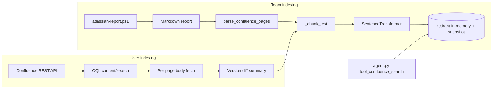

---
tags:
  - implementation
  - medavis
  - confluence
category: medavis
status: current
last-updated: 2026-04-28
---

# Confluence Search & Indexing

> **Category**: MEDAVIS | **Source**: `scripts/rag/index_confluence.py`, `scripts/rag/index_confluence_user.py`, `scripts/rag/agent.py` (`tool_confluence_search`)

## Overview

Team Confluence updates are pulled into the RAG store via a PowerShell daily report, parsed into wiki page records, chunked, and embedded with the same model used elsewhere. A separate path indexes pages authored by specific users through the Confluence REST API (CQL or V2 scan), optionally computing per-page change summaries from historical versions. The agent exposes `confluence_search` to query indexed wiki chunks with optional space filtering.

## Architecture & Design

### System Context

Indexing scripts and the Flask agent share the `ai_briefings` Qdrant collection and persist vectors to `SNAPSHOT_PATH` (`.rag-store.json` under `REPORTS_ROOT`). Team flow is offline-report-driven; user flow is API-driven.



### Data Flow

**Team (`index_confluence.py`):**

1. `run_confluence_report` runs PowerShell on `JIRA_REPORT_SCRIPT` (`atlassian-report.ps1` via `config.JIRA_REPORT_SCRIPT`) with `-ReportDir`, 120s timeout.
2. Resolves report path: `atlassian-daily-report-YYYYMMDD.md` under the date folder, or latest matching file.
3. `parse_confluence_pages` extracts the `## Team Confluence Updates` section and splits on `### [` blocks; regex pulls title, URL, space, updated, author, summary, key topics.
4. `index_confluence_pages` chunks `text`, embeds with `all-MiniLM-L6-v2`, upserts with deterministic UUID5 ids `confluence:{parent_title}:{i}`.
5. `_save_snapshot` writes all points to `SNAPSHOT_PATH`.

**User (`index_confluence_user.py`):**

1. Resolves Atlassian account via `KNOWN_ACCOUNTS` or `_search_user` (Jira user search API).
2. Default path: `fetch_user_pages_cql` builds CQL `creator = "{accountId}" AND type = "page"` plus optional `lastModified` range; calls `/wiki/rest/api/content/search` with `expand=space,version`, paginates (batch 50, `time.sleep` throttling).
3. For each page, fetches `body.storage`, strips HTML, extracts headings; if `version_number > 1`, fetches previous version via `status=historical&version={prev}` and `_compute_change_summary` (difflib unified diff on lines).
4. `index_pages` chunks, embeds, UUID5 namespace `confluence-user:{parent_title}:{i}`, saves snapshot.

**Search (`tool_confluence_search`):**

1. Builds Qdrant filter: `item_type == wiki_page`, optional `space` exact match.
2. Delegates to `_vector_search` (cosine on 384-d vectors, optional BM25 RRF merge).

### Key Design Decisions

- **Shared embedding model**: `all-MiniLM-L6-v2` (384 dims), offline HF hub, aligns with agent RAG (`VECTOR_SIZE = 384`).
- **In-memory Qdrant + JSON snapshot**: No server dependency; snapshot is the durable store reloaded on startup/index runs.
- **Team path avoids API quota during bulk index**: Report markdown is the contract between PowerShell and Python.
- **User path uses CQL** for targeted author queries instead of only scanning all V2 pages (`fetch_user_pages` exists but `main()` uses CQL by default).

## Implementation Details

### Core Components

| Area | Symbol | Role |
|------|--------|------|
| Team report | `run_confluence_report`, `parse_confluence_pages` | Subprocess + regex parse |
| Team index | `index_confluence_pages` | Chunk, embed, upsert |
| User fetch | `fetch_user_pages_cql`, `_fetch_previous_version_text` | API + version diff |
| Diff | `_compute_change_summary` | `difflib.unified_diff`, line previews capped |
| Chunking | `_chunk_text` | Paragraph merge, `max_chars` 500 (team/user), overlap 100 |
| Search | `tool_confluence_search` | Filtered vector search |

### API Surface

- **CLI**: `python index_confluence.py` (full), `--report-only`, `--index-only <md>`; `python index_confluence_user.py "<name>" [--limit N] [--date-from/--date-to] [--report-json]`.
- **Agent tool**: `confluence_search` — parameters `query`, optional `space` (payload field name `space`; values come from parsed report or API space name).

### Configuration

- **Env**: `ATLASSIAN_SITE`, `ATLASSIAN_EMAIL`, `ATLASSIAN_API_TOKEN` (required for user indexer).
- **Paths**: `REPORTS_ROOT`, `SNAPSHOT_PATH`, `JIRA_REPORT_SCRIPT` / `JIRA_SKILL_DIR` from `scripts/config.py`.
- **Collection**: `COLLECTION = "ai_briefings"`.

### Error Handling & Edge Cases

- Report subprocess non-zero: warning + stderr snippet; may still find a report file.
- Missing Confluence section: `parse_confluence_pages` returns `[]`.
- CQL non-200: loop breaks with message; body fetch failures: empty HTML, logged, continues.
- `_fetch_previous_version_text`: exceptions → `""`; first version skips diff.
- Windows console: `_safe_print` replaces non-ASCII for stdout.

## Code Walkthrough

- Team subprocess and report resolution: ```118:149:scripts/rag/index_confluence.py
def run_confluence_report(report_dir: str) -> str:
    ...
    result = subprocess.run(
        ["powershell", "-ExecutionPolicy", "Bypass", "-File", REPORT_SCRIPT,
         "-ReportDir", report_dir],
        ...
        timeout=120,
    )
```

- Report parsing for `### [title](url)` blocks: ```152:228:scripts/rag/index_confluence.py
def parse_confluence_pages(report_path: str) -> List[dict]:
    ...
    page_blocks = re.split(r'\n(?=### \[)', confluence_text)
```

- User CQL and pagination: ```227:296:scripts/rag/index_confluence_user.py
def fetch_user_pages_cql(display_name: str, limit: int = 200,
                         date_from: str = "", date_to: str = "") -> List[dict]:
    ...
    cql_parts = [f'creator = "{account_id}"', 'type = "page"']
```

- Change summary from difflib: ```172:202:scripts/rag/index_confluence_user.py
def _compute_change_summary(current_text: str, previous_text: str) -> str:
    ...
    diff = list(difflib.unified_diff(prev_lines, curr_lines, n=0))
```

- Agent wiki search filters: ```323:338:scripts/rag/agent.py
def tool_confluence_search(query: str, space: str = "") -> str:
    ...
    conditions = [FieldCondition(key="item_type", match=MatchValue(value="wiki_page"))]
    if space:
        conditions.append(FieldCondition(key="space", match=MatchValue(value=space)))
```

## Improvement Ideas

### Short-term

- Align tool parameter docs with stored `space` values (name vs key) or index both fields.
- Retry/backoff for transient Confluence API errors; structured logging instead of print.

### Medium-term

- Incremental index using `lastModified` and point upsert/delete by page id.
- Page-level HTTP caching (ETag) to skip unchanged bodies.

### Long-term

- Real-time or webhook-driven sync from Confluence.
- Attachment and inline image text extraction pipeline.

## References

- `scripts/rag/index_confluence.py`
- `scripts/rag/index_confluence_user.py`
- `scripts/rag/agent.py` — `tool_confluence_search`, `_auto_rag_search` (wiki keyword branch)
- `scripts/config.py` — `SNAPSHOT_PATH`, `JIRA_REPORT_SCRIPT`, `REPORTS_ROOT`
