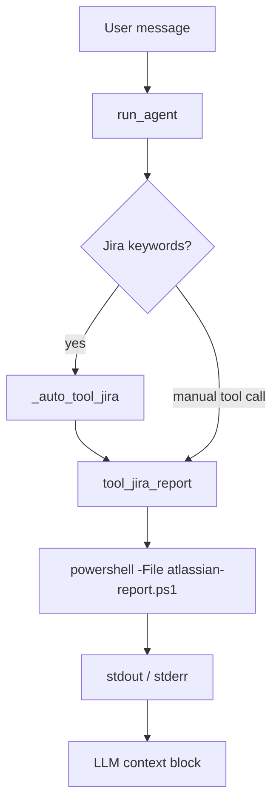

---
tags:
  - implementation
  - medavis
  - jira
category: medavis
status: current
last-updated: 2026-04-28
---

# JIRA Report

> **Category**: MEDAVIS | **Source**: `scripts/rag/agent.py` (`tool_jira_report`), `scripts/config.py`, `scripts/tools/atlassian-report.ps1` (path via `JIRA_REPORT_SCRIPT`)

## Overview

The agent can run the same PowerShell script used for MEDAVIS Atlassian reporting to fetch a fresh Jira/Confluence daily summary into a date-stamped report directory. `tool_jira_report` captures stdout (and truncated stderr on failure) for injection into the LLM context. The daily briefing pipeline also runs this step as `jira_daily`. Keyword-based auto-routing runs the report in parallel with RAG when the user message looks Jira-related.

## Architecture & Design

### System Context



### Data Flow

1. **Default directory**: `report_dir = os.path.join(REPORTS_ROOT, datetime.now().strftime("%Y-%m-%d"))` when empty.
2. **Script path**: `JIRA_SCRIPT = JIRA_REPORT_SCRIPT` from config (default `scripts/tools/atlassian-report.ps1` under `JIRA_SKILL_DIR`).
3. **Execution**: `subprocess.run` with `timeout=TOOL_TIMEOUT_SECONDS` (120), captures text output.
4. **Response**: Returns up to 2000 chars of stdout; appends truncated stderr if return code non-zero.
5. **Auto-injection**: In `run_agent`, if `q_lower` matches `_jira_kw`, a thread pool runs `_auto_tool_jira()` which calls `tool_jira_report()` with no args; result is appended under `--- Jira report ---` (first 1500 chars in the context block).

### Key Design Decisions

- **PowerShell as source of truth**: Complex Jira/JQL and formatting stay in the existing script; Python remains a thin wrapper.
- **Same script as Confluence team indexer**: `index_confluence.py` uses `JIRA_REPORT_SCRIPT` for the report file consumed by wiki indexing.
- **Truncation**: Protects context window and latency; users needing full report should open the generated `.md` under `REPORTS_ROOT`.

## Implementation Details

### Core Components

| Symbol | Role |
|--------|------|
| `tool_jira_report` | Validates script exists, runs PowerShell, formats result |
| `_auto_tool_jira` | Wrapper for parallel auto-fetch |
| `run_agent` | Keyword detection, `ThreadPoolExecutor`, merges Jira text into `auto_tool_context` |
| `_daily_fetch_worker` | Pipeline step `jira_daily`: runs script with `output_dir`, falls back to reading `atlassian-daily-report-{YYYYMMDD}.md` if stdout empty |

### API Surface

- **Ollama tool schema**: `jira_report` with optional `report_dir` (see `TOOL_SCHEMAS` in `agent.py`).
- **HTTP**: Daily fetch API triggers background job that includes `jira_daily` step.

### Configuration

- `JIRA_REPORT_SCRIPT` → `os.path.join(JIRA_SKILL_DIR, "atlassian-report.ps1")`.
- `REPORTS_ROOT` (env `JARVIS_REPORTS_ROOT`): report output root.
- `TOOL_TIMEOUT_SECONDS = 120` in `agent.py`; indexer uses 120s in `index_confluence.py` for the same script.

### Error Handling & Edge Cases

- Missing script file: returns error string with path.
- `TimeoutExpired`: `"Error: Jira report timed out."`
- Generic exceptions: `"Error running Jira report: {e}"`
- Empty stdout: placeholder message that run completed with no output.
- Auto-tool thread: exceptions swallowed in `future.result` loop (`except Exception: pass`) so RAG can still proceed.

## Code Walkthrough

- Tool implementation: ```341:360:scripts/rag/agent.py
def tool_jira_report(report_dir: str = "") -> str:
    """Run the Jira/Confluence daily report and return the summary."""
    if not report_dir:
        report_dir = os.path.join(REPORTS_ROOT, datetime.now().strftime("%Y-%m-%d"))
    if not os.path.isfile(JIRA_SCRIPT):
        return f"Error: Jira report script not found at {JIRA_SCRIPT}"
    try:
        result = subprocess.run(
            ["powershell", "-ExecutionPolicy", "Bypass", "-File", JIRA_SCRIPT,
             "-ReportDir", report_dir],
            capture_output=True, text=True, timeout=TOOL_TIMEOUT_SECONDS,
        )
```

- Auto-routing keywords and parallel execution: ```1063:1098:scripts/rag/agent.py
    _commit_kw = ("commit", "git log", "pushed", "merged", "code change", "repository activity")
    _jira_kw = ("jira", "ticket", "sprint", "backlog", "open issue", "task status")
    need_commits = any(kw in q_lower for kw in _commit_kw)
    need_jira = any(kw in q_lower for kw in _jira_kw)
    ...
        if need_jira:
            yield {"type": "thinking", "tool": "jira_report (auto)", "args": {}}
            futures["jira"] = pool.submit(_auto_tool_jira)
```

- Daily pipeline step: ```4469:4488:scripts/rag/agent.py
        if _should_run("jira_daily"):
            job["step"] = "Running Jira daily report..."
            try:
                if os.path.exists(JIRA_SCRIPT):
                    r3 = sp.run(
                        ["powershell", "-ExecutionPolicy", "Bypass", "-File", JIRA_SCRIPT,
                         "-ReportDir", output_dir],
                        capture_output=True, text=False, timeout=120
                    )
```

- Toolbar / status: `missing_steps` includes `jira_daily` when `atlassian-daily-report-{date}.md` is absent for that date folder (see `api_briefing_status` around lines 5032–5092).

## Improvement Ideas

### Short-term

- Surface stderr/exit code to the UI when auto-Jira fails silently in the thread pool.
- Unify timeout constants between agent and indexer.

### Medium-term

- Optional Jira REST/JQL path in Python for structured fields (priority, assignee, sprint) without parsing markdown.
- Ticket detail enrichment: expand keys from summary into descriptions and links.

### Long-term

- Sprint analytics (velocity, carryover) from Jira APIs.
- Cached report with TTL to avoid redundant script runs per session.

## References

- `scripts/rag/agent.py` — `tool_jira_report`, `_auto_tool_jira`, `run_agent`, `_daily_fetch_worker`
- `scripts/config.py` — `JIRA_REPORT_SCRIPT`, `REPORTS_ROOT`
- `scripts/rag/index_confluence.py` — `run_confluence_report` (same script, team Confluence section)
