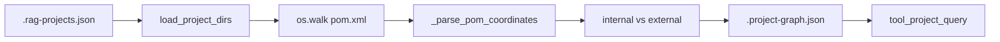

---
tags:
  - implementation
  - medavis
  - project-graph
category: medavis
status: current
last-updated: 2026-04-28
---

# Project Dependency Graph

> **Category**: MEDAVIS | **Source**: `scripts/rag/project_graph.py`, `scripts/rag/agent.py` (`tool_project_query`)

## Overview

`project_graph.py` walks configured project directories (same discovery as codebase indexing), parses every `pom.xml` with `xml.etree.ElementTree`, extracts Maven coordinates and dependencies, classifies which dependencies point at other indexed projects, and writes a JSON graph to `PROJECT_GRAPH_PATH`. The agent’s `tool_project_query` loads that JSON and answers list/info/dependency/impact questions without hitting Maven at runtime.

## Architecture & Design

### System Context



### Data Flow

1. `build_graph()` calls `load_project_dirs()` from `index_codebase` (respects `SKIP_DIRS` during walk).
2. For each project, `_scan_project_poms` collects parsed POMs sorted by path depth so root POM is first.
3. Root coordinates populate project record; all modules’ dependencies merged into `all_dependencies` (deduped by `groupId:artifactId`).
4. **Internal edge detection**: collect all `groupId`s from projects; for each dependency, if `dep_group` is in that set *or* `dep_artifact` exists in `artifact_to_project`, treat as internal — target resolved to project name via artifact index when possible.
5. **Reverse edges**: for each internal dep A→B, append A to B’s `depended_by`.
6. `save_graph` writes pretty JSON to `PROJECT_GRAPH_PATH`.

### Key Design Decisions

- **Maven-only**: Gradle/npm are out of scope in the current scanner (see improvements).
- **Heuristic internal match**: Matching either groupId or artifactId to known projects catches multi-module and corporate group layouts but may mis-label edge cases (same artifactId in two external libs).
- **JSON file, not DB**: Simple to diff and version; agent reads whole file per query.

## Implementation Details

### Core Components

| Symbol | Role |
|--------|------|
| `_parse_pom_coordinates` | XML parse: GAV, parent, dependencies list, modules |
| `_scan_project_poms` | Walk tree, skip `SKIP_DIRS`, return sorted POM list |
| `build_graph` | Assemble `projects`, `artifact_index`, `total_projects` |
| `save_graph` | Write `PROJECT_GRAPH_PATH` |
| `_load_project_graph` | Agent-side JSON load with empty fallback |
| `tool_project_query` | `list`, `info`, `dependencies`, `dependents`, `impact`, `relationships` |

### API Surface

- **CLI**: `python project_graph.py` / `python project_graph.py --print`.
- **Agent**: `project_query` tool — `query_type`, optional `project_name` (fuzzy match on project name or artifact id).

### Configuration

- `PROJECT_GRAPH_PATH` from `scripts/config.py` (default under `REPORTS_ROOT`).
- Project list: `PROJECT_DIRS_PATH` / `.rag-projects.json` (`base_dirs`, `explicit_projects`).

### Error Handling & Edge Cases

- Parse errors / missing file on a POM: `_parse_pom_coordinates` returns `None`, skipped.
- No POMs: project entry with zeros/empty lists still created if directory exists.
- `tool_project_query`: missing file → message to run `python scripts/rag/project_graph.py`.
- Project name match: substring both ways + artifact_index lookup.

## Code Walkthrough

- POM parsing and dependency list: ```21:72:scripts/rag/project_graph.py
def _parse_pom_coordinates(pom_path: str) -> dict | None:
    ...
        for dep in root.findall(f"{ns}dependencies/{ns}dependency"):
            deps.append({
                "groupId": dep.findtext(f"{ns}groupId") or "",
                ...
            })
```

- Internal dependency classification: ```155:170:scripts/rag/project_graph.py
    all_group_ids = {pd["groupId"] for pd in project_data.values() if pd.get("groupId")}
    for name, data in project_data.items():
        for dep in data["all_dependencies"]:
            ...
            if dep_group in all_group_ids or dep_artifact in artifact_to_project:
                target = artifact_to_project.get(dep_artifact, dep["key"])
```

- `tool_project_query` impact branch: ```557:566:scripts/rag/agent.py
    if query_type == "impact" and matched:
        data = projects[matched]
        by = data.get("depended_by", [])
        deps = [d["target"] for d in data.get("internal_dependencies", [])]
        ...
        if by:
            lines.append(f"  CAUTION: {len(by)} downstream project(s) may need testing.")
```

- Agent RAG synergy: `_auto_rag_search` loads the graph when project-like keywords appear and appends `--- Project Relationships ---` if multiple `project:*` sources appear in results (`agent.py` ~862–944).

## Improvement Ideas

### Short-term

- Validate graph freshness (mtime) and warn if older than codebase index.

### Medium-term

- Gradle (`build.gradle.kts` / BOM) and npm `package.json` parsers behind the same graph schema.
- Simple HTML/D3 visualization from JSON.

### Long-term

- Deeper change impact: tie graph to module-level ownership and CI test scope.
- CI step to regenerate graph on `pom.xml` changes.

## References

- `scripts/rag/project_graph.py`
- `scripts/rag/agent.py` — `tool_project_query`, `_load_project_graph`, `_auto_rag_search`
- `scripts/rag/index_codebase.py` — `load_project_dirs`, `SKIP_DIRS`
- `scripts/config.py` — `PROJECT_GRAPH_PATH`, `PROJECT_DIRS_PATH`
