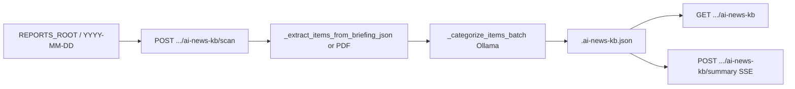

---
tags:
  - implementation
  - personal
  - ai-news-kb
category: personal
status: current
last-updated: 2026-04-28
---

# AI News Knowledge Base

> **Category**: PERSONAL | **Source**: `scripts/rag/agent.py` (AI News KB section, `_AI_KB_PATH` through `api_ai_news_kb_summary`)

## Overview

The AI News Knowledge Base persists deduplicated news items extracted from per-date report folders under `REPORTS_ROOT`, enriches new rows with LLM-assigned categories via Ollama, and can stream an SSE summary that includes themes, learning paths, and healthcare-IT angles. The canonical store is a single JSON file `.ai-news-kb.json` at the reports root.

## Architecture & Design

### System Context

KB sits beside daily briefing artifacts: scan reads the same `briefing-data*.json` (or `ai-briefing.pdf`) that the briefing pipeline produces.

### Data Flow

1. **Load**: `_load_ai_kb` reads `_AI_KB_PATH` or returns `{"items": [], "last_scanned": None}` (`3402–3406`).
2. **Scan**: `api_ai_news_kb_scan` lists `REPORTS_ROOT` subdirs matching `^\d{4}-\d{2}-\d{2}$`, extracts items per folder, dedupes by `date|title`, categorizes only new items, sorts items by date descending, sets `last_scanned`, saves (`3603–3636`).
3. **Extract**: Prefer `briefing-data-filtered.json` then `briefing-data.json`; map `per_source_data` items to `{date, source, title, summary, url, category}` (`3414–3448`). If no JSON, `_extract_items_from_pdf` parses `ai-briefing.pdf` with heuristics (`3455–3527`).
4. **Categorize**: Batches of up to 25 uncategorized items; fixed category list; Ollama `OLLAMA_MODEL_FAST` non-streaming; parses numbered lines; fallback `"Other"` (`3530–3590`).
5. **Summary**: Groups up to 80 recent items by category, builds prompt, streams Ollama chat to SSE (`3639–3711`).

### Key Design Decisions

- **File-based KB**: Simple merge-on-scan; no database. Trade-off: concurrent writes not addressed.
- **Dedup key**: `f"{date}|{title}"` only—duplicate titles on same day collapse (`3618–3622`).
- **PDF fallback**: Supports legacy folders that only have PDF (`3450–3451`).
- **Category closure**: Unknown LLM labels mapped to closest string length heuristic (`3582–3583`).

## Implementation Details

### Core Components

| Symbol | Role |
|--------|------|
| `_AI_KB_PATH` | `os.path.join(REPORTS_ROOT, ".ai-news-kb.json")` (`3399`) |
| `_load_ai_kb` / `_save_ai_kb` | JSON load/save (`3402–3411`) |
| `_extract_items_from_briefing_json` | JSON path for items (`3414–3452`) |
| `_extract_items_from_pdf` | pypdf + regex parsing (`3455–3527`) |
| `_categorize_items_batch` | Ollama batch categorization (`3530–3590`) |
| `api_ai_news_kb_get` | Read-only API (`3593–3600`) |
| `api_ai_news_kb_scan` | Scan + merge + save (`3603–3636`) |
| `api_ai_news_kb_summary` | SSE stream (`3639–3711`) |

### API Surface

- `GET /api/toolbar/ai-news-kb` → `items`, `last_scanned`, `total`
- `POST /api/toolbar/ai-news-kb/scan` → `new_count`, `total`, `last_scanned`
- `POST /api/toolbar/ai-news-kb/summary` → `text/event-stream` with JSON lines `type: token | done | error`

### Configuration

- `REPORTS_ROOT` (from agent config) determines both scan roots and `_AI_KB_PATH`.
- Ollama: `OLLAMA_HOST`, `OLLAMA_MODEL_FAST` (agent globals).

### Error Handling & Edge Cases

- JSON read errors in extract: swallowed, empty contribution (`3446–3447`).
- Categorization errors: entire batch may get `"Other"` (`3587–3589`).
- Summary with empty KB: HTTP 400 `"No items in KB. Run Scan first."` (`3643–3644`).
- Stream errors: SSE event `type: error` (`3704–3705`).

## Code Walkthrough

- KB path and persistence: `3399–3411:scripts/rag/agent.py`
- Extraction and categorization: `3414–3590:scripts/rag/agent.py`
- HTTP handlers: `3593–3711:scripts/rag/agent.py`

## Improvement Ideas

### Short-term

- Persist scan errors per folder in the JSON for visibility.
- Stricter validation of LLM category lines (fuzzy match to allowed set).

### Medium-term

- Cross-day trend fields (topic velocity, recurring titles) derived from sorted `items`.
- Export to CSV/Markdown for external tools.

### Long-term

- User-defined category taxonomy stored in settings and injected into the prompt.
- Incremental refinement job that re-categorizes low-confidence items.

## References

- `scripts/rag/agent.py` — block starting at “AI News Knowledge Base” (`3396+`)
- Daily briefing JSON schema producers: `scripts/pipeline/merge-sources.py`
