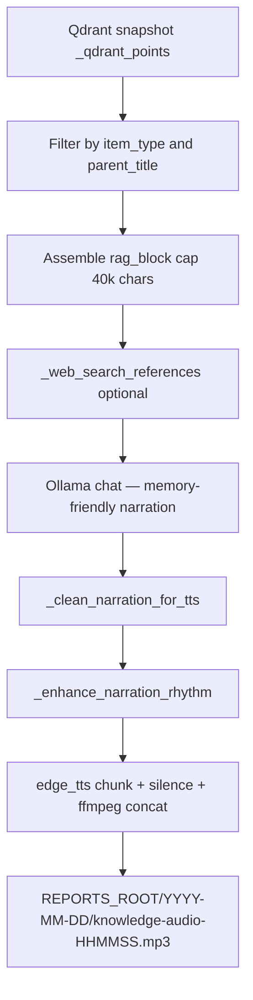

---
tags:
  - implementation
  - personal
  - audio-knowledge
category: personal
status: current
last-updated: 2026-04-30
---

# Audio Knowledge (Podcast from RAG)

> **Category**: PERSONAL | **Source**: `scripts/rag/routes/ai_news.py` (audio-from-knowledge worker, narration, TTS pipeline)

## Overview

Audio Knowledge turns selected RAG-indexed documents (grouped by `parent_title` / filename) into a long-form educational podcast script via Ollama, optionally enriched with a small web-search snippet, then synthesizes speech with Edge TTS into a dated MP3 under `REPORTS_ROOT`. Jobs run in background threads with polled status and a history listing of prior `knowledge-audio-*.mp3` files.

## Architecture & Design

### System Context

Distinct from Daily Fetch audio: this path uses **retrieved chunk text** from the vector store, not `briefing-data.json`.

### Data Flow

1. **POST** creates `job_id`, queues `_generate_knowledge_audio` on a daemon thread.
2. **Sync Qdrant**: `_get_qdrant()`, `_sync_qdrant_points_from_snapshot()`.
3. **Select chunks**: Iterate `_qdrant_points`; match `item_type`; filter by `selected_parents` list if non-empty; collect title/date/source/text.
4. **Assemble**: Concatenate chunk texts into markdown sections until ~40000 characters.
5. **Web**: From first five titles, build query; `_resolved_web_search_references(..., 5)` optional block.
6. **Script**: Ollama `OLLAMA_MODEL_FAST`, `think: True`, `num_predict: 16384`, language-specific system/user prompts with memory-friendly writing rules; voices `en-US-AndrewNeural` vs `zh-CN-YunxiNeural`.
7. **Cleanup**: Strip think tags, markdown, prefixes; `_clean_narration_for_tts`.
8. **Rhythm**: `_enhance_narration_rhythm` splits long sentences at natural break points.
9. **TTS**: Split into ~2000-char chunks at `。` / `.`; single or multi-part MP3; ffmpeg concat if available else binary append.
10. **Done**: `output_path`, `output_url` under `/api/toolbar/audio-file/...`, `narration_preview`.

### Key Design Decisions

- **Parent group selection**: API accepts `selected_parents` matching aggregated `parent_title` from `/items`—users scope which books/news clusters to narrate.
- **Content cap**: 40k chars limits cost/latency vs completeness.
- **Thinking enabled on Ollama**: May use `thinking` field if `content` empty.
- **Edge TTS**: Same family as Daily Fetch; rate `-5%`, pitch `+0Hz`.
- **No SSML**: Edge-TTS v7+ (2025+) removed custom SSML support. Rhythm achieved through text manipulation and inter-segment silence.

## Audio Quality & Memorability (2026-04-30)

### Problem

Generated audio had two issues: (1) "AI味" too strong — robotic pacing with flat delivery, (2) listeners couldn't remember content after listening.

### Solution: Three-Layer Enhancement

**Layer 1: LLM Narration Quality (prompt rewrite)**
- All system prompts rewritten from "broadcast reporter" to "conversational podcast host"
- Mandatory use of everyday analogies for abstract concepts
- Required oral filler words (嗯、对吧、你想想看、说白了) for naturalness
- Sentence rhythm variation: long explanatory → short punchy summary

**Layer 2: Structured Memory Techniques (built into prompts)**
- Preview: Each section opens with 1-sentence roadmap ("这一段我们聊三件事……")
- Analogy: Every new concept starts with a relatable comparison ("这就好比……")
- Repetition: Key terms/numbers appear twice with different phrasing
- Recap: Each section ends with oral one-liner summary ("所以简单来说……")
- Review: Final segment recaps all topics' core takeaways (cross-segment linking)

**Layer 3: TTS Rhythm Enhancement**
- `_enhance_narration_rhythm()` splits overly long sentences (>120 chars) at natural clause boundaries
- Inter-segment 800ms silence (ffmpeg `anullsrc`) for "breathing room" between topics
- Paragraph-level separation preserved for natural TTS pausing

### Design Note: Why Not SSML

Edge-TTS v7.2.8 (2026-03) removed custom SSML support. Microsoft only permits the `<speak><voice>` envelope that the library generates internally. Available parameters: `rate`, `pitch`, `volume` via the `Communicate` constructor only. The rhythm enhancement approach works within these constraints by giving the TTS engine shorter, well-punctuated sentences that it naturally renders with better prosody.

## Implementation Details

### Core Components

| Symbol | Role |
|--------|------|
| `_audio_jobs` | In-memory job status dict |
| `_generate_knowledge_audio` | Background worker |
| `_generate_segmented_narrations` | Per-source/category narration with memory techniques |
| `_enhance_narration_rhythm` | Text-level rhythm optimization for TTS |
| `_clean_narration_for_tts` | Strip markdown/annotations |
| `_tts_segments_to_mp3` | Multi-segment TTS with silence gaps |
| `_tts_to_mp3` | Single narration → MP3 |
| `api_audio_knowledge` | Start job route |
| `api_audio_knowledge_history` | List recent MP3s |
| `api_audio_knowledge_items` | Group chunks by parent for UI |
| `api_audio_knowledge_status` | Poll job |
| `api_serve_audio_file` | Static serve MP3/PDF |

### API Surface

- `POST /api/toolbar/audio-knowledge` — JSON: `item_type` (required), `selected_parents` (list), `language` (`zh` default)
- `GET /api/toolbar/audio-knowledge/history`
- `GET /api/toolbar/audio-knowledge/items?type=<item_type>`
- `GET /api/toolbar/audio-knowledge/<job_id>`
- `GET /api/toolbar/audio-file/<date_str>/<filename>`

### Configuration

- Ollama: `OLLAMA_HOST`, `OLLAMA_MODEL_FAST`, `RAG_NARRATION_MODEL`
- Output: `REPORTS_ROOT` + today's date folder
- Voices fixed per language branch

### Error Handling & Edge Cases

- No matching chunks: job `status: done` with `error` message.
- Empty narration after LLM: same.
- Exceptions: `status: done`, `error` string, traceback logged.
- `book_chapter` item type lists distinct chunk titles under each parent.
- SSML fallback: if any TTS step fails, plain-text mode is used automatically.

## Code Walkthrough

- Audio worker + Knowledge Audio TTS: `scripts/rag/routes/ai_news.py` (lines 378–600+)
- Daily Fetch audio pipeline: `scripts/rag/routes/daily_fetch.py` (imports `_generate_segmented_narrations`, `_tts_segments_to_mp3`)
- Standalone audio generator: `scripts/output/generate-audio.py` (legacy, not enhanced)

## Improvement Ideas

### Short-term

- Pluggable voice per request (reuse `_TTS_VOICE_FALLBACKS` pattern from Daily Fetch).
- Chapter metadata (per parent section) in response JSON for players that support chapters.

### Medium-term

- Target duration slider (adjust `user_msg` length hints and `num_predict`).
- Offline bundle: download MP3 + sidecar transcript.
- Experiment with varied `rate` per chunk (e.g., slower `-10%` for recap sections, faster `-2%` for transitions).

### Long-term

- RSS feed of `knowledge-audio-*.mp3` for podcast clients.
- Local GPU TTS (CosyVoice / F5-TTS) for near-human quality when hardware available.

## References

- `scripts/rag/routes/ai_news.py` — Audio from Knowledge, narration generation, TTS pipeline, rhythm enhancement
- `scripts/rag/routes/daily_fetch.py` — Daily Fetch audio generation (imports from ai_news)
- `scripts/output/generate-audio.py` — Standalone audio generator (legacy)
