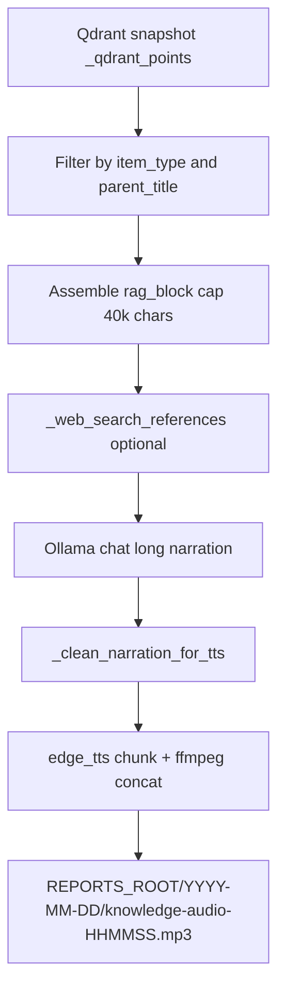

---
tags:
  - implementation
  - personal
  - audio-knowledge
category: personal
status: current
last-updated: 2026-04-28
---

# Audio Knowledge (Podcast from RAG)

> **Category**: PERSONAL | **Source**: `scripts/rag/agent.py` (`_audio_jobs`, `_generate_knowledge_audio`, `api_toolbar/audio-knowledge*` routes)

## Overview

Audio Knowledge turns selected RAG-indexed documents (grouped by `parent_title` / filename) into a long-form educational podcast script via Ollama, optionally enriched with a small web-search snippet, then synthesizes speech with Edge TTS into a dated MP3 under `REPORTS_ROOT`. Jobs run in background threads with polled status and a history listing of prior `knowledge-audio-*.mp3` files.

## Architecture & Design

### System Context

Distinct from Daily Fetch audio: this path uses **retrieved chunk text** from the vector store, not `briefing-data.json`.

### Data Flow

1. **POST** creates `job_id`, queues `_generate_knowledge_audio` on a daemon thread (`3916–3931`).
2. **Sync Qdrant**: `_get_qdrant()`, `_sync_qdrant_points_from_snapshot()` (`3726–3727`).
3. **Select chunks**: Iterate `_qdrant_points`; match `item_type`; filter by `selected_parents` list if non-empty; collect title/date/source/text (`3729–3743`).
4. **Assemble**: Concatenate chunk texts into markdown sections until ~40000 characters (`3753–3765`).
5. **Web**: From first five titles, build query; `_web_search_references(..., 5)` optional block (`3767–3775`).
6. **Script**: Ollama `OLLAMA_MODEL_FAST`, `think: True`, `num_predict: 16384`, language-specific system/user prompts; voices `en-US-AndrewNeural` vs `zh-CN-YunxiNeural` (`3777–3820`).
7. **Cleanup**: Strip think tags, markdown, prefixes; `_clean_narration_for_tts` (`3827–3833`).
8. **TTS**: Split into ~2000-char chunks at `。` / `.`; single or multi-part MP3; ffmpeg concat if available else binary append (`3853–3901`).
9. **Done**: `output_path`, `output_url` under `/api/toolbar/audio-file/...`, `narration_preview` (`3905–3908`).

### Key Design Decisions

- **Parent group selection**: API accepts `selected_parents` matching aggregated `parent_title` from `/items`—users scope which books/news clusters to narrate.
- **Content cap**: 40k chars limits cost/latency vs completeness (`3755`).
- **Thinking enabled on Ollama**: May use `thinking` field if `content` empty (`3824–3825`).
- **Edge TTS**: Same family as Daily Fetch; rate `-5%`, pitch `+0Hz` (`3872–3878`).

## Implementation Details

### Core Components

| Symbol | Role |
|--------|------|
| `_audio_jobs` | In-memory job status dict (`3717`) |
| `_generate_knowledge_audio` | Worker (`3720–3913`) |
| `api_audio_knowledge` | Start job (`3916–3931`) |
| `api_audio_knowledge_history` | List recent MP3s (`3934–3958`) |
| `api_audio_knowledge_items` | Group chunks by parent for UI (`3961–3997`) |
| `api_audio_knowledge_status` | Poll job (`4000–4005`) |
| `api_serve_audio_file` | Static serve MP3/PDF (`4008–4018`) |

### API Surface

- `POST /api/toolbar/audio-knowledge` — JSON: `item_type` (required), `selected_parents` (list), `language` (`zh` default)
- `GET /api/toolbar/audio-knowledge/history`
- `GET /api/toolbar/audio-knowledge/items?type=<item_type>`
- `GET /api/toolbar/audio-knowledge/<job_id>`
- `GET /api/toolbar/audio-file/<date_str>/<filename>`

### Configuration

- Ollama: `OLLAMA_HOST`, `OLLAMA_MODEL_FAST`
- Output: `REPORTS_ROOT` + today’s date folder (`3846–3851`)
- Voices fixed per language branch (`3779–3786`)

### Error Handling & Edge Cases

- No matching chunks: job `status: done` with `error` message (`3745–3748`).
- Empty narration after LLM: same (`3835–3838`).
- Exceptions: `status: done`, `error` string, traceback logged (`3910–3913`).
- `book_chapter` item type lists distinct chunk titles under each parent (`3987–3990`).

## Code Walkthrough

- Worker and TTS assembly: `3720–3913:scripts/rag/agent.py`
- Routes: `3916–4018:scripts/rag/agent.py`
- Item grouping for picker: `3961–3997:scripts/rag/agent.py` (`show_dates` for `news_item`, `raw_content`, `learning_guide`)

## Improvement Ideas

### Short-term

- Pluggable voice per request (reuse `_TTS_VOICE_FALLBACKS` pattern from Daily Fetch).
- Chapter metadata (per parent section) in response JSON for players that support chapters.

### Medium-term

- Target duration slider (adjust `user_msg` length hints and `num_predict`).
- Offline bundle: download MP3 + sidecar transcript.

### Long-term

- RSS feed of `knowledge-audio-*.mp3` for podcast clients.
- Multi-speaker or alternating voices per section.

## References

- `scripts/rag/agent.py` — “Audio from Knowledge” section (`3714+`)
- Related TTS utilities in same file: `_clean_narration_for_tts` (`4301+`), Daily Fetch `_tts_segments_to_mp3` (`4217+`)
