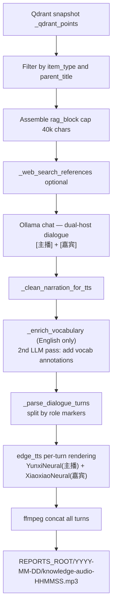
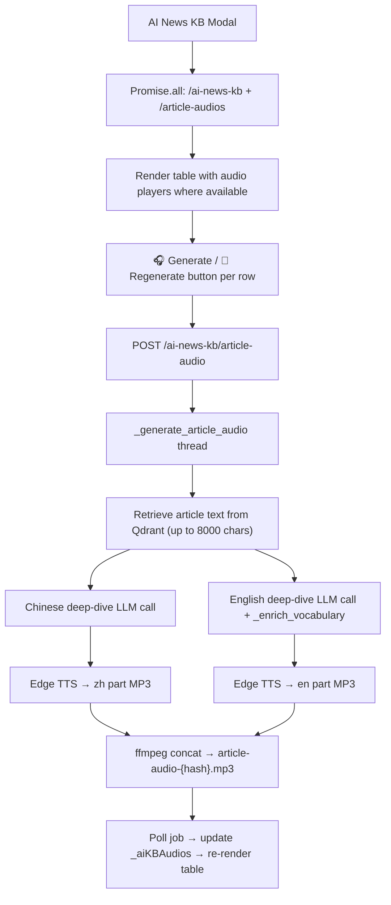

---
tags:
  - implementation
  - personal
  - audio-knowledge
category: personal
status: current
last-updated: 2026-05-07b
---

# Audio Knowledge (Podcast from RAG)

> **Category**: PERSONAL | **Source**: `scripts/rag/routes/ai_news.py` (audio-from-knowledge worker, narration, TTS pipeline)

## Overview

Audio Knowledge turns selected RAG-indexed documents (grouped by `parent_title` / filename) into a long-form educational podcast script via Ollama, optionally enriched with a small web-search snippet, then synthesizes speech with Edge TTS into a dated MP3 under `REPORTS_ROOT`. Jobs run in background threads with polled status and a history listing of prior `knowledge-audio-*.mp3` files.

## Architecture & Design

### System Context

Distinct from Daily Fetch audio: this path uses **retrieved chunk text** from the vector store, not `briefing-data.json`.

### Data Flow

1. **POST** creates `job_id`, queues `_generate_knowledge_audio` on a daemon thread.
2. **Sync Qdrant**: `_get_qdrant()`, `_sync_qdrant_points_from_snapshot()`.
3. **Select chunks**: Iterate `_qdrant_points`; match `item_type`; filter by `selected_parents` list if non-empty; collect title/date/source/text.
4. **Assemble**: Concatenate chunk texts into markdown sections until ~40000 characters.
5. **Web**: From first five titles, build query; `_resolved_web_search_references(..., 5)` optional block.
6. **Script**: Ollama `OLLAMA_MODEL_FAST`, `think: True`, `num_predict: 16384`, dual-host dialogue format with `[主播]`/`[嘉宾]` markers.
7. **Cleanup**: Strip think tags, markdown, prefixes; `_clean_narration_for_tts`.
8. **Parse**: `_parse_dialogue_turns` splits dialogue into (role, text) tuples.
9. **TTS**: Each turn rendered with role-specific voice (YunxiNeural / XiaoxiaoNeural), chunked at ~2000 chars, concatenated via ffmpeg.
10. **Done**: `output_path`, `output_url` under `/api/toolbar/audio-file/...`, `narration_preview`.

### Key Design Decisions

- **Parent group selection**: API accepts `selected_parents` matching aggregated `parent_title` from `/items`—users scope which books/news clusters to narrate.
- **Content cap**: 40k chars limits cost/latency vs completeness.
- **Thinking enabled on Ollama**: May use `thinking` field if `content` empty.
- **Edge TTS**: Same family as Daily Fetch; rate `-5%`, pitch `+0Hz`.
- **No SSML**: Edge-TTS v7+ (2025+) removed custom SSML support. Rhythm achieved through text manipulation and inter-segment silence.

## Audio Quality Evolution

### v1 (2026-04-30): Memory Techniques — REPLACED

Initial approach forced analogies, filler words (嗯、对吧、说白了), and mandatory story openings via prompts. Result: LLM output became repetitive and formulaic (same analogies recycled, same phrases repeated across all segments).

### v2 (2026-05-03): Dual-Host Dialogue — CURRENT

**Problem:** v1's forced analogies and filler words made output worse — monotonous and artificial. Phrases like "你说是吗" and "买衣服" analogies appeared repeatedly across all segments.

**Solution: Dual-host podcast dialogue format**

All narration prompts rewritten to generate dialogue between two roles:
- **[主播] (Host)**: A sharp journalist/anchor who asks good questions and drives the conversation. Voice: `zh-CN-YunxiNeural` (male).
- **[嘉宾] (Guest)**: An expert analyst who provides depth, context, and clear explanations. Voice: `zh-CN-XiaoxiaoNeural` (female).

Key design changes:
1. **Removed** all forced analogy/filler/memory rules — let the dialogue flow naturally
2. **Added** `_parse_dialogue_turns()` to split LLM output by `[主播]`/`[嘉宾]` markers
3. **TTS pipeline** renders each turn with the appropriate voice, then concatenates
4. **Graceful fallback**: if LLM doesn't produce markers, entire text renders as host voice

English mode uses `[Host]`/`[Guest]` with `en-US-AndrewNeural` + `en-US-JennyNeural`.

### v3 (2026-05-07): English Vocabulary Enrichment — CURRENT for English mode

**Problem:** v2's dual-host dialogue format worked well for Chinese. But for English mode (used by a Chinese CET-6 level learner), the `qwen3:1.7b` model was too small to follow multi-part instructions ("discuss news + explain vocabulary simultaneously"). Even `qwen3.5:4b` only produced ~2 vocabulary explanations in a single pass, far below the target of 5-8.

**Solution: 2-pass vocabulary enrichment pipeline**

1. **Pass 1 — Content generation**: Generate the podcast dialogue focusing purely on news discussion (same as v2).
2. **Pass 2 — Vocabulary annotation**: A second focused LLM call (`_enrich_vocabulary()`) rewrites the dialogue to insert 5-8 em-dash vocabulary explanations inline.

Pattern: `[Guest] This is a paradigm shift — a fundamental change in approach — for the industry.`

Key design changes:
1. **Model upgrade**: Narration model changed from `qwen3:1.7b` → `qwen3.5:4b` for richer, longer output
2. **Added** `_enrich_vocabulary()` post-processor that runs a second Ollama call with a focused editing prompt
3. **Enrichment only for English**: Chinese narration is unaffected (no vocabulary teaching needed)
4. **Diverse vocabulary**: Prompt requires each explained word to be different (idioms, phrasal verbs, formal vocabulary above CET-6 level)
5. **Trade-off**: ~2x generation time per segment (~5-7 min total for 2 passes), but significantly better English learning value

Why 2-pass instead of single-pass:
- Small local models (1.7B–4B) cannot reliably follow multiple competing instructions in a single prompt
- Separating "generate content" from "annotate vocabulary" gives each call a single focused task
- The enrichment pass preserves the original dialogue structure while adding annotations

### v4 (2026-05-07): AI News KB Per-Article Deep-Dive Audio — CURRENT

**Problem:** Users could only generate audio for the full Knowledge Audio pool (grouped by parent). For the AI News KB, users wanted to deep-dive into a single article — retrieving it from RAG and generating bilingual (Chinese first, English second with vocabulary) audio. Additionally, generated audio was lost when closing and reopening the KB modal.

**Solution: Per-article deep-dive audio with persistence**

1. **New API endpoint** `POST /api/toolbar/ai-news-kb/article-audio`: Accepts article title/summary/url/source, generates bilingual deep-dive audio in a background thread.
2. **Bilingual output**: Two separate LLM calls (Chinese deep-dive + English deep-dive with `_enrich_vocabulary`), each rendered to MP3 via Edge TTS, then concatenated with `ffmpeg`.
3. **Deterministic filenames**: `article-audio-{md5_hash_of_title[:10]}.mp3` — same article always maps to the same file, enabling lookup without a database.
4. **Persistence API** `GET /api/toolbar/ai-news-kb/article-audios`: Scans report directories for `article-audio-*.mp3` files, matches hashes back to KB article titles, returns `{title: audio_url}` map.
5. **Frontend**: On KB modal open, fetches existing audios alongside items via `Promise.all`. Articles with audio show an inline `<audio>` player + regenerate button; articles without show a generate button. After generation, `_aiKBAudios` map is updated and table re-renders immediately.

### Design Note: Why Not SSML

Edge-TTS v7.2.8 (2026-03) removed custom SSML support. Microsoft only permits the `<speak><voice>` envelope that the library generates internally. Available parameters: `rate`, `pitch`, `volume` via the `Communicate` constructor only.

## Implementation Details

### Core Components

| Symbol | Role |
|--------|------|
| `_audio_jobs` | In-memory job status dict |
| `_generate_knowledge_audio` | Background worker |
| `_generate_segmented_narrations` | Per-source/category dual-host dialogue generation |
| `_parse_dialogue_turns` | Split dialogue by `[主播]`/`[嘉宾]` markers into (role, text) tuples |
| `_enhance_narration_rhythm` | Split long sentences at natural break points for TTS |
| `_clean_narration_for_tts` | Strip markdown/annotations |
| `_enrich_vocabulary` | Post-process English dialogue to inject vocabulary annotations via a second LLM call |
| `_tts_segments_to_mp3` | Multi-segment dual-voice TTS with inter-segment silence |
| `_tts_to_mp3` | Single dialogue → dual-voice MP3 |
| `_DIALOGUE_VOICES` | Voice mapping: zh host=YunxiNeural, guest=XiaoxiaoNeural |
| `api_audio_knowledge` | Start job route |
| `api_audio_knowledge_history` | List recent MP3s |
| `api_audio_knowledge_items` | Group chunks by parent for UI |
| `api_audio_knowledge_status` | Poll job |
| `api_article_audio` | Start per-article deep-dive audio job |
| `_generate_article_audio` | Background worker: bilingual (zh+en) article audio with vocabulary enrichment |
| `api_article_audios` | List existing article audios mapped by title (hash-based file lookup) |
| `api_serve_audio_file` | Static serve MP3/PDF |

### API Surface

- `POST /api/toolbar/audio-knowledge` — JSON: `item_type` (required), `selected_parents` (list), `language` (`zh` default)
- `GET /api/toolbar/audio-knowledge/history`
- `GET /api/toolbar/audio-knowledge/items?type=<item_type>`
- `GET /api/toolbar/audio-knowledge/<job_id>`
- `POST /api/toolbar/ai-news-kb/article-audio` — JSON: `title` (required), `summary`, `url`, `source`; returns `{ job_id }`
- `GET /api/toolbar/ai-news-kb/article-audios` — returns `{ audios: { title: url } }` map of persisted article audios
- `GET /api/toolbar/audio-file/<date_str>/<filename>`

### Configuration

- Ollama: `OLLAMA_HOST`, `OLLAMA_MODEL_FAST` (qwen3:1.7b), `RAG_NARRATION_MODEL` (qwen3.5:4b, upgraded from qwen3:1.7b for richer narration)
- Output: `REPORTS_ROOT` + today's date folder
- Voices fixed per language branch

### Error Handling & Edge Cases

- No matching chunks: job `status: done` with `error` message.
- Empty narration after LLM: same.
- Exceptions: `status: done`, `error` string, traceback logged.
- `book_chapter` item type lists distinct chunk titles under each parent.
- No dialogue markers from LLM: entire text treated as single host turn (graceful fallback).

## Code Walkthrough

- Audio worker + Knowledge Audio TTS: `scripts/rag/routes/ai_news.py` (lines 378–600+)
- Per-article deep-dive audio: `scripts/rag/routes/ai_news.py` — `api_article_audio` (643–661), `_generate_article_audio` (664–806), `api_article_audios` (810–832)
- Daily Fetch audio pipeline: `scripts/rag/routes/daily_fetch.py` (imports `_generate_segmented_narrations`, `_tts_segments_to_mp3`)
- Frontend KB modal with persistent audio: `scripts/rag/templates/index.html` — `_aiKBAudios`, `generateArticleAudio`, `_aiKBRenderTable` with inline players
- Standalone audio generator: `scripts/output/generate-audio.py` (legacy, not enhanced)

## Improvement Ideas

### Short-term

- Pluggable voice per request (reuse `_TTS_VOICE_FALLBACKS` pattern from Daily Fetch).
- Chapter metadata (per parent section) in response JSON for players that support chapters.

### Medium-term

- Target duration slider (adjust `user_msg` length hints and `num_predict`).
- Offline bundle: download MP3 + sidecar transcript.
- Experiment with varied `rate` per role (e.g., host slightly faster, guest slightly slower for contrast).

### Long-term

- RSS feed of `knowledge-audio-*.mp3` for podcast clients.
- Local GPU TTS (CosyVoice / F5-TTS) for near-human quality when hardware available.
- Multi-episode continuity (guest references previous episodes).

## References

- `scripts/rag/routes/ai_news.py` — Audio from Knowledge, dual-host dialogue generation, dialogue parser, TTS pipeline
- `scripts/rag/routes/daily_fetch.py` — Daily Fetch audio generation (imports from ai_news)
- `scripts/output/generate-audio.py` — Standalone audio generator (legacy)
