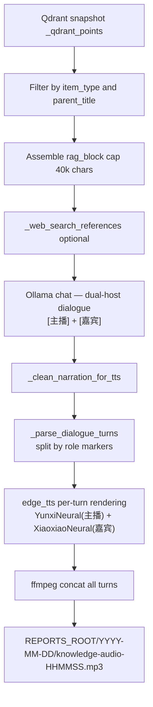

---
tags:
  - implementation
  - personal
  - audio-knowledge
category: personal
status: current
last-updated: 2026-05-03
---

# Audio Knowledge (Podcast from RAG)

> **Category**: PERSONAL | **Source**: `scripts/rag/routes/ai_news.py` (audio-from-knowledge worker, narration, TTS pipeline)

## Overview

Audio Knowledge turns selected RAG-indexed documents (grouped by `parent_title` / filename) into a long-form educational podcast script via Ollama, optionally enriched with a small web-search snippet, then synthesizes speech with Edge TTS into a dated MP3 under `REPORTS_ROOT`. Jobs run in background threads with polled status and a history listing of prior `knowledge-audio-*.mp3` files.

## Architecture & Design

### System Context

Distinct from Daily Fetch audio: this path uses **retrieved chunk text** from the vector store, not `briefing-data.json`.

### Data Flow

1. **POST** creates `job_id`, queues `_generate_knowledge_audio` on a daemon thread.
2. **Sync Qdrant**: `_get_qdrant()`, `_sync_qdrant_points_from_snapshot()`.
3. **Select chunks**: Iterate `_qdrant_points`; match `item_type`; filter by `selected_parents` list if non-empty; collect title/date/source/text.
4. **Assemble**: Concatenate chunk texts into markdown sections until ~40000 characters.
5. **Web**: From first five titles, build query; `_resolved_web_search_references(..., 5)` optional block.
6. **Script**: Ollama `OLLAMA_MODEL_FAST`, `think: True`, `num_predict: 16384`, dual-host dialogue format with `[主播]`/`[嘉宾]` markers.
7. **Cleanup**: Strip think tags, markdown, prefixes; `_clean_narration_for_tts`.
8. **Parse**: `_parse_dialogue_turns` splits dialogue into (role, text) tuples.
9. **TTS**: Each turn rendered with role-specific voice (YunxiNeural / XiaoxiaoNeural), chunked at ~2000 chars, concatenated via ffmpeg.
10. **Done**: `output_path`, `output_url` under `/api/toolbar/audio-file/...`, `narration_preview`.

### Key Design Decisions

- **Parent group selection**: API accepts `selected_parents` matching aggregated `parent_title` from `/items`—users scope which books/news clusters to narrate.
- **Content cap**: 40k chars limits cost/latency vs completeness.
- **Thinking enabled on Ollama**: May use `thinking` field if `content` empty.
- **Edge TTS**: Same family as Daily Fetch; rate `-5%`, pitch `+0Hz`.
- **No SSML**: Edge-TTS v7+ (2025+) removed custom SSML support. Rhythm achieved through text manipulation and inter-segment silence.

## Audio Quality Evolution

### v1 (2026-04-30): Memory Techniques — REPLACED

Initial approach forced analogies, filler words (嗯、对吧、说白了), and mandatory story openings via prompts. Result: LLM output became repetitive and formulaic (same analogies recycled, same phrases repeated across all segments).

### v2 (2026-05-03): Dual-Host Dialogue — CURRENT

**Problem:** v1's forced analogies and filler words made output worse — monotonous and artificial. Phrases like "你说是吗" and "买衣服" analogies appeared repeatedly across all segments.

**Solution: Dual-host podcast dialogue format**

All narration prompts rewritten to generate dialogue between two roles:
- **[主播] (Host)**: A sharp journalist/anchor who asks good questions and drives the conversation. Voice: `zh-CN-YunxiNeural` (male).
- **[嘉宾] (Guest)**: An expert analyst who provides depth, context, and clear explanations. Voice: `zh-CN-XiaoxiaoNeural` (female).

Key design changes:
1. **Removed** all forced analogy/filler/memory rules — let the dialogue flow naturally
2. **Added** `_parse_dialogue_turns()` to split LLM output by `[主播]`/`[嘉宾]` markers
3. **TTS pipeline** renders each turn with the appropriate voice, then concatenates
4. **Graceful fallback**: if LLM doesn't produce markers, entire text renders as host voice

English mode uses `[Host]`/`[Guest]` with `en-US-AndrewNeural` + `en-US-JennyNeural`.

### Design Note: Why Not SSML

Edge-TTS v7.2.8 (2026-03) removed custom SSML support. Microsoft only permits the `<speak><voice>` envelope that the library generates internally. Available parameters: `rate`, `pitch`, `volume` via the `Communicate` constructor only.

## Implementation Details

### Core Components

| Symbol | Role |
|--------|------|
| `_audio_jobs` | In-memory job status dict |
| `_generate_knowledge_audio` | Background worker |
| `_generate_segmented_narrations` | Per-source/category dual-host dialogue generation |
| `_parse_dialogue_turns` | Split dialogue by `[主播]`/`[嘉宾]` markers into (role, text) tuples |
| `_enhance_narration_rhythm` | Split long sentences at natural break points for TTS |
| `_clean_narration_for_tts` | Strip markdown/annotations |
| `_tts_segments_to_mp3` | Multi-segment dual-voice TTS with inter-segment silence |
| `_tts_to_mp3` | Single dialogue → dual-voice MP3 |
| `_DIALOGUE_VOICES` | Voice mapping: zh host=YunxiNeural, guest=XiaoxiaoNeural |
| `api_audio_knowledge` | Start job route |
| `api_audio_knowledge_history` | List recent MP3s |
| `api_audio_knowledge_items` | Group chunks by parent for UI |
| `api_audio_knowledge_status` | Poll job |
| `api_serve_audio_file` | Static serve MP3/PDF |

### API Surface

- `POST /api/toolbar/audio-knowledge` — JSON: `item_type` (required), `selected_parents` (list), `language` (`zh` default)
- `GET /api/toolbar/audio-knowledge/history`
- `GET /api/toolbar/audio-knowledge/items?type=<item_type>`
- `GET /api/toolbar/audio-knowledge/<job_id>`
- `GET /api/toolbar/audio-file/<date_str>/<filename>`

### Configuration

- Ollama: `OLLAMA_HOST`, `OLLAMA_MODEL_FAST`, `RAG_NARRATION_MODEL`
- Output: `REPORTS_ROOT` + today's date folder
- Voices fixed per language branch

### Error Handling & Edge Cases

- No matching chunks: job `status: done` with `error` message.
- Empty narration after LLM: same.
- Exceptions: `status: done`, `error` string, traceback logged.
- `book_chapter` item type lists distinct chunk titles under each parent.
- No dialogue markers from LLM: entire text treated as single host turn (graceful fallback).

## Code Walkthrough

- Audio worker + Knowledge Audio TTS: `scripts/rag/routes/ai_news.py` (lines 378–600+)
- Daily Fetch audio pipeline: `scripts/rag/routes/daily_fetch.py` (imports `_generate_segmented_narrations`, `_tts_segments_to_mp3`)
- Standalone audio generator: `scripts/output/generate-audio.py` (legacy, not enhanced)

## Improvement Ideas

### Short-term

- Pluggable voice per request (reuse `_TTS_VOICE_FALLBACKS` pattern from Daily Fetch).
- Chapter metadata (per parent section) in response JSON for players that support chapters.

### Medium-term

- Target duration slider (adjust `user_msg` length hints and `num_predict`).
- Offline bundle: download MP3 + sidecar transcript.
- Experiment with varied `rate` per role (e.g., host slightly faster, guest slightly slower for contrast).

### Long-term

- RSS feed of `knowledge-audio-*.mp3` for podcast clients.
- Local GPU TTS (CosyVoice / F5-TTS) for near-human quality when hardware available.
- Multi-episode continuity (guest references previous episodes).

## References

- `scripts/rag/routes/ai_news.py` — Audio from Knowledge, dual-host dialogue generation, dialogue parser, TTS pipeline
- `scripts/rag/routes/daily_fetch.py` — Daily Fetch audio generation (imports from ai_news)
- `scripts/output/generate-audio.py` — Standalone audio generator (legacy)
