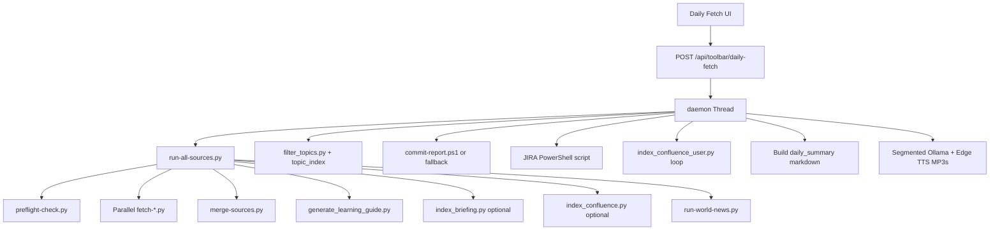

---
tags:
  - implementation
  - personal
  - daily-fetch
category: personal
status: current
last-updated: 2026-04-28
---

# Daily Fetch Pipeline

> **Category**: PERSONAL | **Source**: `scripts/rag/agent.py`, `scripts/pipeline/run-all-sources.py`, `scripts/pipeline/preflight-check.py`, `scripts/pipeline/merge-sources.py`, `scripts/pipeline/filter_topics.py`, `scripts/pipeline/topic_index.py`, `scripts/pipeline/run-world-news.py`, `scripts/output/generate-audio.py`, `scripts/output/briefing-template.py`

## Overview

Daily Fetch is a background job started from the RAG agent UI that runs the day’s AI briefing fetch (including preflight, parallel source scripts, merge, learning guide, optional RAG/Confluence indexing, and world news), then applies topic deduplication, commit and Jira reports, per-user Confluence wiki fetch, builds a text summary, and generates three MP3 briefings (AI, international world news, China news) using segmented Ollama narration plus Edge TTS. It supports resuming incomplete runs via a “continue” API that replays only missing logical steps.

## Architecture & Design

### System Context

The pipeline bridges **orchestrated subprocesses** (`run-all-sources.py` and friends) with **in-process orchestration** in `_run_daily_fetch`, which also handles wiki indexing per team member, PowerShell reports, and audio. Related but separate CLI tools (`briefing-template.py` for PDF, `generate-audio.py` for narration-from-JSON MP3) share the same `briefing-data.json` schema produced by `merge-sources.py`; the Daily Fetch path does not invoke those scripts—it generates audio directly in the agent.

### Data Flow

1. **Start job**: `api_daily_fetch` allocates `job_id`, initializes `_daily_fetch_jobs[job_id]`, starts `_run_daily_fetch` in a thread (`4930–4937:scripts/rag/agent.py`).
2. **Fetch phase**: `python pipeline/run-all-sources.py --output-dir <REPORTS_ROOT/YYYY-MM-DD> --proxy socks5://localhost:10808` (`4417–4423`). That script runs preflight, parallel AI fetches, merge, learning guide, optional briefing RAG + Confluence indexing, then world news under `world-news/` (`89–257:scripts/pipeline/run-all-sources.py`).
3. **Topic dedup**: If `briefing-data.json` exists, `filter_topics.py` writes `briefing-data-filtered.json` in aggressive mode (`4429–4441`).
4. **Commit report**: PowerShell `tools/commit-report.ps1` or `tool_commit_summary` fallback (`4446–4467`).
5. **Jira daily**: PowerShell script from `JIRA_SCRIPT`; may read back `atlassian-daily-report-*.md` (`4470–4489`).
6. **Wiki fetch**: Sequential `index_confluence_user.py` per hard-coded team user with `--date-from yesterday --report-json`; optional Ollama summaries; writes `wiki-fetch-<date>.md` (`4492–4649`).
7. **Summary**: Reads filtered or raw briefing JSON and `world-news-data.json` for key bullets; concatenates commit/Jira excerpts into `job["daily_summary"]` (`4651–4713`).
8. **Audio**: Per-source segments from briefing JSON → `_generate_segmented_narrations` → `_tts_segments_to_mp3` → `ai-briefing.mp3` with `audio_lang_ai` (`4715–4758`). World/China segments from merged world news JSON, split by source tag `中国新闻`, using `audio_lang_world` / `audio_lang_china` (`4808–4910`). Optional `world_news_merge` recovery merges raw world-news JSONs via `run-world-news.py --no-fetch` or `merge_news()` (`4760–4806`).
9. **Completion**: `job["status"] = "done"`, `steps` and `files` populated (`4912–4921`). Errors set `status: "error"` (`4923–4926`).

### Key Design Decisions

- **Subprocess isolation**: Fetch and merge run in separate Python processes with timeouts (e.g. 600s for `run-all-sources`) so a hung fetcher does not kill the Flask process.
- **Filtered vs raw JSON**: Audio and summaries prefer `briefing-data-filtered.json` when present (`4719–4721`, `4655–4657`).
- **Segmented narration**: Long briefings are split per source/category to avoid single huge LLM calls; uses `OLLAMA_MODEL_NARRATION` via `_ollama_narration_call` (`4107–4214`, `4047–4073`).
- **Fault tolerance**: Each step appends to `steps` with exit code and truncated output; failures in one step do not always abort later steps (exceptions are caught per block).
- **Continue semantics**: `only_steps` filters which named steps run; history computes `missing_steps` for the UI (`4940–4956`, `5084–5106`).

## Implementation Details

### Core Components

| Component | Role |
|-----------|------|
| `_run_daily_fetch` | Main worker; step gating, subprocess calls, summary, audio (`4399–4926`) |
| `api_daily_fetch` / `api_daily_fetch_continue` / `api_daily_fetch_status` / `api_daily_fetch_history` | HTTP API for start, resume, poll, and per-date artifact inspection (`4929–5131`) |
| `run-all-sources.main` | Async orchestrator: preflight, `asyncio.gather` fetchers, merge, learning guide, indexing, world news (`126–279`) |
| `preflight-check` | Playwright reachability; writes `preflight-results.json`; non-blocking for later fetches (`63–94`) |
| `merge-sources` | Builds `briefing-data.json` + timing metadata for template/PDF schema (`93–120`) |
| `filter_topics` + `TopicIndex` | Dedup using persistent topic index from `config.TOPIC_INDEX_PATH` (`27–80` in filter, `64–80` in topic_index) |
| `run-world-news` | Fetches/merges international + China feeds; `merge_news()` for recovery (`121–150`) |
| `_generate_segmented_narrations`, `_tts_segments_to_mp3` | Narration + Edge TTS with ffmpeg concat fallback (`4107–4295`) |

### API Surface

- `POST /api/toolbar/daily-fetch` → `{ job_id }`
- `POST /api/toolbar/daily-fetch/continue` → body: `steps`, optional `date`
- `GET /api/toolbar/daily-fetch/<job_id>` → job dict (status, step, steps, files, daily_summary, errors)
- `GET /api/toolbar/daily-fetch/history?date=YYYY-MM-DD` → files, stats, `missing_steps`, flags for audio/PDF

### Configuration

- Output root: `REPORTS_ROOT` / `today` subdirectory (`4407–4408`).
- Proxy: `socks5://localhost:10808` hard-coded on `run-all-sources` invocation (`4421`).
- Audio languages: `_GLOBAL_SETTINGS["audio_lang_ai" | "audio_lang_world" | "audio_lang_china"]` default `"zh"`; `"en"` selects `en-US-AndrewNeural` (`4741–4742`, `4851–4852`, `4886–4887`).
- `briefing-template.py` / `generate-audio.py`: use `REPORTS_ROOT` from `scripts/config.py`; schema aligned with `merge-sources` output—not called by `_run_daily_fetch`.

### Error Handling & Edge Cases

- Subprocess failures recorded in `steps` with stderr/stdout tails; worker often continues.
- Wiki/Jira/Commit blocks catch exceptions and append error strings to `steps`.
- Empty narration segments skip TTS; step records failure (`4751–4752`).
- World news merge: if `world-news-data.json` missing but per-source JSONs exist, merge subprocess or `merge_news` import path (`4764–4804`).

## Code Walkthrough

- Job lifecycle and fetch entry: `4929–4937:scripts/rag/agent.py`
- Full step sequence and audio: `4399–4910:scripts/rag/agent.py`
- Orchestrator phases (preflight → fetch → merge → learning guide → world news): `147–257:scripts/pipeline/run-all-sources.py`
- Merge output schema: `39–120:scripts/pipeline/merge-sources.py`
- History-driven `missing_steps` for continue: `4968–5131:scripts/rag/agent.py`
- Standalone PDF/audio CLIs (ecosystem): `1–40:scripts/output/briefing-template.py`, `1–40:scripts/output/generate-audio.py`

## Improvement Ideas

### Short-term

- Make proxy URL configurable via `_GLOBAL_SETTINGS` or env instead of hard-coding `socks5://localhost:10808`.
- Surface `preflight-results.json` and `timing-log.json` in the daily-fetch status JSON for quicker debugging.

### Medium-term

- Retry with backoff for transient fetch/TTS failures; optional parallel wiki user fetches with rate limiting.
- Small pipeline dashboard (step timeline from `steps` + file list).

### Long-term

- Scheduler (Windows Task Scheduler / cron) or webhook-triggered runs calling the same APIs.
- Optional invocation of `briefing-template.py` after merge for automatic PDF in the same job.

## References

- `scripts/rag/agent.py` — Daily Fetch routes and `_run_daily_fetch`
- `scripts/pipeline/run-all-sources.py` — End-to-end fetch orchestration
- `scripts/pipeline/preflight-check.py`, `merge-sources.py`, `filter_topics.py`, `topic_index.py`, `run-world-news.py`
- `scripts/output/briefing-template.py`, `scripts/output/generate-audio.py` — PDF and alternate MP3 path
