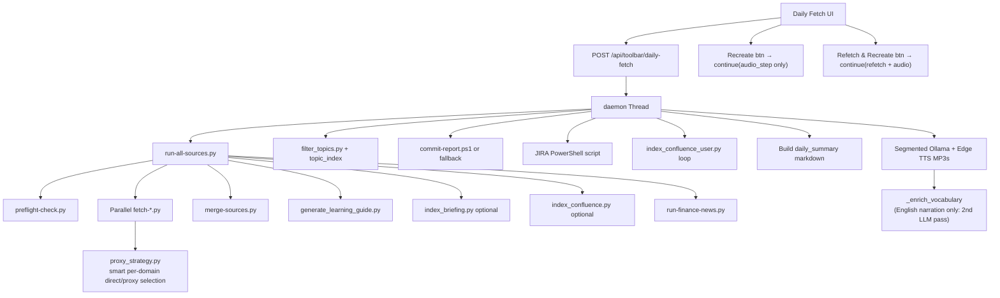

---
tags:
  - implementation
  - personal
  - daily-fetch
category: personal
status: current
last-updated: 2026-07-29
---

# Daily Fetch Pipeline

> **Category**: PERSONAL | **Source**: `scripts/rag/routes/daily_fetch.py`, `scripts/fetchers/proxy_strategy.py`, `scripts/rag/routes/ai_news.py`, `scripts/pipeline/run-all-sources.py`, `scripts/pipeline/run-finance-news.py`, …

## Overview

Daily Fetch is a background job started from the RAG agent UI that runs the day’s AI briefing fetch (including preflight, parallel source scripts, merge, learning guide, optional RAG/Confluence indexing, and **finance news**), then applies topic deduplication, commit and Jira reports, per-user Confluence wiki fetch, builds a text summary, and generates **two** MP3 briefings (**AI** + **Finance News**) using segmented Ollama narration plus Edge TTS. It supports resuming incomplete runs via a “continue” API that replays only missing logical steps.

Finance news details: [../briefing-pipeline/finance-news-impl.md](../briefing-pipeline/finance-news-impl.md).

## Architecture & Design

### System Context

The pipeline bridges **orchestrated subprocesses** (`run-all-sources.py` and friends) with **in-process orchestration** in `_run_daily_fetch`, which also handles wiki indexing per team member, PowerShell reports, and audio. Related but separate CLI tools (`briefing-template.py` for PDF, `generate-audio.py` for narration-from-JSON MP3) share the same `briefing-data.json` schema produced by `merge-sources.py`; the Daily Fetch path does not invoke those scripts—it generates audio directly in the agent.

```mermaid
flowchart TD
  UI[Daily Fetch UI] --> POST["POST /api/toolbar/daily-fetch"]
  UI --> RecreateOnly["Recreate btn → continue(audio_step only)"]
  UI --> RefetchRecreate["Refetch & Recreate btn → continue(refetch + audio)"]
  POST --> Thread[daemon Thread]
  Thread --> RAS["run-all-sources.py"]
  RAS --> PF[preflight-check.py]
  RAS --> Fetch[Parallel fetch-*.py]
  Fetch --> Proxy["proxy_strategy.py<br/>smart per-domain direct/proxy selection"]
  RAS --> Merge[merge-sources.py]
  RAS --> LG[generate_learning_guide.py]
  RAS --> Idx[index_briefing.py optional]
  RAS --> Conf[index_confluence.py optional]
  RAS --> FN[run-finance-news.py]
  Thread --> Dedup["filter_topics.py + topic_index"]
  Thread --> Commit[commit-report.ps1 or fallback]
  Thread --> Jira[JIRA PowerShell script]
  Thread --> Wiki[index_confluence_user.py loop]
  Thread --> Sum[Build daily_summary markdown]
  Thread --> Audio[Segmented Ollama + Edge TTS MP3s]
  Audio --> Enrich["_enrich_vocabulary<br/>(English narration only: 2nd LLM pass)"]
```

### Data Flow

1. **Start job**: `api_daily_fetch` allocates `job_id`, initializes `_daily_fetch_jobs[job_id]`, starts `_run_daily_fetch` in a thread.
2. **Fetch phase**: `python pipeline/run-all-sources.py --output-dir <REPORTS_ROOT/YYYY-MM-DD>`. Individual fetchers use `proxy_strategy.py` for per-domain direct vs. SOCKS5 proxy selection with persistent caching. Per-script timeout: 180s. That script runs preflight, parallel AI fetches, merge, learning guide, optional briefing RAG + Confluence indexing, then **finance news** under `finance-news/` via `run-finance-news.py --report-date <YYYY-MM-DD>`.
3. **Topic dedup**: If `briefing-data.json` exists, `filter_topics.py` writes `briefing-data-filtered.json` in aggressive mode.
4. **Commit report**: PowerShell `tools/commit-report.ps1` or `tool_commit_summary` fallback; timeout 600s (increased from 300s to accommodate slow `git fetch --all` over VPN).
5. **Jira daily**: PowerShell script from `JIRA_SCRIPT`; may read back `atlassian-daily-report-*.md`.
6. **Wiki fetch**: Sequential `index_confluence_user.py` per hard-coded team user with `--date-from yesterday --report-json`; optional Ollama summaries; writes `wiki-fetch-<date>.md`.
7. **Summary**: Reads filtered or raw briefing JSON and finance/legacy world news JSON for key bullets; concatenates commit/Jira excerpts into `job["daily_summary"]`.
8. **Refetch finance news** (optional, Refetch & Recreate): Runs `run-finance-news.py --no-translate --report-date <date>` with 900s timeout (fetch + market-impact merge only; translation decoupled).
9. **Finance news translation** (separate step): Loads `finance-news/finance-news-data.json` only (not legacy world-news), calls `translate_news_to_chinese()` in-process. Skips if already translated or if only legacy paths exist. Runs independently so slow fetchers do not consume the translation time budget.
10. **Audio**: Per-source segments from briefing JSON → `_generate_segmented_narrations` → English segments get `_enrich_vocabulary` → `_tts_segments_to_mp3` → `ai-briefing.mp3` (`audio_lang_ai`) and `finance-news.mp3` (`audio_lang_finance`). Finance segments come from all filtered items (chunked). Path helper prefers `finance-news/finance-news-data.json`, falls back to legacy `world-news/`.
11. **AI Learning Knowledge**: `_ingest_ai_news_to_learning` extracts today's AI news from `briefing-data.json`, categorizes each item by topic, deduplicates by MD5 hash of lowercase title, and appends to `C:\reports\ai\knowledge\notes\ai_learning\08-ai-news-digest.md`.
12. **Completion**: `job["status"] = "done"`, `steps` and `files` populated. Errors set `status: "error"`.

### Key Design Decisions

- **Subprocess isolation**: Fetch and merge run in separate Python processes with timeouts (e.g. 600s for `run-all-sources`, 900s for finance news fetch, 600s for commit report) so a hung fetcher does not kill the Flask process.
- **Decoupled translation**: Finance news translation runs as a separate in-process step (`finance_news_translate`) rather than inside the `refetch_finance` subprocess. This prevents timeout failures when slow network fetches consume most of the time budget.
- **Market-impact filter**: Finance merge applies default-deny scoring on title/summary only (source display names like "CNBC Markets" must not keep junk). Same-day scoring uses `--report-date` (or date folder name), not "today" alone.
- **Filtered vs raw JSON**: Audio and summaries prefer `briefing-data-filtered.json` when present.
- **Segmented narration**: Long briefings are split per source/category to avoid single huge LLM calls; uses `OLLAMA_MODEL_NARRATION` via `_ollama_narration_call`.
- **Fault tolerance**: Each step appends to `steps` with exit code and truncated output; failures in one step do not always abort later steps (exceptions are caught per block).
- **Continue semantics**: `only_steps` filters which named steps run; history computes `missing_steps` for the UI. `finance_news_translate` is only listed when the canonical finance JSON exists.
- **Split Recreate / Refetch & Recreate**: Each audio type has two buttons: "Recreate" runs only the audio generation step from existing data; "Refetch & Recreate" re-runs fetchers + merge first, then regenerates audio. Both use `/api/toolbar/daily-fetch/continue` with different `steps` arrays.
- **Smart proxy strategy**: Fetchers use `proxy_strategy.py` to automatically probe direct vs. SOCKS5 proxy access per domain, caching results in `.proxy-strategy.json`.
- **English vocabulary enrichment**: English narration passes through a 2-pass pipeline: content generation followed by `_enrich_vocabulary()` for CET-6 level learners. Uses `qwen3.5:4b`.

## Implementation Details

### Core Components

| Component | Role |
|-----------|------|
| `_run_daily_fetch` | Main worker; step gating, subprocess calls, summary, audio (`4399–4926`) |
| `api_daily_fetch` / `api_daily_fetch_continue` / `api_daily_fetch_status` / `api_daily_fetch_history` | HTTP API for start, resume, poll, and per-date artifact inspection (`4929–5131`) |
| `run-all-sources.main` | Async orchestrator: preflight, `asyncio.gather` fetchers, merge, learning guide, indexing, finance news |
| `preflight-check` | Playwright reachability; writes `preflight-results.json`; non-blocking for later fetches (`63–94`) |
| `merge-sources` | Builds `briefing-data.json` + timing metadata for template/PDF schema (`93–120`) |
| `filter_topics` + `TopicIndex` | Dedup using persistent topic index from `config.TOPIC_INDEX_PATH` (`27–80` in filter, `64–80` in topic_index) |
| `run-finance-news` | Fetches/merges market sources; market-impact filter; `merge_news()` for recovery |
| `_generate_segmented_narrations`, `_tts_segments_to_mp3` | Narration + Edge TTS with ffmpeg concat fallback |
| `proxy_strategy.py` | Smart per-domain proxy selection with persistent cache; provides helpers for Playwright, httpx, requests |
| `_enrich_vocabulary` | Post-process English narration to inject vocabulary annotations via 2nd LLM call (in `ai_news.py`) |
| `finance_news_paths` | Shared path helper: prefer finance-news JSON, fall back to legacy world-news |

### API Surface

- `POST /api/toolbar/daily-fetch` → `{ job_id }`
- `POST /api/toolbar/daily-fetch/continue` → body: `steps`, optional `date`
- `GET /api/toolbar/daily-fetch/<job_id>` → job dict (status, step, steps, files, daily_summary, errors)
- `GET /api/toolbar/daily-fetch/history?date=YYYY-MM-DD` → files, stats, `missing_steps`, flags for audio/PDF

### Configuration

- Output root: `REPORTS_ROOT` / `today` subdirectory (`4407–4408`).
- Proxy: Per-domain strategy via `proxy_strategy.py`; resolves proxy URL from `BRIEFING_PROXY` env var first, falls back to the stored `proxy_url` in the memory file. Cache persisted at `REPORTS_ROOT/.proxy-strategy.json`. Startup scripts (`bin/jarvis-start.bat`, `bin/jarvis-restart.bat`) default `BRIEFING_PROXY` to `socks5://localhost:10808` if not already set.
- Audio languages: `_GLOBAL_SETTINGS["audio_lang_ai" | "audio_lang_finance" | "audio_lang_knowledge"]` default `"zh"`. Legacy `audio_lang_world` / `audio_lang_china` migrate into `audio_lang_finance` only when that key was never saved.
- Audio voices (single-narrator): `_GLOBAL_SETTINGS["audio_voice_zh" | "audio_voice_en"]` default `"female"` → Edge presets in `scripts/rag/tts_voices.py` (zh: Xiaoxiao/Yunjian; en: Jenny/Andrew US). Dialogue / Knowledge Audio uses fixed dual-gender pairs from the same module (Global gender ignored). Presets exclude dialect and `en-IN-*` voices.
- Finance audio narration (`content_type=finance`): facts plus one short market-impact sentence per item (`scripts/rag/narration_prompts.py`). AI briefing narration stays facts-only. Text finance JSON/reports are unchanged.
- Narration model: `RAG_NARRATION_MODEL` default `qwen3.5:4b`; English mode uses 2-pass enrichment for vocabulary teaching.
- `briefing-template.py` / `generate-audio.py`: use `REPORTS_ROOT` from `scripts/config.py`; schema aligned with `merge-sources` output—not called by `_run_daily_fetch`. (Standalone CLI voice defaults may still differ; out of Daily Fetch scope.)

### Error Handling & Edge Cases

- Subprocess failures recorded in `steps` with stderr/stdout tails; worker often continues.
- Wiki/Jira/Commit blocks catch exceptions and append error strings to `steps`.
- Empty narration segments skip TTS; step records failure (`4751–4752`).
- Finance news merge: if `finance-news-data.json` missing but per-source JSONs exist under `finance-news/`, recovery runs `run-finance-news.py --no-fetch --report-date <date>`. Distinct status when the finance-news directory is missing.

## Code Walkthrough

- Job lifecycle and fetch entry: `4929–4937:scripts/rag/agent.py`
- Full step sequence and audio: `4399–4910:scripts/rag/agent.py`
- Orchestrator phases (preflight → fetch → merge → learning guide → finance news): `scripts/pipeline/run-all-sources.py`
- Merge output schema: `scripts/pipeline/merge-sources.py`
- Finance filter / paths: `scripts/pipeline/finance_news_filter.py`, `finance_news_paths.py`, `run-finance-news.py`
- History-driven `missing_steps` for continue: `scripts/rag/routes/daily_fetch.py`
- TTS voice presets / resolve: `scripts/rag/tts_voices.py`
- Segmented narration prompts (finance impact): `scripts/rag/narration_prompts.py`
- Standalone PDF/audio CLIs (ecosystem): `scripts/output/briefing-template.py`, `scripts/output/generate-audio.py`

## Improvement Ideas

### Short-term

- ~~Make proxy URL configurable~~ — **DONE (2026-05-06)**: Implemented smart per-domain proxy strategy with persistent caching; reads `BRIEFING_PROXY` env.
- ~~Proxy fallback when env var unset~~ — **DONE (2026-05-08)**: `proxy_strategy.py` now falls back to the stored `proxy_url` from memory when `BRIEFING_PROXY` is not set, preventing silent degradation to direct connection for proxy-dependent domains.
- Surface `preflight-results.json` and `timing-log.json` in the daily-fetch status JSON for quicker debugging.

### Medium-term

- Retry with backoff for transient fetch/TTS failures; optional parallel wiki user fetches with rate limiting.
- Small pipeline dashboard (step timeline from `steps` + file list).

### Long-term

- Scheduler (Windows Task Scheduler / cron) or webhook-triggered runs calling the same APIs.
- Optional invocation of `briefing-template.py` after merge for automatic PDF in the same job.

## References

- `scripts/rag/agent.py` — Daily Fetch routes and `_run_daily_fetch`
- `scripts/pipeline/run-all-sources.py` — End-to-end fetch orchestration
- `scripts/pipeline/preflight-check.py`, `merge-sources.py`, `filter_topics.py`, `topic_index.py`, `run-finance-news.py`
- `docs/implementation/briefing-pipeline/finance-news-impl.md`- `scripts/output/briefing-template.py`, `scripts/output/generate-audio.py` — PDF and alternate MP3 path
- `scripts/fetchers/proxy_strategy.py` — Smart per-domain proxy selection
- `scripts/rag/routes/ai_news.py` — Narration generation, vocabulary enrichment, TTS pipeline
