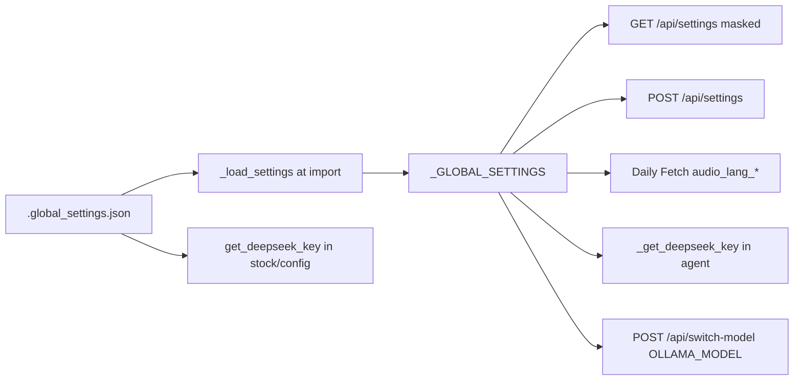

---
tags:
  - implementation
  - personal
  - global-settings
category: personal
status: current
last-updated: 2026-04-28
---

# Global Settings

> **Category**: PERSONAL | **Source**: `scripts/rag/agent.py` (settings and model switch), `scripts/stock/config.py` (`get_deepseek_key`, `call_deepseek`)

## Overview

Global Settings persist a small JSON document next to the RAG agent for audio language preferences and an optional DeepSeek API key. The Flask app loads this file at startup into `_GLOBAL_SETTINGS`, exposes masked reads and updates over HTTP, and can hot-swap the active Ollama chat model in memory. The stock module reads the same JSON path for DeepSeek credentials when calling cloud reasoning APIs.

## Architecture & Design

### System Context

### Data Flow

1. **Startup**: `_GLOBAL_SETTINGS = _load_settings()` merges defaults with file (`2411–2433`).
2. **Read**: `GET /api/settings` returns `_settings_safe()` — copies dict, replaces raw key with `deepseek_api_key_masked`, removes raw secret (`2455–2464`).
3. **Write**: `POST /api/settings` merges keys present in body for each key in `_GLOBAL_SETTINGS_DEFAULTS`, saves (`2442–2451`).
4. **Key-only endpoint**: `POST /api/settings/deepseek-key` with `api_key` updates secret and returns masked preview (`2467–2475`).
5. **Test**: `POST /api/deepseek/test` uses body `api_key` or `_get_deepseek_key()` to call DeepSeek OpenAI-compatible API (`2478–2513`).
6. **Model switch**: `POST /api/switch-model` sets module-global `OLLAMA_MODEL` (`2516–2527`).
7. **Stock**: `get_deepseek_key()` reads `scripts/rag/.global_settings.json` first, else `DEEPSEEK_API_KEY` env (`68–79:scripts/stock/config.py`).

### Key Design Decisions

- **File colocated with agent**: Path `_SETTINGS_FILE = os.path.join(os.path.dirname(__file__), ".global_settings.json")` (`2400`) — same file `scripts/stock/config.py` references via normpath (`63–65`).
- **Defaults always defined**: Ensures all expected keys exist before merge (`2402–2408`).
- **Silent IO failures**: `_save_settings` and `_load_settings` swallow exceptions (`2419–2420`, `2429–2430`).
- **DeepSeek key resolution**: Agent helpers prefer settings then env (`2436–2439`); stock module duplicates file+env logic for independence.

## Implementation Details

### Core Components

| Symbol | Role |
|--------|------|
| `_SETTINGS_FILE` | Path to JSON (`2400`) |
| `_GLOBAL_SETTINGS_DEFAULTS` | `audio_lang_*`, `deepseek_api_key` (`2402–2408`) |
| `_load_settings` / `_save_settings` | Disk persistence (`2411–2430`) |
| `_GLOBAL_SETTINGS` | Runtime dict (`2433`) |
| `_get_deepseek_key` | Agent-side key resolution (`2436–2439`) |
| `api_settings` | GET/POST CRUD (`2442–2452`) |
| `_settings_safe` | Masked export (`2455–2464`) |
| `api_settings_deepseek_key` | Dedicated secret update (`2467–2475`) |
| `api_deepseek_test` | Connectivity check (`2478–2513`) |
| `api_switch_model` | Ollama model hot-swap (`2516–2527`) |
| `get_deepseek_key` (stock) | Read same file for `call_deepseek` (`68–79`) |
| `call_deepseek` | OpenAI client → DeepSeek `deepseek-v4-pro` (`91–134`) |

### API Surface

- `GET/POST /api/settings` — JSON settings (masked on GET)
- `POST /api/settings/deepseek-key` — body `{ "api_key": "..." }`
- `POST /api/deepseek/test` — optional `api_key` override
- `GET/POST /api/switch-model` — GET current; POST `{ "model": "..." }`

### Configuration

| Key | Purpose |
|-----|---------|
| `audio_lang_ai` | Daily Fetch AI briefing MP3 language (`zh`/`en`) |
| `audio_lang_world` | World (non-China) news MP3 |
| `audio_lang_china` | China-tagged news MP3 |
| `audio_lang_knowledge` | Reserved in defaults; Audio Knowledge uses per-request `language` |
| `deepseek_api_key` | Cloud API secret |

Environment fallback: `DEEPSEEK_API_KEY` when file key empty (`2438–2439`, `79:scripts/stock/config.py`).

### Error Handling & Edge Cases

- Invalid JSON on load: defaults kept (`2419–2420`).
- Test without key: HTTP 400 (`2483–2484`).
- Switch model with empty name: HTTP 400 (`2523–2526`).
- `call_deepseek`: returns `{"ok": False, "error": "No DeepSeek API key configured"}` if no client (`104–106`).

## Code Walkthrough

- Agent settings and APIs: `2400–2527:scripts/rag/agent.py`
- Consumers: `_run_daily_fetch` reads `audio_lang_*` (`4741`, `4851`, `4886` in agent)
- Stock DeepSeek: `58–134:scripts/stock/config.py`

## Improvement Ideas

### Short-term

- Validate `audio_lang_*` values against an allowlist on POST.
- File lock or atomic write for `_save_settings` to avoid partial JSON on crash.

### Medium-term

- Named user profiles (multiple JSON blobs or keyed sections).
- Sync settings to a remote store for multi-machine use.

### Long-term

- Per-session model override without mutating global `OLLAMA_MODEL`.
- Benchmark harness comparing models on fixed prompts, stored in settings history.

## References

- `scripts/rag/agent.py` — settings routes and `_GLOBAL_SETTINGS`
- `scripts/stock/config.py` — `get_deepseek_key`, `call_deepseek`, `DEEPSEEK_BASE_URL`
- Consumer: Daily Fetch audio language selection in `_run_daily_fetch`
