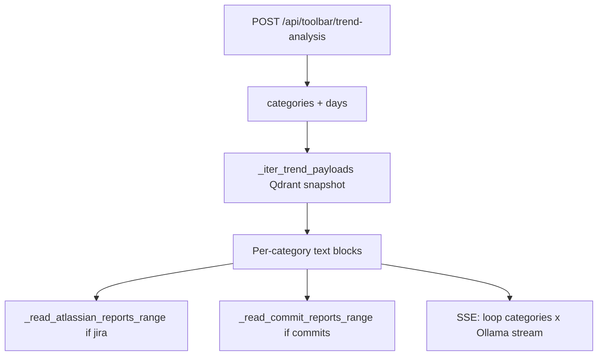

---
tags:
  - implementation
  - personal
  - trend-analysis
category: personal
status: current
last-updated: 2026-04-28
---

# Trend Analysis

> **Category**: PERSONAL | **Source**: `scripts/rag/agent.py` (trend analysis helpers and `api_toolbar_trend_analysis`)

## Overview

Trend Analysis is a toolbar endpoint that accepts a list of categories and a day window (1–90), gathers evidence from the local RAG snapshot (and on-disk Atlassian/commit reports for some categories), then streams **per-category prediction-focused analysis** from Ollama over Server-Sent Events. Each category is analyzed in sequence with a dedicated prompt and token stream.

## Architecture & Design

### System Context

Note: `_build_trend_analysis_prompt` (`3219–3243`) builds a combined analyst prompt template, but **`api_toolbar_trend_analysis` does not call it**; the live route uses `_stream_one_category`’s narrower “predictions for next 1–2 weeks” prompt instead (`3314–3327`).

### Data Flow

1. Parse `categories` list and `days` (default 7, clamped 1–90) (`3248–3257`).
2. Compute inclusive date range `start_s` … `end_s` from today (`3259–3262`).
3. For each requested category, build a text block:
   - **ai_news**: `_top_rag_items_for_types(_TREND_AI_TYPES, …)` → formatted lines (`3267–3273`). Types: `news_item`, `arxiv_paper`, `github_trending` (`3110`).
   - **world_news**: `item_type == world_news` (`3275–3281`).
   - **wiki**: `wiki_page` (`3283–3289`).
   - **jira**: RAG types `_TREND_JIRA_TYPES` (`jira_ticket`, `wiki_page`) **plus** text from `atlassian*.md` files via `_read_atlassian_reports_range` (capped in block) (`3291–3302`).
   - **commits**: `commit-report-*.md` per day via `_read_commit_reports_range`, max 8000 chars (`3304–3306`).
4. **Stream**: For each category in request order, emit SSE `type: token` for a header, then stream Ollama `OLLAMA_MODEL_FAST` chat with `stream: True`, `think: True`, stripping `<think>` wrapper when present (`3314–3387`).
5. Final SSE event `type: done` with full accumulated text and date range (`3387`).

### Key Design Decisions

- **Snapshot-first**: Uses `_qdrant_points` cache when populated; otherwise scrolls Qdrant (`3128–3151`).
- **Date filter**: Payload `date` field first 10 chars must fall in `[start_s, end_s]` (`3121–3125`, `3172–3177`).
- **Jira hybrid context**: Combines vector hits with raw markdown reports for richer signal (`3291–3302`).
- **Sequential categories**: Predictable ordering; simpler client; longer total latency than parallel.

## Implementation Details

### Core Components

| Symbol | Role |
|--------|------|
| `_TREND_AI_TYPES`, `_TREND_JIRA_TYPES` | Allowed `item_type` sets (`3110–3111`) |
| `_iter_trend_payloads` | Iterate all payloads for trend use (`3128–3151`) |
| `_top_rag_items_for_types` | Filter, sort by date desc, slice (`3165–3180`) |
| `_read_commit_reports_range` | Glob `commit-report-*.md` per day (`3183–3198`) |
| `_read_atlassian_reports_range` | Glob `atlassian*.md` per day (`3201–3216`) |
| `_format_rag_item_line` | Single-line evidence string (`3154–3162`) |
| `api_toolbar_trend_analysis` | HTTP + SSE generator (`3246–3393`) |

### API Surface

- `POST /api/toolbar/trend-analysis` — JSON: `categories` (strings: `ai_news`, `world_news`, `wiki`, `jira`, `commits`), `days` (int)
- Response: `text/event-stream` with JSON objects in `data:` lines (`type`: `token` | `done`)

### Configuration

- `OLLAMA_HOST`, `OLLAMA_MODEL_FAST`
- `REPORTS_ROOT` for report globbing
- RAG: `COLLECTION`, Qdrant client from `_get_qdrant()`

### Error Handling & Edge Cases

- Empty RAG matches: placeholder strings like `"(No matching RAG items in range.)"` (`3273`, `3281`, etc.).
- Stream parse errors on Ollama lines: ignored (`3366–3367`).
- Request exception in category stream: yields error text chunk (`3368–3369`).

## Code Walkthrough

- Type sets and RAG iteration: `3110–3180:scripts/rag/agent.py`
- Report readers: `3183–3216:scripts/rag/agent.py`
- Route and SSE streaming: `3246–3393:scripts/rag/agent.py`

## Improvement Ideas

### Short-term

- Optional use of `_build_trend_analysis_prompt` for a unified multi-category pass to reduce redundancy.
- Cap and label token counts per category in SSE metadata.

### Medium-term

- Store prediction snapshots by date for diffing “what we predicted vs what happened”.
- Explicit confidence scores parsed from model output into structured JSON alongside SSE.

### Long-term

- Time-series charts from dated RAG payloads or report metrics.
- User-defined categories mapped to `item_type` filters via settings.

## References

- `scripts/rag/agent.py` — “Trend analysis (RAG + reports + streaming LLM)”
- Report layout conventions: `commit-report-*.md`, `atlassian*.md` under `REPORTS_ROOT/YYYY-MM-DD/`
