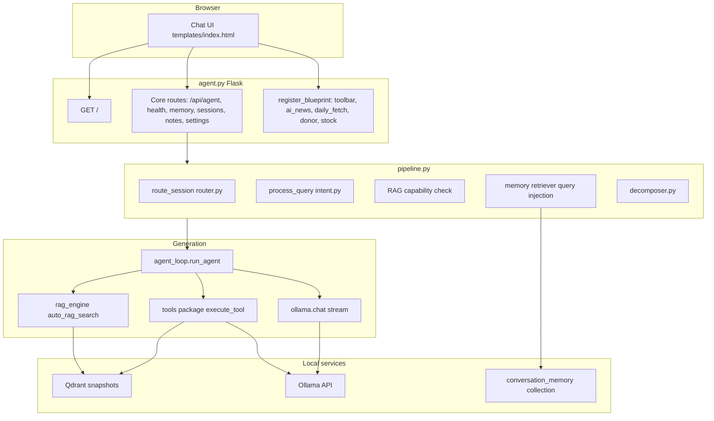

# Implementation Guide: agent.py

## Overview

`agent.py` is the main Jarvis RAG chat application: a **thin Flask orchestrator** (~1,405 lines) that streams answers over **Server-Sent Events (SSE)**, wires **automatic retrieval** from Qdrant with optional **tool calling** (Jira, git commits, Confluence search, etc.), and serves a **chat UI** loaded from **`scripts/rag/templates/index.html`** (large standalone HTML/CSS/JS file, read at process startup and rendered via `render_template_string`). Heavy HTTP surface area has been moved into **`routes/`** Blueprints (`toolbar`, `ai_news`, `daily_fetch`, `donor`, `stock`). Query understanding runs through **`pipeline.py`** (routing → intent → RAG confidence → **conversation memory** injection → optional decomposition) before **`agent_loop.run_agent`** performs auto-RAG and generation.

Location: `scripts/rag/agent.py`. Default URL: **`http://127.0.0.1:18889`** (`python agent.py [port]`).

## Technologies

- **Flask:** HTTP API, `Response` with `text/event-stream` for SSE; chat page from external `templates/index.html` loaded into memory as `AGENT_HTML`
- **sentence-transformers:** batched embeddings for auto-RAG and memory (via `rag_engine` / `memory`)
- **qdrant-client:** in-memory collections (`ai_briefings`, `conversation_memory`) loaded from snapshots; filtered vector search
- **ollama (Python package):** `ollama.chat` with `stream=True` for token streaming; native tool-call support; health via `ollama.list`
- **`ollama` HTTP API (requests):** used in `intent.py` for fast LLM classify/enhance paths
- **Front end:** single-file `templates/index.html` (markdown rendering, image upload, session sidebar, toolbar actions, stock/donor modals, etc.)

The top-of-file docstring still mentions `requests`; chat uses the **`ollama`** client library, while intent enhancement/classification uses **`requests`** against the Ollama HTTP API.

## Architecture



**Request path (non-learning chat):**

1. `POST /api/agent` receives JSON (`query`, optional `image`, `history`, `session_id`).
2. **`handle_query`** in `pipeline.py` runs: **`router.route_session`** → **`intent.process_query`** (enhancement, session/heuristic/LLM classification, RAG probe for knowledge-like intents) → **memory context** + tool hints on low/medium RAG confidence → **`decomposer.decompose_query`** for multi-part questions.
3. SSE generator may emit a **`confidence`** event from pipeline metadata, then **`run_agent`** streams tokens and tool cycles.
4. After the stream, a background thread may run **`memory.extractor.extract_immediate`** for fact extraction.

**Learning / AWS / deep-dive paths** still apply extra prompt and RAG overrides inside `api_agent` after routing; if the pipeline raises, execution falls back to a legacy direct `run_agent` path.

## Modular layout

| Area | Role |
|------|------|
| **`agent.py`** | Flask app, core JSON routes, blueprint registration, learning wiring (helpers in `learning/helpers.py`), memory API, UI bootstrap |
| **`routes/toolbar.py`** | Reindex, chunk analysis, deep-dive session seed, wiki-fetch, commit-summary, Jira report, trend-analysis |
| **`routes/ai_news.py`** | AI news KB (scan, summary), audio-from-knowledge jobs, audio/report file serving |
| **`routes/daily_fetch.py`** | Daily fetch pipeline jobs, history/continue, learning-session and learning-context helpers |
| **`routes/donor.py`** | Donor listing/scoring, AI reason, PDF export |
| **`routes/stock.py`** | Stock analysis, watchlist, scan/long-term jobs, training, prediction, sentiment, risk, timing, backtest, China data |
| **`pipeline.py`** | Single orchestrator for pre-LLM query processing; builds `PipelineContext` for `run_agent` |
| **`router.py`** | Session ID → learning mode, system prompt stem, `deep_dive` detection |
| **`intent.py`** | Query enhancement, **3-stage** classification (session type → keyword heuristic → fast LLM), RAG capability scoring |
| **`decomposer.py`** | Multi-part query decomposition and per-subquery tool hints |
| **`memory/`** | Qdrant **`conversation_memory`** store, LLM extraction, Q→A patterns, retrieval injection (`store`, `extractor`, `patterns`, `retriever`) |
| **`rag_engine.py`** | Embeddings, Qdrant `ai_briefings`, **`auto_rag_search`**, query rewrite |
| **`agent_loop.py`** | Streaming loop, auto-RAG + auto-tools parallelism, tool execution bridge |
| **`tools/`** | `TOOL_SCHEMAS`, registrations, tool implementations (`implementations.py`, `registry.py`, `schemas.py`) |
| **`learning/`** | `constants.py` + **`helpers.py`** — topic resolution (`resolve_english_topic_by_name`), learning input classification (`classify_and_resolve_learning_input`), `fetch_fresh_topics`, `web_search_references`; imported from `agent.py` |
| **`prompts.py`** | System prompts for full/compact/learning modes |
| **`templates/index.html`** | All client-side HTML/CSS/JS for the agent UI |

Approximate sizes (line counts drift with edits): blueprint modules are typically **~350–1,050** lines each; `agent.py` **~1.4k** lines; the UI template **several thousand** lines.

## Conversation memory (Phase 5)

Persisted facts and learned behavior live in **`memory/`**:

- **`memory/store.py`** — Qdrant collection **`conversation_memory`**, CRUD, vector search, JSON snapshot load/save (`MEMORY_SNAPSHOT_PATH` from `config`).
- **`memory/extractor.py`** — LLM-based extraction (`extract_immediate`, `extract_batch`); used post-reply and batch paths.
- **`memory/patterns.py`** — Q→A pattern learning, corrections, retrieval feedback hooks.
- **`memory/retriever.py`** — **`query_memories_for_context`** and **`get_tool_suggestions_from_memory`**; `pipeline.py` calls these when RAG confidence is **low** or **medium**, prepending memory text to the effective query and augmenting suggested tools.

**HTTP (in `agent.py`):**

| Method | Path | Purpose |
|--------|------|---------|
| `GET` | `/api/memory` | List/search conversation memories |
| `DELETE` | `/api/memory/<memory_id>` | Delete one entry |
| `POST` | `/api/memory/extract` | Trigger extraction (batch/on-demand per handler) |

Other core routes on the app object include **`POST /api/feedback`** (retrieval feedback wired toward memory patterns), DeepSeek key/test endpoints under **`/api/settings/deepseek-key`** and **`/api/deepseek/test`**.

## Auto-RAG pipeline

End-to-end retrieval is no longer “only” a function inside `agent.py`:

1. **`pipeline.py`** runs first for standard chat: intent + RAG confidence inform disclaimers, memory injection, and decomposition before any generation.
2. Actual vector retrieval and context formatting remain in **`rag_engine.auto_rag_search`** (helpers: `batch_encode`, `vector_search`, entity boosting, wiki bias, merge/dedupe, top-five chunk packaging) — invoked from **`agent_loop`** as before.
3. **`run_agent()`** receives optional **`auto_prefetch: list[str] | None`** from the pipeline (via `agent.py`, from **`PipelineContext.all_suggested_tools`**). When provided, it drives which commit/Jira **auto-tools** run in parallel with auto-RAG—replacing duplicate keyword-based detection inside the loop. When `None` (legacy or learning paths), the loop still uses internal keyword heuristics for commit/Jira prefetch.

**System prompt selection** and **conditional tool schemas** (e.g. trimming tools when auto-context is already present) are enforced in the agent loop / prompt assembly path, consistent with the earlier design.

## Tool system

Tools are **not** inlined in `agent.py`. The app does:

```python
from tools import TOOL_SCHEMAS, register_tools, execute_tool, get_all_tool_functions, init_tools, ...
init_tools(...)
TOOL_FUNCTIONS = get_all_tool_functions()
register_tools(TOOL_FUNCTIONS)
agent_loop.register_auto_tools(commit_fn=..., jira_fn=...)
```

**Loop:** Up to `MAX_AGENT_ITERATIONS` (default 8), the model streams; `tool_calls` are executed via the tools package, results appended, generation continues. **`analyze_image`** and other registered tools follow the same path.

**Source harvesting:** Search tools that emit numbered lines with bracketed sources feed `collected_sources` for the final `answer_done` event (logic in `agent_loop`).

## SSE streaming

`POST /api/agent` returns `text/event-stream`. Each event is one line: `data: <JSON>\n\n`.

**Event types:**

| Type | Purpose |
|------|---------|
| `model` | Active Ollama model name |
| `thinking` | Tool invocation starting (`tool`, `args`) |
| `tool_result` | Tool finished (`tool`, short `preview`) |
| `token` | Streamed LLM text (`content`) |
| `confidence` | Pipeline intent/RAG confidence (`level`, `score`, `intent`, `suggest_web_search`) |
| `answer_done` | Final message with `sources` list |
| `answer` / `answer_chunk` | Supplemental content chunks (e.g. disclaimer append) |
| `error` | Failure (`message`) |

The front-end JavaScript parses payloads and updates the DOM.

## Session management

Sessions are **JSON files** under `CHAT_SESSIONS_DIR` (`C:/reports/ai/.chat-sessions` by default, from `config`).

**Endpoints (still on the main app in `agent.py`):**

- `GET /api/sessions` — List recent sessions (metadata).
- `POST /api/sessions` — Create empty session.
- `GET /api/sessions/<session_id>` — Load full session.
- `DELETE /api/sessions/<session_id>` — Remove session file.
- `POST /api/sessions/<session_id>/messages` — Append messages; first user message can set title.
- `POST /api/sessions/<session_id>/clear` — Clear messages (learning fresh-start).

Session IDs must be valid UUID strings (except fixed learning IDs from `learning/constants`).

## API reference (core vs blueprints)

Core application routes are implemented **in `agent.py`**. Toolbar, AI news KB, audio, daily fetch, donor, and stock URLs are implemented on **Flask Blueprints** in **`scripts/rag/routes/`** but expose the **same URL prefixes** as before (`/api/toolbar/...`, `/api/donor-analysis`, `/api/stock/...`), so clients do not need path changes — only **code organization** moved.

### Core (`agent.py`)

| Method | Path | Description |
|--------|------|-------------|
| `GET` | `/` | Chat UI (`templates/index.html` via `render_template_string`) |
| `POST` | `/api/agent` | SSE chat; pipeline pre-processes non-learning queries |
| `GET` | `/api/health` | Ollama, Qdrant, model/config probe |
| `GET` / `POST` | `/api/switch-model` | Read or set chat model (`RAG_AGENT_MODEL` / global) |
| `GET` / `POST` | `/api/settings` | Global settings (e.g. audio language prefs) |
| `POST` | `/api/settings/deepseek-key` | Persist DeepSeek API key server-side |
| `POST` | `/api/deepseek/test` | Test DeepSeek connectivity |
| `GET` | `/api/memory` | Conversation memory listing/search |
| `DELETE` | `/api/memory/<id>` | Delete memory entry |
| `POST` | `/api/memory/extract` | Trigger memory extraction |
| `POST` | `/api/feedback` | Retrieval / quality feedback |
| Sessions / notes | `/api/sessions/*`, `/api/notes/*` | As above |

### Blueprint: `routes/toolbar.py` (`toolbar_bp`)

Representative endpoints: **`/api/toolbar/reindex`**, **`/api/toolbar/reindex/<job_id>`**, **`/api/toolbar/chunk-analysis`**, **`/api/toolbar/deep-dive`**, **`/api/toolbar/wiki-fetch`**, **`/api/toolbar/commit-summary`**, **`/api/toolbar/jira-report`**, **`/api/toolbar/trend-analysis`**.

### Blueprint: `routes/ai_news.py` (`ai_news_bp`)

AI news KB (**`/api/toolbar/ai-news-kb/*`**), **audio-from-knowledge** jobs (**`/api/toolbar/audio-knowledge/*`**), **`/api/toolbar/audio-file/...`**, **`/api/toolbar/report-content/...`**.

### Blueprint: `routes/daily_fetch.py` (`daily_fetch_bp`)

Daily fetch **POST `/api/toolbar/daily-fetch`**, **POST `/api/toolbar/daily-fetch/continue`**, status/history **`/api/toolbar/daily-fetch/<job_id>`**, **`/api/toolbar/daily-fetch/history`**, plus **learning-session** helpers **`/api/toolbar/learning-session`**, **`/api/toolbar/learning-context`** (implementations delegate to helpers imported where needed).

### Blueprint: `routes/donor.py` (`donor_bp`)

**`GET /api/donor-analysis`**, **`POST /api/donor-analysis/ai-reason`**, **`POST /api/donor-analysis/pdf`**.

### Blueprint: `routes/stock.py` (`stock_bp`)

**`/api/stock/*`** — analyze (incl. deepseek variant), watchlist CRUD/refresh, scan and long-term job APIs, PDF export/file serve, train/predict/sentiment/blackswan/risk, timing train/predict/backtest, China data/fund-flow/national-team, etc.

## Configuration

| Setting | Implementation note |
|---------|---------------------|
| **Chat model** | `OLLAMA_MODEL = os.environ.get("RAG_AGENT_MODEL", "qwen3.5:4b")`. |
| **Ollama host** | `OLLAMA_HOST` in agent; client may also honor **`OLLAMA_HOST`** env. |
| **Fast model constant** | `OLLAMA_MODEL_FAST` — intent enhancement/classification (`intent.py`). |
| **Narration model** | `RAG_NARRATION_MODEL` / `OLLAMA_MODEL_NARRATION` (Daily Fetch segmented audio — see blueprint code). |
| **Paths** | `SNAPSHOT_PATH`, `MEMORY_SNAPSHOT_PATH`, `REPORTS_ROOT`, collections, vector size — **`config.py`** + agent constants. |
| **Repo / Jira** | `REPO_CONFIG`, `JIRA_SCRIPT` passed into `init_tools`. |

## Commit Summary & Team Activity

Commit summary tooling is invoked through **`tools`** (`tool_commit_summary`) and **`POST /api/toolbar/commit-summary`** (toolbar blueprint). Behavior (multi-repo scan, `AUTHOR_ALIASES`, `git log`, collapsible UI) is unchanged at a functional level — only **location** moved to **`routes/toolbar.py`** + **`tools/implementations.py`**.

## Audio from Knowledge

Long-form narration from KB selection: implementation lives primarily in **`routes/ai_news.py`** (generation jobs, history, Edge-TTS, file paths under reports). UX flow remains a two-step wizard in the embedded UI.

## Explain This (Deep Dive)

Explain-this flows typically construct a prompt and reuse **`POST /api/agent`**; deep-dive sessions use **`POST /api/toolbar/deep-dive`** (`routes/toolbar.py`). **`pipeline.py`** still classifies decomposition and retrieval confidence upstream of auto-RAG when not in learning-only shortcuts.

## Daily Fetch

Orchestration, background threads, segmented narration, wiki fetch, merge recovery: **`routes/daily_fetch.py`** (large module). **`POST /api/toolbar/daily-fetch/continue`** supports resuming missing steps (see blueprint + UI history badges).

## Global Settings

**`GET/POST /api/settings`** on the main app (`agent.py`). See [Global Settings Implementation](./global-settings-impl.md) for full details on the backend API, frontend modal, and extension points.

## Donor Analysis

**`routes/donor.py`** exposes listing, **`/ai-reason`**, and PDF export. Parsing/scoring specifics remain documented in tooling under `scripts/tools/parse-cryos-donors.py` etc.

## Design decisions

- **SSE over WebSockets:** One-way token streaming with ordinary HTTP infra.
- **Pipeline before generation:** **`pipeline.py`** centralizes routing, intent, memory augmentation, decomposition, and confidence metadata for SSE.
- **3-stage intent:** Session-derived intent avoids LLM calls in learning modes; cheap heuristics catch obvious tooling; **`intent.py`** uses fast LLM for the rest plus **RAG capability probe** (`check_rag_capability`) for KB-like intents.
- **Conversation memory:** Low/medium RAG confidence triggers **semantic memory retrieval** (`memory/retriever.py`) rather than stuffing irrelevant chunks.
- **Parallel auto-work:** Auto-RAG and optional commit/Jira still run concurrently in **`agent_loop`** where applicable; pipeline sessions pass **`auto_prefetch`** so tool choice matches upstream intent/decomposition instead of a second keyword pass.
- **Conditional tool schemas:** Still used when auto-context saturates prompts (agent loop responsibility).
- **Iteration cap:** `MAX_AGENT_ITERATIONS` prevents infinite tool loops.
- **External UI file:** **`templates/index.html`** keeps `agent.py` maintainable versus a mega inline string — still rendered through **`render_template_string`** for simplicity (no separate build step).
- **Blueprints:** Large domains (stock, daily fetch, ai news/audio, toolbar, donor) register on one Flask app — clear ownership and grep-friendly files.
- **Fast model for batch tasks:** Narration/classify uses **`qwen3:1.7b`** tier models where appropriate (see env vars).
- **No-cache headers:** HTML responses send strict no-cache headers so refreshed JS/CSS is picked up immediately.
- **HTML parsing vs Playwright (donors):** Manual save + BeautifulSoup — avoids brittle auth automation.
- **Daily Fetch background jobs:** Long pipelines stay off HTTP request latency (daemon threads + polling in `daily_fetch` blueprint).

## Learning Features

Learning session IDs and routing remain in **`agent.py`** and **`routes/daily_fetch.py`** for roadmap/progress payloads; **`learning/helpers.py`** holds `resolve_english_topic_by_name`, `classify_and_resolve_learning_input`, `fetch_fresh_topics`, `web_search_references`, and related helpers. `_openLearning`-driven clears and AWS cert branching stay in **`agent.py`**. Detailed prompt text lives in **`prompts.py`**. Deep-dive session creation:** `POST /api/toolbar/deep-dive`** (`routes/toolbar.py`). For per-feature edits, **`docs/implementation/rag/learning-features-impl.md`** stays the drill-down companion.

### Learning Notes

Stored per `NOTES_FILE` in **`config`**; **`PUT /api/notes/<id>`** supports updates (`agent.py`). Client helpers in `index.html`.

---

**Related modules (unchanged roles):** `agent_loop.py` (streaming + tools + auto-RAG), `rag_engine.py` (vectors + `auto_rag_search`), **`router.py`** (session-first routing consumed by **`pipeline.py`**), **`prompts.py`**, **`tools/`**, **`learning/`**.
