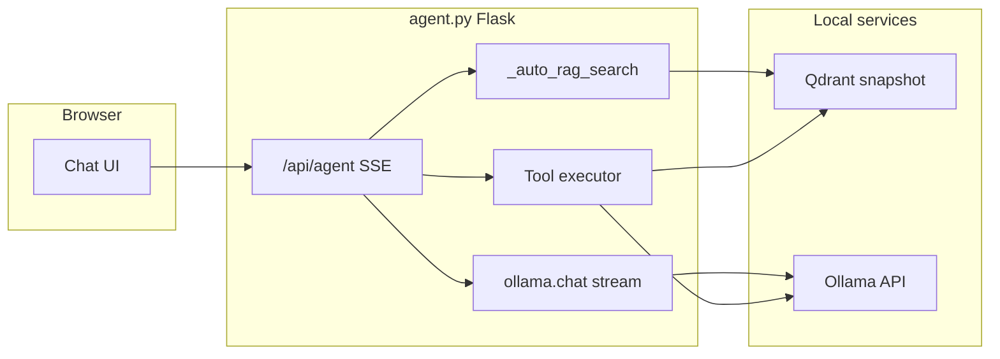

# Implementation Guide: agent.py

## Overview

`agent.py` is the main Jarvis RAG chat application: a Flask server that streams answers over **Server-Sent Events (SSE)**, combines **automatic retrieval** from Qdrant with optional **tool calling** (Jira, git commits, Confluence search, etc.), and serves a **self-contained chat UI** (HTML/CSS/JS embedded in the module). Location: `scripts/rag/agent.py` (~5,300+ lines). Default URL: **`http://127.0.0.1:18889`** (`python agent.py [port]`).

## Technologies

- **Flask:** HTTP API, `Response` with `text/event-stream` for SSE, `render_template_string` for the chat page
- **sentence-transformers:** batched embeddings for auto-RAG queries
- **qdrant-client:** in-memory collection loaded from snapshot; filtered vector search
- **ollama (Python package):** `ollama.chat` with `stream=True` for token streaming; `ollama.list` for health; native tool-call support from the model
- **Embedded front end:** large template string with markdown rendering, image upload, session sidebar, toolbar actions

The docstring mentions `requests`; the implementation uses the **`ollama`** client library rather than hand-rolled HTTP calls for chat.

## Architecture



High-level request path:

1. User submits a message (and optional image) to `POST /api/agent`.
2. `run_agent` yields SSE JSON events while work progresses.
3. Auto-RAG and optional auto-tools may run concurrently (`ThreadPoolExecutor`).
4. System + user messages are sent to Ollama with streaming; tool calls trigger execute-and-continue loops until a final answer or max iterations.

## Auto-RAG pipeline

Implemented in `_auto_rag_search` (and helpers `_batch_encode`, `_vector_search`):

1. **Encode** the user query (and optionally extra strings in one batch for efficiency).
2. **Entity-style boosting:** A fixed map from keywords (e.g. `jan`, `raymond`) to full display names. If the lowercased query matches, additional searches run with `author` payload filters and with embeddings of those names.
3. **Wiki bias:** If the query mentions wiki/Confluence/documentation-style keywords, an extra search runs with `item_type == wiki_page`.
4. **Merge and dedupe:** Results from the primary search and extras are combined; duplicates by `title` are dropped.
5. **Top context:** Up to **five** chunks are formatted into a context block with source lines; parallel `sources` metadata is collected for the UI.

Separately, when the query mentions git/commit keywords or Jira keywords, `_auto_tool_commit` / `_auto_tool_jira` can run in parallel and prepend structured “live data” blocks to the same augmented user message.

**System prompt selection:** If any auto-context (RAG or auto-tools) is non-empty, a compact system prompt is used to save tokens; otherwise the full persona prompt is used.

**Tool schemas:** When auto-context was injected, the agent **disables** tool schemas for that turn’s generation path (`use_tools = not has_auto_context`) to reduce prompt size and latency; tool use still applies when starting from no auto-context.

## Tool system

Tools are defined in `TOOL_SCHEMAS` and implemented in `TOOL_FUNCTIONS` (see `_execute_tool`). Examples include `rag_search`, `briefing_search`, `confluence_search`, `jira_report`, `commit_summary`, and `analyze_image`.

**Loop:** For each iteration (up to `MAX_AGENT_ITERATIONS`, default 8), the model streams tokens. If it emits `tool_calls`, the server runs each tool, appends tool messages, and calls the model again. Vision re-analysis uses `ollama.chat` with the image for `analyze_image`.

**Source harvesting:** For search tools that return numbered lines with bracketed source names, the agent parses lines to extend `collected_sources` for the final `answer_done` event.

## SSE streaming

`POST /api/agent` returns `text/event-stream`. Each event is one line: `data: <JSON>\n\n`.

**Event types:**

| Type | Purpose |
|------|---------|
| `model` | Announces the active Ollama model name |
| `thinking` | Tool invocation starting (`tool`, `args`) |
| `tool_result` | Tool finished (`tool`, short `preview`) |
| `token` | Streamed LLM text (`content`) |
| `answer_done` | Final message with `sources` list |
| `answer` | Non-streaming-style full content (legacy/alternate path in client handling) |
| `error` | Failure (`message`) |

The front-end JavaScript parses each SSE payload and updates the DOM (thinking indicators, token append, source list).

## Session management

Sessions are stored as **JSON files** under `CHAT_SESSIONS_DIR` (`C:/reports/ai/.chat-sessions` by default).

**Endpoints:**

- `GET /api/sessions` — List up to 50 recent sessions (metadata: `id`, `title`, timestamps, `message_count`).
- `POST /api/sessions` — Create empty session.
- `GET /api/sessions/<session_id>` — Load full session including messages.
- `DELETE /api/sessions/<session_id>` — Remove session file.
- `POST /api/sessions/<session_id>/messages` — Append user + assistant messages; first user message can set `title`.
- `POST /api/sessions/<session_id>/clear` — Clear all messages from a session (keeps session object). Used by Tech/Casual English fresh-start.

Session IDs must be valid UUID strings.

## API reference (core)

| Method | Path | Description |
|--------|------|-------------|
| `GET` | `/` | Chat UI (embedded template) |
| `POST` | `/api/agent` | Body: JSON with `query`, optional `image` (base64), optional `history`. SSE stream of events. |
| `GET` | `/api/health` | Ollama reachability, model list, Qdrant collection info, configured model names |
| `GET` / `POST` | `/api/switch-model` | GET returns current model; POST `{ "model": "..." }` sets global `OLLAMA_MODEL` |

**Toolbar / auxiliary routes** (used by the embedded UI):

| Method | Path | Description |
|--------|------|-------------|
| `POST` | `/api/toolbar/reindex` | Trigger RAG re-indexing (background job) |
| `GET` | `/api/toolbar/reindex/<job_id>` | Poll re-index job status |
| `POST` | `/api/toolbar/wiki-fetch` | Fetch Confluence wiki pages for selected users |
| `GET` | `/api/toolbar/wiki-fetch/<job_id>` | Poll wiki-fetch job status |
| `GET` | `/api/toolbar/chunk-analysis` | RAG chunk statistics |
| `POST` | `/api/toolbar/commit-summary` | Git commit summary with date range and author filtering |
| `POST` | `/api/toolbar/jira-report` | Jira/Confluence daily report |
| `POST` | `/api/toolbar/audio-knowledge` | Generate audio from knowledge base (background job) |
| `GET` | `/api/toolbar/audio-knowledge/<job_id>` | Poll audio generation job status |
| `GET` | `/api/toolbar/audio-file/<date>/<filename>` | Serve generated files (MP3, PDF) for playback/download |
| `POST` | `/api/toolbar/daily-fetch` | Start full daily briefing pipeline as background job |
| `GET` | `/api/toolbar/daily-fetch/<job_id>` | Poll daily fetch job status |
| `GET` | `/api/settings` | Get global settings (audio language preferences) |
| `POST` | `/api/settings` | Update global settings (partial update) |
| `GET` | `/api/donor-analysis` | Score all donors; query param `recipient_cmv` (negative/positive) |
| `POST` | `/api/donor-analysis/pdf` | Generate PDF report of top donors with scoring and optional AI reasoning |

## Configuration

| Setting | Implementation note |
|---------|---------------------|
| **Chat model** | `OLLAMA_MODEL = os.environ.get("RAG_AGENT_MODEL", "qwen3.5:4b")` — override default model with env var **`RAG_AGENT_MODEL`**. |
| **Ollama host** | `OLLAMA_HOST = "http://localhost:11434"` is defined and logged at startup; the `ollama` Python client typically respects the standard **`OLLAMA_HOST`** environment variable for the actual connection if set in the environment. |
| **Fast model constant** | `OLLAMA_MODEL_FAST` is exposed in health JSON for UI hints; not the same as the main chat model. |
| **Narration model** | `OLLAMA_MODEL_NARRATION = os.environ.get("RAG_NARRATION_MODEL", "qwen3:1.7b")` — the model used for Daily Fetch segmented audio narration. Override with env var **`RAG_NARRATION_MODEL`**. |
| **Paths** | `SNAPSHOT_PATH`, `REPORTS_ROOT`, `COLLECTION`, `VECTOR_SIZE` align with the rest of the RAG toolchain. |
| **Repo / script paths** | `REPO_CONFIG`, `JIRA_SCRIPT`, etc., tune git and Jira tooling. |

## Commit Summary & Team Activity

The commit summary feature provides Git commit analysis with date range and author filtering.

**Backend (`tool_commit_summary`):**
- Accepts `hours`, `authors` (list), `since_date`, and `until_date` parameters
- Scans all repos in `REPO_CONFIG` plus auto-discovered repos under `d:/projects`
- Runs `git fetch --all --prune` for configured repos, then `git log --all --since=... --until=...`
- Author filtering uses `AUTHOR_ALIASES` dictionary for case-insensitive, alias-aware matching (e.g., "Johnny Yang" matches `johnny.yang` in Git)
- Returns up to 200 commits with repo name, hash, author, message, and date

**Frontend modals:**
- Both Commit Summary and Team Activity open modals with member checkboxes and date range pickers
- Results use `addCollapsibleSystemMessage()` — shows first 12 entries with a "Show all (N more entries)" expand button
- Full commit data is pushed to `conversationHistory` so the LLM summary covers ALL commits, not just the visible preview
- LLM prompts explicitly instruct: "Use ONLY the latest commit data block. Do NOT invent job titles."

## Audio from Knowledge

Generates long-form educational podcast audio (~10 minutes) from selected RAG knowledge base content, enriched with latest web findings.

**User flow (two-step wizard):**
1. **Step 1:** Click "Audio from Knowledge" → modal shows radio buttons for source type (AI Briefings, Raw Articles, Wiki, Code, Books, Project Docs) + previously generated audio history with date filter
2. **Step 2:** Click "Next" → loads all documents of that type from Qdrant as checkboxes. For books, shows chapters grouped under book titles. Select All / Select None buttons available.
3. Pick language (Chinese/English) → click "Generate Audio"
4. Progress indicator shows: searching → searching web → generating script → generating audio → done
5. Inline audio player appears with download link

**Backend pipeline (`_generate_knowledge_audio`):**
1. **Content gathering:** Iterates `_qdrant_points` snapshot, filters by `item_type` and selected `parent_title` values. Full chunk text is collected (up to 40K chars total).
2. **Web enrichment:** Extracts key topics from selected content, searches DuckDuckGo for latest updates. Always runs.
3. **Narration generation:** Sends full content + web references to the fast LLM (`qwen3:1.7b`) with `think: true` for deeper reasoning. Target: 8000-12000 characters (~10 min spoken). `num_predict: 16384`, timeout 900s.
4. **Two-section narration:** LLM generates content with "知识库内容" (Knowledge Base) and "最新网上资讯" (Latest from Web) sections.
5. **TTS:** Uses `edge-tts` with voice selection based on language (`zh-CN-YunxiNeural` for Chinese, `en-US-AndrewNeural` for English). Long narrations are chunked at sentence boundaries and concatenated via ffmpeg.
6. **Output:** MP3 saved to `C:/reports/ai/YYYY-MM-DD/knowledge-audio-HHMMSS.mp3`, served via `/api/toolbar/audio-file/`.

**API endpoints:**
- `GET /api/toolbar/audio-knowledge/history` — lists previously generated audio files (up to 20, newest first)
- `GET /api/toolbar/audio-knowledge/items?type=book_chapter` — lists available documents grouped by `parent_title` for a given `item_type`
- `POST /api/toolbar/audio-knowledge` — starts generation job (accepts `item_type`, `selected_parents`, `language`)
- `GET /api/toolbar/audio-knowledge/<job_id>` — polls job status

## Explain This (Deep Dive)

Provides in-depth explanations of AI/tech topics using RAG context.

**User flow:**
1. Click "Explain This" → modal opens with topic input, depth selector (quick/deep), web search toggle
2. Enter a topic (e.g., "LoRA fine-tuning", "attention mechanism")
3. Click "Explain" → constructs a rich prompt and sends it through the normal chat flow

**Implementation:** Unlike Audio from Knowledge, this feature doesn't have a separate backend endpoint. It constructs a detailed prompt that instructs the agent to:
- Search the RAG knowledge base for relevant context from previous briefings
- Optionally search the web for latest information
- Provide a structured explanation at the selected depth level
- Reference any relevant briefing items

The agent's existing auto-RAG pipeline handles the knowledge base search automatically.

## Daily Fetch

One-click pipeline that runs the full daily briefing workflow from the Jarvis UI.

**User flow:**
1. Click "Daily Fetch" under Personal Tools
2. Button shows progress text as each step runs (including per-segment narration progress)
3. On completion, a summary of all steps and generated files appears in chat
4. The LLM auto-generates a brief summary of what was produced

**Backend pipeline (`_run_daily_fetch`):**
1. **AI + World News fetch:** Runs `run-all-sources.py` with proxy support (timeout: 600s). This internally runs 9 AI fetchers in parallel, then world news as Phase 5 (6 sources including Chinese news, plus Ollama translation).
2. **Topic deduplication:** Runs `filter_topics.py` in aggressive mode to remove stale items.
3. **Commit report:** Calls `tool_commit_summary(hours=48)` for the last 2 days of Git activity across all configured repos.
4. **Jira daily report:** Runs `atlassian-report.ps1` from the Jira skill for team activity.
5. **Wiki Fetch:** Runs `index_confluence_user.py` for each team member (configurable `_WIKI_USERS` list) with `--date-from` set to yesterday and `--report-json`. Parses stdout for page/chunk counts and page detail JSON (`REPORT_JSON:{...}`). Writes `wiki-fetch-YYYY-MM-DD.md` with per-user breakdowns, totals, and a **Page Details** section with clickable Confluence links, space names, content summaries (first 200 chars), and section headings.
6. **World News merge recovery:** If individual source JSONs exist (e.g., `ap-news.json`, `china-news.json`) but the merged `world-news-data.json` is missing, attempts to merge via `run-world-news.py --no-fetch --no-translate` (or direct `merge_news()` call). This handles cases where the translation step failed during the initial pipeline run.
7. **AI Briefing audio (segmented):** Splits `per_source_data` by source, generates per-source narrations using the fast narration model (`qwen3:1.7b`) with `think: false`. Chinese prompts explicitly instruct: no English reproduction, only proper nouns in English. Language is determined by `_GLOBAL_SETTINGS["audio_lang_ai"]`.
8. **World News audio (segmented):** Filters to **international-only** items (excludes China source), generates per-category narrations → `world-news.mp3`. Language: `_GLOBAL_SETTINGS["audio_lang_world"]`.
9. **Chinese News audio (segmented):** Filters to **China-only** items (Sina, People's Daily), up to 6 items per category → `china-news.mp3`. Language: `_GLOBAL_SETTINGS["audio_lang_china"]`.

**Segmented audio generation (introduced April 2026):**

Previously, audio narration used a single large LLM call to `qwen3.5:4b` with `num_predict: 32768` (up to 30 min timeout). This was replaced with a segmented approach for faster generation:

| Aspect | Old approach | New segmented approach |
|--------|-------------|----------------------|
| Model | `qwen3.5:4b` (`OLLAMA_MODEL`) | `qwen3:1.7b` (`OLLAMA_MODEL_NARRATION`) |
| LLM calls | 1 large call per audio | N calls (one per source/category) |
| `num_predict` per call | 32768 | 8192 |
| Timeout per call | 1800s | 600s |
| Intro/outro | Embedded in single narration | First segment gets intro, last gets outro |
| Target audio length | ~8-15 min | ~15 min (sum of all segments) |

Key functions:
- `_ollama_narration_call()` — Low-level Ollama call using `OLLAMA_MODEL_NARRATION` with `think: false` (thinking disabled to prevent cross-language leakage in narration output)
- `_generate_segmented_narrations(segments, content_type, lang)` — Iterates segments, generates narration with language-aware prompts (Chinese or English) and intro/outro on first/last
- `_tts_segments_to_mp3()` — Edge-TTS each segment's narration, chunk at 2000 chars, merge via ffmpeg
- `_pick_wn_text(it, prefer_zh)` — Helper to select `title_zh`/`summary_zh` or `title`/`summary` based on language preference
- `_build_audio_segments(categories, source_filter, prefer_zh, max_per_cat)` — Filter items by source and build per-category narration segments

**Script organization (refactored):**
- AI fetchers: `scripts/fetchers/ai/` (9 scripts)
- News fetchers: `scripts/fetchers/news/` (6 scripts, including `fetch-china-news.py`)
- Orchestrators live under `scripts/pipeline/`: `run-all-sources.py`, `run-world-news.py`

**API endpoints:**
- `POST /api/toolbar/daily-fetch` — Starts the pipeline in a background thread, returns `{ job_id }`
- `GET /api/toolbar/daily-fetch/<job_id>` — Returns `{ status, step, steps[], files[] }`
- `GET /api/toolbar/daily-fetch/history?date=YYYY-MM-DD` — Returns historical data for a given date (defaults to today). Response includes `{ date, files[], stats, has_audio, has_wn_audio, has_cn_audio, has_pdf, missing_steps[], available_dates[] }`.

**History stats object:**

| Field | Source | Description |
|-------|--------|-------------|
| `ai_items` | `briefing-data.json` / `briefing-data-filtered.json` | Number of AI news items |
| `world_news_items` | `world-news-data.json` (excl. China) | International news items |
| `china_news_items` | `world-news-data.json` (China tag only) | Chinese news items |
| `jira_tickets` | `jira-report-*.md` | Open Jira tickets (parsed from report) |
| `confluence_pages` | `jira-report-*.md` | Confluence pages (parsed from report) |
| `wiki_pages` | `wiki-fetch-*.md` | Wiki pages fetched in Wiki Fetch step (parsed from `**Total: N pages**`) |

**Missing steps:** The history endpoint computes `missing_steps[]` — pipeline steps whose output files are absent for the selected date. The UI shows these as badges and enables a "Continue" button to re-run only the missing steps. Tracked steps: `fetch_sources`, `topic_dedup`, `commit_report`, `jira_daily`, `wiki_fetch`, `world_news_merge`, `ai_audio`, `world_audio`, `china_audio`.

**Merge recovery in missing_steps:** When individual world news source JSONs exist but `world-news-data.json` is missing, `world_news_merge` is added. Additionally, `world_audio` and `china_audio` are added even before the merge exists (they will run after the merge step completes during Continue), so a single Continue press can merge → generate both audio files in one operation.

## Global Settings

Server-side user preferences accessible via the ⚙ gear icon next to the model selector.

Currently manages audio language preferences for three audio types. Settings are stored in-memory in `_GLOBAL_SETTINGS` and exposed through `GET/POST /api/settings`.

See [Global Settings Implementation](./global-settings-impl.md) for full details on the backend API, frontend modal, and extension points.

## Donor Analysis

Full-featured donor profile analysis with scoring, ranking, AI recommendations, and PDF export. Located under the **Personal Tools** category in the sidebar.

**Data pipeline:**
1. User saves the Cryos search results page as HTML (Ctrl+S in browser)
2. `scripts/tools/parse-cryos-donors.py` parses the saved HTML using BeautifulSoup, extracting donor properties from the rendered card elements
3. Extracted data is saved as JSON (`C:/reports/ai/YYYY-MM-DD/cryos-donors.json`) and indexed into RAG with `item_type: "donor_profile"`

**Scoring algorithm (`_score_donor`)** — 100-point scale:

| Category | Max Points | Logic |
|----------|-----------|-------|
| Sperm Quality | 30 | MOT30+=3, MOT20=2, MOT10=1 (normalized to 30); IUI-ready bonus +0.5 |
| CMV Match | 20 | If recipient CMV-negative: donor must be CMV-negative for full score |
| Stock Availability | 15 | 10+ vials=15, 5+=10, 1+=5, 0=0 |
| Genetic Screening | 10 | Available=10, Not available=0 |
| Physical Preference | 10 | Height 175-190cm=10, 170-195=7, other=4 |
| ID Release | 5 | Identity disclosure option available=5 |
| Face Matching | 5 | Cryos face matching available=5 |
| Profile Depth | 5 | Extended=5, Basic=2 |

**UI features:**
- **Recipient CMV filter:** Toggle between negative/positive to recalculate scores
- **Sortable table:** All donors with color-coded scores (green ≥80, blue ≥60, yellow ≥40, red <40)
- **Top 20 + AI Reasoning:** Sends top 20 donor summaries with score breakdowns to the LLM for analysis and recommendation
- **PDF Export:** Generates a ReportLab PDF with table, scoring criteria, and optional AI reasoning. Supports English and Chinese (STSong-Light CID font)

**API endpoints:**
- `GET /api/donor-analysis?recipient_cmv=negative` — Returns all donors with scores, sorted by total score descending
- `POST /api/donor-analysis/pdf` — Body: `{ top_n, recipient_cmv, reason_text, language }`. Generates PDF and returns download URL

## Design decisions

- **SSE over WebSockets:** Simpler for one-way token streaming from server to browser with standard HTTP infrastructure.
- **Auto-RAG before first LLM call:** Ensures most questions get grounded context without requiring the model to opt into a tool.
- **Parallel auto-work:** RAG, optional commit fetch, and optional Jira report run concurrently to reduce perceived latency.
- **Conditional tool schemas:** Skipping tools when auto-context already filled reduces tokens and speeds the first response.
- **Iteration cap:** Prevents infinite tool loops at the cost of returning an error event if the cap is hit.
- **Monolithic template:** Same deployment story as `search_ui.py`—one process, no separate front-end build.
- **Collapsible system messages:** Large result sets (commits, reports) show a preview with expand button to avoid overwhelming the chat, while the full data is still sent to the LLM for comprehensive summaries.
- **Fast model for audio narration:** Uses `qwen3:1.7b` instead of the main model for audio script generation — faster and sufficient for creative narration tasks.
- **No-cache headers:** The HTML page is served with `Cache-Control: no-cache` to ensure the browser always loads the latest JavaScript after code changes.
- **HTML parsing over Playwright:** Donor data extraction uses BeautifulSoup on a manually saved HTML page rather than Playwright automation, avoiding login/session complexities and network dependencies.
- **Weighted scoring model:** Donor scoring uses clinically-informed weights (CMV match is critical/boolean, sperm quality is highest weighted) rather than equal weighting, reflecting real-world IUI/IVF decision priorities.
- **Personal Tools category:** Separated from team-oriented "Usage Tools" to distinguish personal/private features from shared team workflows.
- **Organized fetcher directories:** AI source fetchers (`fetchers/ai/`) and world news fetchers (`fetchers/news/`) are separated into dedicated subdirectories for clarity. Orchestrators live under `scripts/pipeline/`: `run-all-sources.py`, `run-world-news.py`.
- **Daily Fetch as background job:** The full pipeline (fetch + dedup + commit + Jira + wiki fetch + audio) runs in a daemon thread with polling status, avoiding HTTP timeouts for the 5-10 minute pipeline.
- **Daily Fetch stat tiles:** The history modal shows 6 stat tiles in a 3-column grid: AI News, World News, 中国新闻, Jira Tickets, Confluence, Wiki Fetch — each sourced from its respective report file.

## Learning Features

### Learning Session Management

Three fixed-ID sessions for learning. AI Learning is persistent; Tech English and Casual English start fresh each time (cleared on open):

```python
_LEARNING_SESSION_IDS = {
    "ai_learning": "00000000-0000-0000-0000-000000000001",     # persistent
    "english_learning": "00000000-0000-0000-0000-000000000002", # fresh each time
    "casual_english": "00000000-0000-0000-0000-000000000003",   # fresh each time
}
```

Each session type has a dedicated system prompt (`SYSTEM_PROMPT_AI_LEARNING`, `SYSTEM_PROMPT_ENGLISH_LEARNING`, `SYSTEM_PROMPT_CASUAL_ENGLISH`) that shapes the LLM's teaching behavior. See `learning-features-impl.md` for full prompt text and modification guide.

The client-side `_openLearning()` function detects `english_learning` and `casual_english` types and calls `POST /api/sessions/<id>/clear` before generating a fresh welcome message with current news topics.

For the full per-feature implementation guide (how to modify each feature), see `docs/implementation/rag/learning-features-impl.md`.

### Topic Resolution (`_resolve_topic_from_history`)

Parses user input like "16", "topic 16", "#16" and resolves it to the actual topic title from the most recent assistant message's numbered list. Filters out bold-prefixed instructional items (e.g. "1. **Correct** your grammar").

### Topic Refresh (`_wants_more_topics` + `_fetch_fresh_topics`)

Detects intent phrases like "more topics", "other topics", "new topics". Fetches fresh topics from news data, excluding already-shown topics by scanning conversation history.

### Summarization Memory (`_summarize_history`)

When conversation exceeds 8 messages (`_SUMMARIZE_THRESHOLD`):
1. Old messages (all except last 6 `_RECENT_KEEP`) are sent to `qwen3:1.7b` for summarization
2. Summary is injected as a `[CONVERSATION MEMORY]` system message
3. Recent 6 messages are kept in full
4. Summaries are cached in `_SUMMARY_CACHE` dict (keyed by message count + content hash)

### Context Window Sizing

`num_ctx` and `num_predict` now account for conversation history length and session type:

```python
history_len = sum(len(m.get("content", "")) for m in messages)
ctx_len = len(augmented_query) + len(sys_prompt) + history_len
if system_prompt_override:  # Learning sessions get larger windows
    num_ctx = 8192 if ctx_len < 6000 else 16384
else:
    num_ctx = 2048 if ctx_len < 1500 else 4096 if ctx_len < 6000 else 8192 if ctx_len < 14000 else 16384

# num_predict: always 4096 for all sessions
"options": {"num_ctx": num_ctx, "num_predict": 4096}
```

A "▶ Continue" button is added to learning session messages (detected by `currentSessionId.startsWith('00000000-')`) so users can extend truncated responses.

### Welcome Message Persistence

The `api_sessions_append_messages` endpoint allows empty `user_message` when `assistant_message` is provided. This enables client-side generated welcome messages to be saved to session history, ensuring the LLM has full conversational context.

### Web Search References (`_web_search_references`)

For AI Learning queries, the system searches DuckDuckGo HTML (`https://html.duckduckgo.com/html/`) via `httpx` with the SOCKS proxy (`_WEB_SEARCH_PROXY`, defaults to `socks5://localhost:10808`). A custom `HTMLParser` extracts result links (class `result__a`) and decodes the `uddg=` redirect URLs. Up to 5 references are formatted as markdown links and:
1. Injected into the LLM prompt so it can incorporate them naturally
2. Appended as an extra `answer_chunk` SSE event after the LLM finishes, guaranteeing the links always appear

### Session Clear (`api_sessions_clear`)

`POST /api/sessions/<id>/clear` removes all messages from a session while keeping the session object. Used by the client-side `_openLearning()` for Tech English and Casual English to start fresh each time the user opens the mode.

## Learning Notes

### Storage

Notes persist in `C:/reports/ai/.learning-notes.json` as a JSON array.

### API Endpoints

| Route | Method | Handler | Description |
|-------|--------|---------|-------------|
| `/api/notes` | GET | `api_notes_list` | List notes, optional `?tag=` filter |
| `/api/notes` | POST | `api_notes_create` | Create note with content, tags, session metadata |
| `/api/notes/<id>` | DELETE | `api_notes_delete` | Delete a note by ID |

### Client-Side

- `saveToNotes(content)`: Saves assistant message content with auto-detected session type tag
- `loadNotes()`: Fetches and renders notes in the slide-out panel
- `deleteNote(id)`: Deletes a note with confirmation
- `toggleNotesPanel()`: Opens/closes the notes panel
