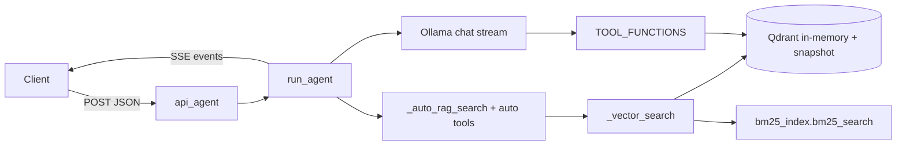

---
tags:
  - implementation
  - usage-tool
  - rag-agent
category: usage-tool
status: current
last-updated: 2026-04-28
---

# RAG Agent (Core Chat Engine)

> **Category**: USAGE TOOL | **Source**: `scripts/rag/agent.py`

## Overview

The RAG agent is a Flask-served chat engine that streams answers over Server-Sent Events (SSE). It pre-fetches hybrid vector + BM25 context from Qdrant, optionally auto-invokes Jira and git tools in parallel, then runs an Ollama model with optional tool calling (RAG search, Confluence, briefings, commits, project graph). It supports vision (base64 images), long-session memory via summarization, and specialized learning/AWS-cert routing in `api_agent`.

## Architecture & Design

### System Context

The agent sits beside the Search UI (`search_ui.py`): both load the same Qdrant collection `ai_briefings` from the JSON snapshot (`SNAPSHOT_PATH` from `scripts/config.py`). The agent exposes `/api/agent` (SSE) and health/settings/session routes; clients include the web UI and `bot_telegram.py` (`/ask`).



### Data Flow

1. **Request**: `api_agent` parses `query`, optional `image`, `history`, `session_id`; may rewrite `effective_query` / `rag_query_override` for learning or AWS cert modes.
2. **Parallel prefetch**: `run_agent` submits `_auto_rag_search` (and optionally `_auto_tool_commit`, `_auto_tool_jira`) via `ThreadPoolExecutor(max_workers=3)`.
3. **Context assembly**: Retrieved lines are injected into the user message; system prompt is `SYSTEM_PROMPT_FULL`, `SYSTEM_PROMPT_COMPACT`, or a learning override; project addon text may append if sources include project chunk types.
4. **LLM loop**: `ollama.chat(..., stream=True)`; if the model returns `tool_calls`, `_execute_tool` runs and a new assistant/tool round is appended—up to `MAX_AGENT_ITERATIONS` (8).
5. **SSE**: Each logical event is JSON on one `data: ...` line; stream ends with `data: [DONE]`.

### Key Design Decisions

- **Hybrid retrieval in-agent**: `_vector_search` mirrors the library pattern: Qdrant cosine search plus optional BM25 hits merged with RRF (`k = 60`), graceful fallback if `bm25_index` fails.
- **Tools gated by context**: When auto-injected RAG/Jira/commit context is non-empty, `use_tools` is set false to save context—unless project-type chunks were retrieved (`use_tools` forced true).
- **Dynamic `num_ctx`**: Derived from estimated prompt size and whether the model name contains `8b`.
- **Reranking / feedback**: Cross-encoder reranking and `feedback_store` weighting are **not** in `agent.py` `_vector_search`; they are implemented in `search_ui.py` `api_search` for the library search HTTP API. The chat agent relies on hybrid fusion and query expansion only.

## Implementation Details

### Core Components

| Symbol | Role |
|--------|------|
| `_get_embed_model`, `_get_qdrant`, `_sync_qdrant_points_from_snapshot` | Lazy MiniLM-L6-v2 encoder; in-memory Qdrant; reload payload cache when snapshot file changes |
| `_batch_encode` | Batched embeddings for multi-query auto-RAG |
| `_vector_search` | Vector query + BM25 RRF fusion; optional `conditions`, precomputed `embedding` |
| `_auto_rag_search` | Multi-branch retrieval (team names, wiki, project keywords + graph expansion); dedup by title; vague-query rewrite + retry |
| `_rewrite_query`, `_should_rewrite_query` | Fast-model (`OLLAMA_MODEL_FAST`) query rewrite via `OLLAMA_HOST` `/api/chat` |
| `TOOL_FUNCTIONS` / `TOOL_SCHEMAS` | Ollama-compatible tool registry (seven tools) |
| `_execute_tool` | Maps tool name to Python callable |
| `_summarize_history` | When history length > `_SUMMARIZE_THRESHOLD` (8), older messages summarized with fast model; cache `_SUMMARY_CACHE` |
| `run_agent` | Generator yielding `thinking`, `tool_result`, `token`, `answer_done`, `error`, `model` events |
| `api_agent` | Flask route: builds prompts, returns `Response(generate(), mimetype="text/event-stream")` |

### API Surface

- **POST `/api/agent`**: Body JSON `query`, optional `image` (base64), `history` (list of `{role, content}`), `session_id`. Response: SSE (`text/event-stream`).
- **POST `/api/feedback`**: Delegates to `feedback_store.record_event` (same module).
- **GET `/api/health`**: Ollama/Qdrant checks.
- Additional routes: settings, model switch, chat sessions, notes, toolbar helpers (not all listed here).

### Configuration

- `OLLAMA_MODEL` (default `qwen3.5:4b` via env `RAG_AGENT_MODEL`), `OLLAMA_MODEL_FAST` (`qwen3:1.7b`), `OLLAMA_HOST` (`http://localhost:11434`).
- `COLLECTION`, `VECTOR_SIZE`, `MAX_AGENT_ITERATIONS` (8), `TOOL_TIMEOUT_SECONDS` (120).
- Paths from `config`: `SNAPSHOT_PATH`, `REPORTS_ROOT`, `PROJECT_GRAPH_PATH`, `KNOWLEDGE_ROOT`, etc.
- `REPO_CONFIG`: hardcoded repo list for `commit_summary`.

### Error Handling & Edge Cases

- Tool execution wrapped in try/except returning error strings.
- Auto-RAG / executor futures: failures swallowed with `except Exception: pass` on individual futures.
- Max iterations: final `error` event if no answer without tool loop completion.
- Vision: special path for `analyze_image` + `image_b64` using non-streaming `ollama.chat` on `OLLAMA_MODEL`.

## Code Walkthrough

- **Constants and prompts**: ```46:111:scripts/rag/agent.py``` — models, collection size, system prompts.
- **Qdrant load + hybrid search**: ```151:279:scripts/rag/agent.py``` — snapshot upsert, `_vector_search` with RRF.
- **Tool registry**: ```600:608:scripts/rag/agent.py``` — `TOOL_FUNCTIONS` map.
- **Query rewrite + auto-RAG**: ```774:946:scripts/rag/agent.py``` — `_should_rewrite_query`, `_rewrite_query`, `_auto_rag_search`.
- **History summarization**: ```962:1012:scripts/rag/agent.py``` — `_summarize_history`.
- **Agent loop (streaming + tools)**: ```1015:1242:scripts/rag/agent.py``` — `run_agent`.
- **SSE endpoint**: ```2020:2351:scripts/rag/agent.py``` — `api_agent` and `generate()`.

## Improvement Ideas

### Short-term

- Surface retrieval scores or source IDs in `answer_done` for UI citations.
- Align agent `_vector_search` optional post-processing with Search UI reranker behind a feature flag.

### Medium-term

- **Multi-model routing**: Route simple Q&A to `OLLAMA_MODEL_FAST`, complex/tool-heavy to the main model.
- **Streaming tool results**: Stream long tool outputs in chunks instead of single `tool_result` preview.
- **Context window optimization**: Token-budget trimmer for `context_block` before LLM call.

### Long-term

- **Conversation branching**: Persist tree of turns for “what-if” follow-ups.
- Shared retrieval service (hybrid + rerank + feedback) used by both `agent.py` and `search_ui.py`.

## References

- `scripts/rag/agent.py` — primary implementation
- `scripts/rag/search_ui.py` — library search with rerank + feedback
- `scripts/rag/bm25_index.py` — BM25 side index (imported by agent)
- `scripts/config.py` — `SNAPSHOT_PATH`, paths
