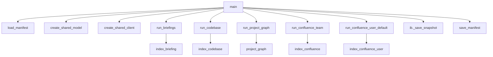

---
tags:
  - implementation
  - usage-tool
  - reindex
category: usage-tool
status: current
last-updated: 2026-04-28
---

# Reindex Orchestration (`reindex_all.py`)

> **Category**: USAGE TOOL | **Source**: `scripts/rag/reindex_all.py`

## Overview

`reindex_all.py` coordinates incremental reindexing of multiple RAG sources—daily briefings, configured codebases, Confluence (team report + per-user API), and the project knowledge graph—using one shared embedding model and one in-memory Qdrant client. State is tracked in a JSON manifest (`MANIFEST_PATH`); a single snapshot save persists the combined collection at the end.

## Architecture & Design

### System Context

The orchestrator imports indexer modules as libraries (`index_briefing`, `index_codebase`, `index_confluence`, `index_confluence_user`, `project_graph`) and uses their shared constants (e.g. `ib.COLLECTION`, `ib.SNAPSHOT_PATH`). It fits between **scheduled/manual maintenance** and the **runtime** apps (`agent.py`, `search_ui.py`) that load `SNAPSHOT_PATH`.



### Data Flow

1. Parse CLI flags (`--force`, `--force-briefings`, `--force-codebase`, `--force-confluence`).
2. Load manifest; initialize model + Qdrant + snapshot via `create_shared_client` → `ib._load_snapshot`.
3. **Briefings**: For each `YYYY-MM-DD` folder under `ib.REPORTS_ROOT`, if `briefing_needs_index`, call `ib.index_date_folder` and update `manifest["briefings"][date]`.
4. **Codebase**: For each project from `ic.load_project_dirs()`, if `codebase_project_needs_index`, call `ic.index_project` with shared `seen_hashes` for dedup; update `manifest["codebase"][key]`.
5. **Project graph**: `pg.build_graph()` + `pg.save_graph()` (independent of Qdrant but logically after codebase).
6. **Confluence team**: If stale, run `iconf.run_confluence_report`, parse pages, `iconf.index_confluence_pages`.
7. **Confluence user**: Default display name `DEFAULT_CONFLUENCE_USER` (`"Rong Yin"`); `icu.fetch_user_pages` + `icu.index_pages`.
8. `ib._save_snapshot(client)`; update `manifest["last_run"]`; `save_manifest`.

### Key Design Decisions

- **Incremental triggers**: Briefings compare folder mtime vs `indexed_at`; codebase compares MD5 content fingerprint of (path, size, mtime) per tree; Confluence team max age 24h; user index max age 7 days.
- **Ordering**: Briefings → Codebase → Graph → Team Confluence → User Confluence → snapshot (see `main` prints).
- **Shared dedup set**: `seen_hashes` passed across `index_project` calls in one run.

## Implementation Details

### Core Components

| Symbol | Role |
|--------|------|
| `load_manifest` / `save_manifest` | Read/write `MANIFEST_PATH`; default empty sections |
| `create_shared_model` | Delegates to `ib._get_model()` |
| `create_shared_client` | In-memory Qdrant + `ib._load_snapshot` |
| `codebase_content_hash` | MD5 over file rel path, size, mtime (respects `ic.SKIP_DIRS`) |
| `briefing_needs_index` | Folder date key + mtime vs manifest |
| `codebase_project_needs_index` | Normalized path key + hash vs manifest |
| `confluence_team_needs_index` / `confluence_user_needs_index` | Time-based TTL |
| `run_*` functions | Mutate manifest + append to `summary` lists |
| `print_summary` | Indexed / skipped / errors |

### API Surface

**CLI only** (no HTTP):

```
python reindex_all.py
python reindex_all.py --force
python reindex_all.py --force-briefings
python reindex_all.py --force-codebase
python reindex_all.py --force-confluence
```

Exit code `0` if no errors in `summary["errors"]`, else `2`.

### Configuration

- `MANIFEST_PATH` from `scripts/config.py` (under `REPORTS_ROOT`, `.index-manifest.json`).
- `DEFAULT_CONFLUENCE_USER` constant in `reindex_all.py` line 42.

### Error Handling & Edge Cases

- Per-item errors append to `summary["errors"]` without stopping the whole run (outer `try` in `main` wraps each phase).
- Corrupt manifest: `load_manifest` may reset sections with warning.
- Missing paths: codebase skips with "path not found" in summary.

## Code Walkthrough

- **Manifest + shared client**: ```61:107:scripts/rag/reindex_all.py```
- **Change detection helpers**: ```109:229:scripts/rag/reindex_all.py``` — hashes, `needs_index` functions.
- **Runners**: ```232:368:scripts/rag/reindex_all.py``` — `run_briefings`, `run_codebase`, `run_confluence_team`, `run_confluence_user_default`, `run_project_graph`.
- **main**: ```390:475:scripts/rag/reindex_all.py``` — flag merge, phase order, snapshot + manifest save.

## Improvement Ideas

### Short-term

- Make `DEFAULT_CONFLUENCE_USER` configurable via env or CLI.
- Distinguish fatal vs warning in exit codes.

### Medium-term

- **Parallel indexing**: Independent briefing folders or projects in a pool (watch Qdrant thread safety).
- **Delta detection**: Finer than whole-tree hash (e.g. per-file manifest entries).

### Long-term

- **Health checks**: Post-run validate point counts, embedding dimension, sample queries.
- **Scheduling**: Document Windows Task Scheduler / cron integration with log rotation.

## References

- `scripts/rag/reindex_all.py`
- `scripts/rag/index_briefing.py`, `index_codebase.py`, `index_confluence.py`, `index_confluence_user.py`, `project_graph.py`
- `scripts/config.py` — `MANIFEST_PATH`, `REPORTS_ROOT`
