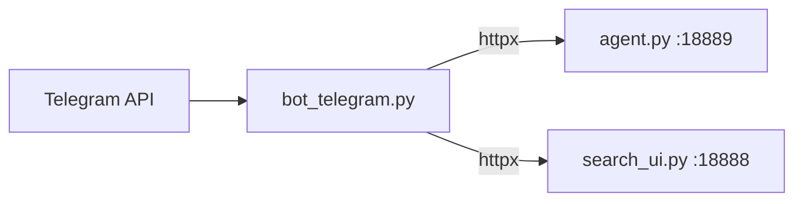

---
tags:
  - implementation
  - usage-tool
  - telegram-bot
category: usage-tool
status: current
last-updated: 2026-04-28
---

# Telegram Bot (`bot_telegram.py`)

> **Category**: USAGE TOOL | **Source**: `scripts/bot_telegram.py`

## Overview

`bot_telegram.py` is an async Telegram client (python-telegram-bot) that proxies selected Jarvis capabilities to a single **owner** user: health checks against the RAG agent and Search UI, daily fetch orchestration, RAG search, streaming LLM chat, knowledge refresh, and stock scan/train/analyze endpoints on the agent HTTP API.

## Architecture & Design

### System Context

The bot does not embed ML itself; it uses `httpx.AsyncClient` to call:

- `AGENT_URL` (default `http://127.0.0.1:18889`) — Flask app in `agent.py` (health, daily fetch, `/api/agent`, stock APIs).
- `SEARCH_URL` (default `http://127.0.0.1:18888`) — `search_ui.py` (`/api/search`, indexing jobs).

Config merges environment variables with `bot_telegram.env` beside the script.



### Data Flow

1. **Startup**: `_kill_stale_instances` may terminate prior bot PIDs (Windows `wmic`); write `bot_telegram.pid`.
2. **Polling loop**: Manual `get_updates` loop with exponential backoff on `Conflict` (409).
3. **Command**: Handler runs after `owner_only` checks `update.effective_user.id == OWNER_ID`.
4. **Long jobs**: `_poll_job` GETs status every 5s, optionally relays `step` to chat; stock/agent streaming paths use long read timeouts.

### Key Design Decisions

- **Owner-only security**: Decorator rejects non-owner with "Unauthorized." and logs warning.
- **Truncation**: `_truncate` limits Telegram message length (~4000 chars).
- **SOCKS**: Optional `SOCKS_PROXY` passed to `HTTPXRequest` for Telegram in restricted networks.

## Implementation Details

### Core Components

| Symbol | Role |
|--------|------|
| `_load_env` | Parse `KEY=value` from `bot_telegram.env` |
| `_get_http` | Shared `httpx.AsyncClient` with timeouts |
| `_agent_get` / `_agent_post`, `_search_get` / `_search_post` | JSON HTTP helpers |
| `_poll_job` | Poll agent or search job endpoints with step updates |
| `_fmt_*` helpers | Format stock scan, analyze, train, long-scan JSON for chat |
| `owner_only` | Authorization decorator |
| Command handlers | `cmd_*` async functions |
| `_run_bot` | Build `Application`, register handlers, polling loop |
| `_kill_stale_instances`, `main` | PID file + process cleanup, `asyncio.run` |

### API Surface (Telegram commands)

| Command | Backend |
|---------|---------|
| `/start`, `/help` | Local `HELP_TEXT` |
| `/status` | `GET AGENT_URL/api/health`, `GET SEARCH_URL/api/chunk-analysis` |
| `/fetch` | `POST /api/toolbar/daily-fetch` + poll |
| `/fetch_step <name>` | `POST /api/toolbar/daily-fetch/continue` with `only_steps` |
| `/search <query>` | `GET SEARCH_URL/api/search` |
| `/ask <question>` | `POST AGENT_URL/api/agent` — parse SSE `data:` lines for `answer_chunk` / `token` |
| `/index` | `POST SEARCH_URL/api/index-new` + poll |
| `/knowledge` | `POST SEARCH_URL/api/refresh-knowledge` + poll |
| `/stock`, `/train`, `/scan`, `/longscan` | Various `/api/stock/*` routes |

Unknown commands: `MessageHandler(filters.COMMAND, cmd_unknown)`.

### Configuration

- **Required**: `TELEGRAM_BOT_TOKEN`, `TELEGRAM_OWNER_ID` (env or `bot_telegram.env`).
- **Optional**: `SOCKS_PROXY`, `AGENT_URL`, `SEARCH_URL`.
- **File**: `_ENV_FILE` = `scripts/bot_telegram.env`.

### Error Handling & Edge Cases

- `Conflict` in error handler: ignored (multiple instances).
- Read timeouts: user-facing messages for `/ask` and `/stock`.
- `_poll_job`: returns timeout dict after 900s default (fetch uses 2400s).
- `cmd_index` mentions `new` count using `it.get("new")` though briefing index items use `date`/`chunks` (may show 0 “new” for that shape).

## Code Walkthrough

- **Config + HTTP**: ```40:134:scripts/bot_telegram.py```
- **Formatters**: ```141:254:scripts/bot_telegram.py```, ```553:588:scripts/bot_telegram.py``` (`_fmt_lt_scan_result`)
- **owner_only + HELP**: ```260:287:scripts/bot_telegram.py```
- **Commands** (status through longscan): ```290:615:scripts/bot_telegram.py```
- **Bot loop + main**: ```627:759:scripts/bot_telegram.py```

## Improvement Ideas

### Short-term

- Align `/index` result formatting with actual `new_items` shape from `/api/index-new`.
- Use python-telegram-bot built-in polling if Conflict handling can be simplified.

### Medium-term

- **Inline mode**: Quick answers from `/api/search` without opening chat.
- **Scheduled briefings**: Cron-like `/fetch` or digest push (with user consent).

### Long-term

- **Voice messages**: Speech-to-text pipeline to `/ask`.
- **Group chat support**: Allowlisted groups with role-based commands (broader than owner-only).

## References

- `scripts/bot_telegram.py`
- `scripts/rag/agent.py` — agent HTTP API
- `scripts/rag/search_ui.py` — search and index jobs
- `bot_telegram.env` (local, not in repo) — secrets and URLs
