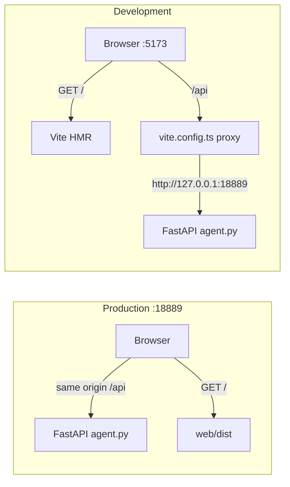
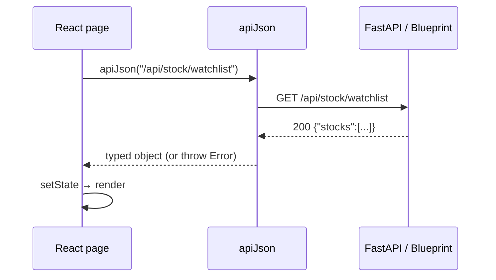
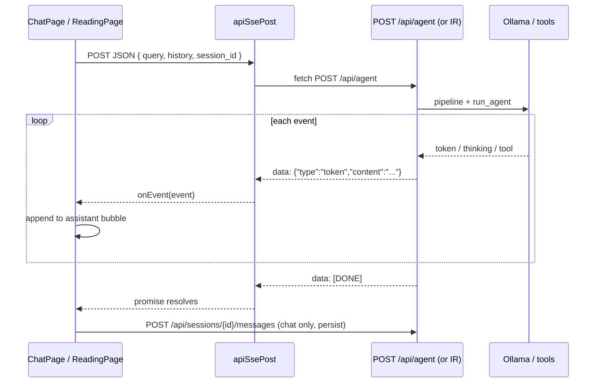
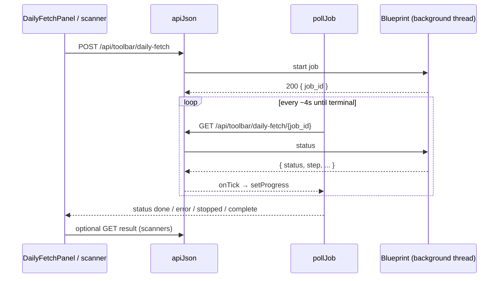

---
tags:
  - implementation
  - frontend
  - api
  - flow
category: frontend
status: current
last-updated: 2026-09-15
---

# Request flow — React UI to Python

The browser never imports Python. Every live-data action is an HTTP `fetch` to a path that starts with **`/api/`**. Python (`scripts/rag/agent.py` + Blueprints) is the only process that talks to Ollama, Qdrant, stock engines, and disk.

Helpers: `web/src/lib/api.ts` (`apiJson`, `apiUpload`, `apiSsePost`). Long jobs: `web/src/lib/jobs.ts` (`pollJob`). Endpoint list: [../rag/agent-spa-impl.md](../rag/agent-spa-impl.md).

---

## 1. Two hops: page vs API

```
User opens http://127.0.0.1:18889/stock/watch
        │
        ▼
  GET /stock/watch          ← not /api → spa_static.py returns web/dist/index.html
        │
        ▼
  Browser runs React Router → Stock watchlist page
        │
        ▼
  GET /api/stock/watchlist  ← /api → FastAPI Blueprint (routes/stock.py) → JSON
        │
        ▼
  React setState → AG Grid / cards render
```

| Request | Who answers | Result |
|---------|-------------|--------|
| `GET /`, `GET /news/daily`, `GET /stock/watch`, … | `spa_static.py` | `index.html` (React Router picks the page) |
| `GET /assets/*.js` | StaticFiles | hashed Vite bundle |
| `GET /fonts/*`, `favicon.svg` | file under `web/dist` | assets |
| **`/api/*`** | `agent.py` or a Blueprint | JSON or `text/event-stream` |

`mount_spa` is registered **after** Blueprints. `spa_fallback` refuses any path that is `api` or `api/...`, so a missing API returns JSON 404, not HTML.

### Production vs Vite HMR



In both modes the **path string in React is identical** (`"/api/stock/watchlist"`). There is no axios baseURL and no generated client. Vite only rewrites the host; it does not rewrite the path.

---

## 2. What happens inside one `fetch`

Every UI call goes through the same stack:

```
Page / feature panel
    → apiJson | apiUpload | apiSsePost   (web/src/lib/api.ts)
        → window.fetch("/api/...", { method, headers, body })
            → (dev only) Vite proxy → :18889
            → uvicorn / FastAPI
                → web_api.py Flask-shaped adapter
                    → @app.route in agent.py
                      OR Blueprint in scripts/rag/routes/*.py
                        → Python business logic
                        → jsonify(...) or SSE Response
```

`web_api.py` exists so route modules can keep Flask APIs (`request.get_json()`, `jsonify`, `Blueprint`, SSE `Response`) while the process is FastAPI/Starlette.

There is **no CORS** in production (HTML and `/api` share :18889). Vite makes `/api` look same-origin on :5173. There is **no auth token**.

---

## 3. Three request patterns

Almost every screen is one of these three. Pick the pattern from latency, not from the page name.

### Pattern A — JSON round-trip (`apiJson`)

Used for reads and short writes: health, sessions, watchlist, settings, notes, regime, national-team, chunk text, analysis cache GET/PUT.



Steps:

1. Feature calls `apiJson("/api/...", { method?, body? })`.
2. If there is a `body`, helper sets `Content-Type: application/json`.
3. `fetch` runs. Helper always `resp.json()`.
4. If `!resp.ok`, throw `Error` using `{ error }` from the JSON body, else `HTTP <status>`.
5. Caller stores the result in React state.

**Example — load watchlist** (`pages/StockPage.tsx`):

```
GET /api/stock/watchlist
    → routes/stock.py
    → JSON { stocks: [...] }
    → WatchlistGrid
```

**Example — save settings** (`pages/SettingsPage.tsx`):

```
POST /api/settings   body { ... }
    → agent.py
    → JSON { settings: {...} }
```

### Pattern B — SSE stream (`apiSsePost`)

Used when tokens should appear as they are generated: chat, intensive-reading analyze / speaking, explain-selection.



Steps:

1. Page builds a JSON body (chat: `query`, `history`, `session_id`, optional `image`).
2. `apiSsePost` POSTs it and requires `resp.body` (a stream).
3. Reader loop: decode bytes → `parseSseChunk` (`lib/sse.ts`) → lines that start with `data: `.
4. Payload `[DONE]` is skipped. Other payloads are `JSON.parse`d and passed to `onEvent`.
5. Chat maps `type`: `token` appends text; `thinking` / `tool_result` go to traces; `error` sets an error string.
6. After the stream ends, Chat **persists** with a separate Pattern A call: `POST /api/sessions/{id}/messages`.

Python chat (`agent.py` `api_agent`):

1. Parse JSON; empty `query` → `400 {"error":"Empty query"}`.
2. `pipeline.handle_query` (route, intent, RAG confidence, optional rewrite).
3. Generator yields `data: {json}\n\n` for rewrite/confidence, then each `run_agent` event, then `data: [DONE]\n\n`.
4. Response MIME `text/event-stream` with `Cache-Control: no-cache` and `X-Accel-Buffering: no` so proxies do not buffer.

Vite’s proxy copies those no-buffer headers for `/api/agent`, `/analyze`, `/explain-selection`, `/speaking`.

Intensive reading uses the same helper against `/api/intensive-reading/analyze`, `/explain-selection`, `/speaking` — same wire format, different Blueprint.

### Pattern C — start + poll job (`apiJson` + `pollJob`)

Used when work takes minutes: daily fetch, wiki fetch, platform updates, audio-knowledge, stock scanners, weekly select/backtest, train.



Steps:

1. `POST .../start` (or `POST /api/toolbar/daily-fetch`) returns quickly with `job_id` or `{ status: "running" }`.
2. Python runs the pipeline on a background thread; status lives in memory (or a small job dict).
3. `pollJob(fetchStatus, onTick)` GETs status every **4000 ms** until `status` is `done` | `error` | `stopped` | `complete` (case-insensitive).
4. Scanners then `GET .../result` for the payload. Daily fetch reloads history for today.
5. Stop buttons POST `.../stop` without waiting for the poll loop.

**Daily fetch** (`features/news/DailyFetchPanel.tsx`):

```
POST /api/toolbar/daily-fetch
    → { job_id }
GET  /api/toolbar/daily-fetch/{job_id}   (repeat)
    → { status, step, ... }
```

**Left-Right-ATH scanner** (`pages/StockPage.tsx`) — **not** the same as AI scan:

```
POST /api/stock/unified_scan/start
GET  /api/stock/unified_scan/status
GET  /api/stock/unified_scan/result
POST /api/stock/unified_scan/stop
```

AI scan uses `/api/stock/scan/*` instead.

### Pattern D — multipart upload (`apiUpload`)

Only intensive reading book upload:

```
POST /api/intensive-reading/upload
    Content-Type: multipart/form-data   (browser sets boundary)
    → routes/intensive_reading.py
    → JSON { book_id, ... }
```

Do **not** set `Content-Type: application/json` on this call (`apiUpload` leaves it alone).

---

## 4. First paint (shell)

When the SPA loads, React also hits Python before the user clicks anything:

```
GET  /                         spa_static → index.html
GET  /assets/index-*.js        Vite bundle
GET  /api/health               AppShell — Ollama up? model name?
GET  /api/sessions             ChatPage — sidebar list
```

Settings additionally `GET /api/switch-model` and `GET /api/settings`.

---

## 5. Worked example — user sends a chat message

1. User types on `/` (`ChatPage`) and submits.
2. If there is no `sessionId`, **Pattern A**: `POST /api/sessions` → `{ id }`.
3. UI appends the user bubble locally (optimistic).
4. **Pattern B**: `POST /api/agent` with `{ query, history, session_id, image? }`.
5. Python: `api_agent` → `pipeline_handle_query` → `run_agent` (auto-RAG, optional tools, Ollama tokens).
6. Each SSE `token` event extends the assistant bubble. `thinking` / `tool_result` fill the trace strip.
7. Stream ends (`[DONE]`).
8. **Pattern A**: `POST /api/sessions/{id}/messages` with the full user + assistant text so a refresh can reload the thread.

If step 4 returns HTTP error JSON, `apiSsePost` throws and Chat shows `error`.

---

## 6. Where to put a new call

| Goal | Do this |
|------|---------|
| New screen using an existing URL | Call `apiJson` / `apiSsePost` / `pollJob` from a feature panel |
| New Python behavior | Add or extend a route in `agent.py` or `scripts/rag/routes/`, then point the panel at that path |
| Do not | Axios, WebSocket, GraphQL, CORS, a second API port, or putting `fetch` in `components/ui/` |

Full path table: [../rag/agent-spa-impl.md](../rag/agent-spa-impl.md). Helpers and CORS notes: [python-bridge.md](./python-bridge.md). How to start both processes: [run-and-serve.md](./run-and-serve.md).
