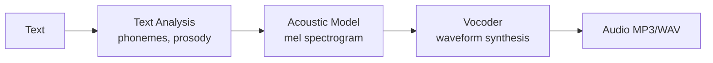
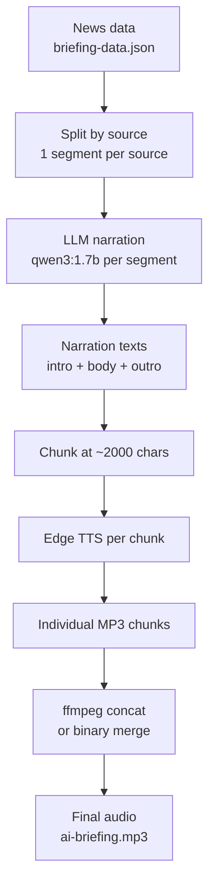

# Know-How: Edge TTS & Text-to-Speech

A beginner-friendly guide to **text-to-speech (TTS)**, **Microsoft Edge neural voices**, and how Jarvis generates audio podcasts. No prior audio engineering background required.

## What is text-to-speech?

TTS converts written text into spoken audio. Modern **neural TTS** produces near-human-quality speech, unlike older systems that sounded robotic.

| Generation | Technique | Quality |
|------------|-----------|---------|
| Old | Concatenative (splice recorded fragments) | Robotic, unnatural pauses |
| Modern | Neural network (learn speech patterns from data) | Natural prosody, intonation, emotion |

## What is Edge TTS?

**Edge TTS** refers to Microsoft Edge's built-in neural speech service, made accessible in Python via the `edge_tts` package.

| Property | Detail |
|----------|--------|
| **Package** | `pip install edge-tts` |
| **Cost** | Free — uses the same endpoint as the Edge browser's Read Aloud feature |
| **API key** | None required |
| **Quality** | High — Microsoft neural voices with natural prosody |
| **Languages** | 300+ voices across 70+ languages |
| **Limitation** | Unofficial API — no SLA, may change without notice |

**Alternatives comparison:**

| Library | Quality | Cost | Speed | Offline |
|---------|---------|------|-------|---------|
| **edge-tts** | Excellent | Free | Fast (streaming) | No |
| gTTS (Google) | Good | Free | Medium | No |
| Coqui TTS | Good | Free | Slow (local GPU) | Yes |
| Bark | Excellent | Free | Very slow | Yes (needs GPU) |
| OpenAI TTS | Excellent | Paid | Fast | No |

Jarvis chose Edge TTS for the best quality-to-simplicity ratio — no API keys, no GPU, excellent Chinese and English voices.

## How neural TTS works (high level)



1. **Text analysis** — Converts text to phonemes (speech sounds), determines where to pause, which words to stress
2. **Acoustic model** — Generates a mel spectrogram (visual representation of sound frequencies over time)
3. **Vocoder** — Converts the spectrogram into actual audio waveforms

You don't need to understand these internals to use Edge TTS — the library handles everything.

## Voices in Jarvis

| Voice | Language | Gender | Used for |
|-------|----------|--------|----------|
| `zh-CN-YunxiNeural` | Chinese | Male | Chinese news narration, AI briefing (ZH mode) |
| `en-US-AndrewNeural` | English | Male | English narration |

Voice selection is driven by `_GLOBAL_SETTINGS`:

```python
lang = _GLOBAL_SETTINGS.get("audio_lang_world", "zh")
voice = "en-US-AndrewNeural" if lang == "en" else "zh-CN-YunxiNeural"
```

Users can switch between Chinese and English audio via the Settings gear icon.

## How Jarvis uses Edge TTS

### Basic usage

```python
import edge_tts
import asyncio

async def text_to_mp3(text, output_path, voice="zh-CN-YunxiNeural"):
    communicate = edge_tts.Communicate(text, voice)
    await communicate.save(output_path)

asyncio.run(text_to_mp3("你好世界，今天的AI新闻摘要开始了。", "hello.mp3"))
```

### The segmented audio pipeline

Jarvis generates ~15-minute podcast episodes through a multi-step pipeline:



### Chunking strategy

Edge TTS has practical limits on input length. Jarvis chunks narration at ~2000 characters:

- Prevents timeout on very long texts
- Keeps memory usage reasonable
- Allows progress tracking during generation

### Audio merging

After TTS produces individual MP3 chunks, they must be combined:

1. **Primary:** `ffmpeg` concat demuxer (lossless join)
2. **Fallback:** Binary concatenation (if ffmpeg unavailable — works for MP3 but less robust)

```python
# ffmpeg concat approach
ffmpeg -f concat -safe 0 -i filelist.txt -c copy output.mp3
```

### Three audio outputs

The Daily Fetch pipeline generates up to three separate MP3 files:

| File | Content | Source filter |
|------|---------|---------------|
| `ai-briefing.mp3` | AI/tech news narration | All AI sources |
| `world-news.mp3` | International news | Non-China sources |
| `china-news.mp3` | Chinese news (Sina, People's Daily, CLS, Toutiao, Weibo) | China-tagged sources, cross-day dedup |

## Common issues

| Issue | Cause | Solution |
|-------|-------|----------|
| Rate limiting | Too many rapid requests | Add small delays between chunks |
| Voice not found | Typo in voice name | Use `edge-tts --list-voices` to verify |
| Encoding errors | Non-UTF-8 text | Clean text before TTS, remove control chars |
| Event loop conflict | Calling `asyncio.run()` inside existing loop | Use `asyncio.get_event_loop().run_until_complete()` or nest |
| Empty audio | Text was all whitespace or special characters | Filter/validate text before TTS |

## Further reading

- [edge-tts on PyPI](https://pypi.org/project/edge-tts/)
- [Microsoft neural voices list](https://learn.microsoft.com/en-us/azure/ai-services/speech-service/language-support)
- Jarvis implementation: `_tts_segments_to_mp3()` in [`scripts/rag/agent.py`](../../../scripts/rag/agent.py)
