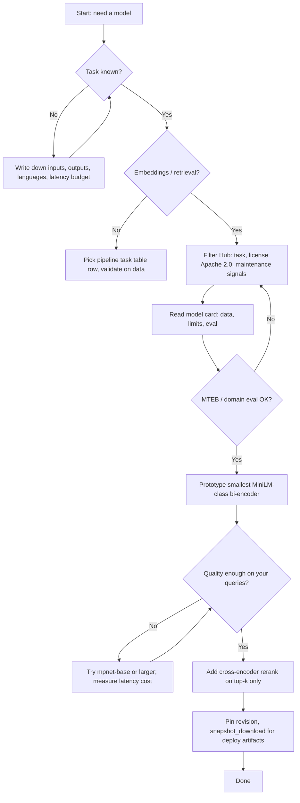

# Chapter 3: Choosing Models and Navigating the Hugging Face Hub

This chapter explains how to pick embedding and language models with confidence, read model cards, use benchmarks like MTEB, and stay within safe licensing and deployment constraints. It connects directly to how Jarvis retrieves and ranks information.

**Navigation:** [Previous: Tokenization](ch2-tokenization.md) · [Next: Sentence Transformers](sentence-transformers.md)

---

## The Model Zoo Problem

The Hugging Face Hub hosts well over half a million public models. That scale is exciting and overwhelming at the same time. Many checkpoints are experiments, forks, or fine-tunes on narrow data. Some are excellent; others are outdated, poorly documented, or unsuitable for production.

You cannot evaluate every model by hand. What you need is a repeatable framework. In order:

1. **Task fit:** Decide what the model must output (labels, spans, embeddings, tokens).
2. **Constraints:** Fix non-negotiables such as CPU-only hosting, maximum latency, languages, and privacy (on-prem vs API).
3. **Shortlist:** Use Hub filters (task tags, library compatibility, license) to cut the search space from hundreds of thousands to tens.
4. **Evidence:** Read cards, compare benchmarks that match your domain, and note who maintains the checkpoint.
5. **Proof on your data:** Run a small evaluation set of real queries or documents before you commit.

This chapter walks through those steps with Jarvis-oriented examples.

**Navigating the Hub:** The model page lists files, commits, community discussions, and linked datasets or Spaces. Use the task filter and the “Inference” widget cautiously: a demo works on one sentence does not validate your workload. Prefer models with eval tables, clear training provenance, and a pinned default revision when authors recommend one.

---

## Task Types

Hugging Face `transformers` pipelines and many Hub filters use standardized task names. The table below maps common NLP tasks to typical model families and what you usually optimize for.

| Hub task / pipeline | Typical model type | Primary output | Notes |
|---------------------|-------------------|----------------|-------|
| `text-classification` | Encoder (e.g. BERT-style) | Label scores per sequence | Whole-sequence decisions |
| `token-classification` | Encoder | Label per token | NER, tagging, span tasks |
| `question-answering` | Encoder (often with span head) | Answer span in context | Needs passage + question |
| `text-generation` | Decoder or encoder–decoder | Continued text | GPT-style, T5-style, etc. |
| `sentence-similarity` | Sentence embedding model | Similarity between texts | Pairs or sets of sentences |
| `feature-extraction` | Encoder | Hidden states / embeddings | Raw vectors for downstream use |

**Jarvis:** retrieval and semantic search rely on **sentence-similarity** style models (sentence transformers) that produce fixed-size vectors for passages and queries. Pipelines and services that expose plain **feature-extraction** use the same underlying encoders but return embedding tensors directly for indexing, clustering, or reranking features. In practice, choose one well-documented embedding model and keep task naming consistent across training and inference.

If you are new to the names above, map your product feature to the table before searching the Hub. Searching “best NLP model” without a task yields noise; searching “sentence-similarity english cpu” yields candidates you can compare fairly.

---

## Reading a Model Card

A model card is the author’s statement of what the checkpoint is for, how it was built, and where it might fail. Treat it as part of the contract, not marketing copy.

**Sections to prioritize**

| Section | What to extract |
|---------|-----------------|
| Model description | Architecture family, objective (MLM, contrastive, etc.), intended domain |
| Intended use | Supported use cases; explicit out-of-scope warnings |
| Training data | Corpora, languages, time window, known biases |
| Evaluation results | Datasets, metrics, comparison baselines |
| Limitations | Failure modes, language coverage, domain shift |
| License | Legal terms governing use and redistribution |

**Trust signals (heuristic, not proof)**

- Download and like counts indicate adoption; spikes can follow hype, so combine with other signals.
- Maintainers under known organizations or long-running community projects often have clearer governance.
- Recent updates suggest active maintenance; stale repos may lack security or compatibility fixes.
- Transparent evaluation tables beat vague claims of “state of the art.”

Always run your own checks on representative queries from your product before locking in a model.

**Red flags:** no training description, no evaluation, generic README copied from a template, or claims that contradict the license. Forks that only change the model name but not the weights deserve extra scrutiny unless you trust the fork author.

---

## The MTEB Leaderboard

**MTEB** (Massive Text Embedding Benchmark) is a standardized suite of retrieval, classification, clustering, and semantic textual similarity tasks used to compare text embedding models across many datasets.

**Scores:** Leaderboard entries aggregate task-specific metrics (often nDCG, accuracy, or correlation-like measures depending on the task) into dataset and macro averages. Higher is generally better for a given column, but pay attention to which **languages** and **domains** your application cares about; a high global average can hide weak performance on your locale or vertical.

**Reading the leaderboard:** Open the [MTEB leaderboard](https://huggingface.co/spaces/mteb/leaderboard), filter or sort by model size, language coverage, and the task families that mirror your workload (e.g. retrieval-heavy columns if you build search). Drill into per-task breakdowns when available.

**Why Jarvis uses `sentence-transformers/all-MiniLM-L6-v2`:** It is a compact bi-encoder with strong MTEB-relative performance for its size, low memory footprint, and predictable latency on CPU-only hosts. For many RAG-style workloads, that balance beats much larger models until quality plateaus force an upgrade.

MTEB is a compass, not a contract. Your documents may be legal, medical, or multilingual in ways the benchmark under-represents. After you narrow candidates on the leaderboard, run retrieval precision@k or mean reciprocal rank on a few hundred labeled query–document pairs from your own system.

---

## Size vs Quality vs Speed

Model “size” usually means **parameter count**: more parameters can capture richer patterns but increase memory, disk, and compute. Deployment constraints (RAM, batch size, CPU vs GPU) often dominate pure benchmark wins.

**Rough categories (informal)**

| Category | Typical parameters (order of magnitude) | Role |
|----------|------------------------------------------|------|
| Tiny / small | tens of millions | Edge, high throughput, prototyping |
| Base | around 100M | Default starting point for many encoders |
| Large | hundreds of millions | Higher ceiling, heavier hardware |

**Latency:** GPUs parallelize matrix math well; CPUs favor smaller matrices and fewer layers. Expect roughly higher per-token or per-sentence latency as width and depth grow, especially on CPU.

**Memory:** Parameters plus activations and batching dominate RAM/VRAM. Embedding models also need headroom for your batch size and any concurrent requests.

**Comparison table (embedding-oriented)**

| Model (example id) | Approx. size | Speed (CPU) | Quality ceiling | Notes |
|--------------------|--------------|-------------|-----------------|-------|
| `all-MiniLM-L6-v2` | Small | Fast | Good for size | Jarvis default bi-encoder |
| `all-MiniLM-L12-v2` | Small–medium | Moderate | Better than L6 | More depth, more cost |
| `all-mpnet-base-v2` | Base | Slower | Strong | Heavier than MiniLM |
| Large sentence-transformers | Large | Slowest on CPU | Highest | Justify with measured gains |

**Rule of thumb:** Start with the smallest model that meets a minimum quality bar on your evaluation set. Scale up only when offline metrics and user-facing quality clearly improve enough to pay for latency and infrastructure.

When comparing two checkpoints, control for **batch size**, **sequence length**, and **hardware**. A large model on GPU can beat a small model on CPU even when the raw benchmark favors the large model on different silicon. Align the benchmark setup with production.

---

## Bi-Encoder vs Cross-Encoder

**Bi-encoder:** Each text (query, document) is encoded independently into a vector. Similarity is computed in vector space (e.g. cosine). Encoding documents can be precomputed and indexed; queries are encoded once per request. Throughput is high.

**Cross-encoder:** Query and candidate are concatenated and processed jointly by a single transformer forward pass. Interactions are modeled at every layer, which improves ranking accuracy but costs roughly one full forward pass **per pair**, making large-scale first-stage retrieval impractical.

| Aspect | Bi-encoder | Cross-encoder |
|--------|------------|----------------|
| Speed | Fast at scale | Slow per pair |
| Accuracy | Good retrieval | Strong reranking |
| Typical use | First-stage search | Top-k rerank |

**Jarvis:** bi-encoders back broad **search** over the corpus; cross-encoders (or cross-style rerankers) refine the **top candidates** where extra compute buys precision.

---

## Downloading and Caching

`AutoModel.from_pretrained("org/name")` and `SentenceTransformer("org/name")` resolve weights from the Hub, download missing files, and place them in the local **HF cache**. On Windows, Hugging Face libraries typically store artifacts under `%USERPROFILE%\.cache\huggingface\` unless you redirect with environment variables. Set `HF_HOME` to move the whole tree; older docs may still mention `TRANSFORMERS_CACHE` for legacy `transformers` releases.

The cache stores **snapshots** keyed by revision so different pins can coexist. Deleting the cache frees disk but forces a full re-download on next load.

```python
from sentence_transformers import SentenceTransformer

model = SentenceTransformer("sentence-transformers/all-MiniLM-L6-v2")
```

For reproducible builds or air-gapped mirrors, pin a **revision** (commit hash, branch, or tag). On the model page, open **Files and versions** and copy the commit identifier you want frozen; use that string as `revision` in code and in deployment configs.

```python
model = SentenceTransformer(
    "sentence-transformers/all-MiniLM-L6-v2",
    revision="main",
)
```

For production, swap `main` for a full commit SHA so upgrades are explicit rather than automatic.

Bulk or scripted fetch without loading into memory:

```python
from huggingface_hub import snapshot_download

path = snapshot_download(
    repo_id="sentence-transformers/all-MiniLM-L6-v2",
    revision="main",
)
```

Pinning a commit SHA instead of a moving branch avoids silent weight changes when the repository default advances.

---

## Licenses to Know

| License | Practical summary |
|---------|-------------------|
| Apache 2.0 | Permissive; patent grant; common in open models |
| MIT | Very permissive; simple terms |
| CC-BY | Often for data or weights; attribution requirements |
| Llama community license | Model-specific rules; read each version |
| Gated models | Access after accepting terms on the Hub; may restrict commercial use |

**Jarvis policy:** use **Apache 2.0** models (and similarly permissive stacks that your legal review approves) so redistribution, on-prem deployment, and integration stay straightforward. Always read the full license text for the exact checkpoint you download.

---

## Summary

1. Define the **task** (`sentence-similarity` / embeddings vs generation vs classification).
2. Shortlist models with **clear cards**, plausible **trust signals**, and acceptable **licenses**.
3. Check **MTEB** (or domain-specific evals) aligned with your languages and retrieval mix.
4. Prefer **small bi-encoders** for first-stage retrieval; add **cross-encoders** only on shortlists.
5. **Pin revisions** and understand the **cache** for reproducible deployments.

**Decision flowchart**



When in doubt, evaluate on real user queries and production-like hardware before promoting a checkpoint to the default in Jarvis.

**Quick reference — Jarvis defaults**

| Stage | Mechanism | Role |
|-------|-----------|------|
| Retrieval | Bi-encoder embeddings | Fast recall over the corpus |
| Reranking | Cross-encoder on top-k | Precision on a short list |
| Governance | Apache 2.0 checkpoints | Predictable compliance |

Together with pinned revisions and a warm cache, that stack keeps behavior stable as the Hub ecosystem evolves around it.
