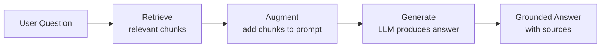
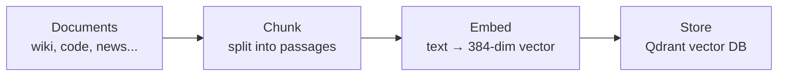
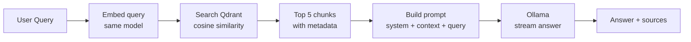

# Know-How: Retrieval-Augmented Generation (RAG)

> This is a quick-reference guide for Jarvis's RAG architecture. If you're new to RAG, start with [Chapter 1: Core RAG Concepts](ch1-rag-concepts.md) first.

A beginner-friendly guide to **RAG** — the architecture pattern that lets Jarvis answer questions using real, up-to-date data instead of relying solely on the LLM's training knowledge. No prior AI systems background required.

## The LLM knowledge problem

Large Language Models have three fundamental limitations:

| Problem | Example |
|---------|---------|
| **Training cutoff** | "What happened in yesterday's sprint?" — the model was never trained on your team's data |
| **No private data** | "What does our Confluence wiki say about DICOM routing?" — it has no access |
| **Hallucination** | When unsure, LLMs confidently make things up rather than saying "I don't know" |

**RAG solves all three** by giving the LLM relevant documents to read before answering.

## What is RAG?

**Retrieval-Augmented Generation** = **Retrieve** relevant context, then **generate** an answer grounded in that context.



Instead of asking the LLM from memory, you first **search** your knowledge base for relevant information, **paste** it into the prompt, and then ask the LLM to answer **based on the provided context**.

## The RAG pipeline

RAG has two main phases: **indexing** (offline) and **retrieval + generation** (at query time).

### Phase 1: Indexing (offline)



1. **Collect** documents from various sources
2. **Chunk** each document into passages (typically 500–1500 characters)
3. **Embed** each chunk using a sentence transformer model
4. **Store** the vector + metadata in Qdrant

### Phase 2: Retrieval + Generation (query time)



1. **Embed** the user's question with the same model used for indexing
2. **Search** the vector database for the most similar chunks
3. **Build** a prompt: system instructions + retrieved chunks + user question
4. **Generate** an answer via the LLM, streamed token by token

## Document chunking

You can't embed an entire 50-page wiki article as one vector — the meaning gets diluted. **Chunking** splits documents into focused passages.

| Strategy | How it works | Trade-off |
|----------|-------------|-----------|
| **Fixed-size** | Split every N characters/words | Simple but may cut mid-sentence |
| **Sentence-based** | Split on sentence boundaries | Preserves meaning but uneven sizes |
| **Semantic** | Split on topic/section boundaries | Best quality but complex |
| **With overlap** | Chunks share some text at boundaries | Reduces information loss at edges |

Jarvis uses text splitting with overlap, keeping chunks around 500–1500 characters.

**Granularity matters:** Too large = diluted meaning, poor matches. Too small = lost context, fragmented answers.

## Embedding models

The embedding model converts text to vectors. The **same model** must be used at both index time and query time — otherwise vectors live in different spaces and similarity is meaningless.

Jarvis uses `all-MiniLM-L6-v2` (384 dimensions). See [sentence-transformers.md](../huggingface/sentence-transformers.md) for details.

## Vector similarity

**Cosine similarity** measures the angle between two vectors, ignoring magnitude:

```
cosine_sim(A, B) = (A · B) / (|A| × |B|)
```

| Score | Meaning |
|-------|---------|
| 1.0 | Identical direction (same meaning) |
| 0.0 | Orthogonal (unrelated) |
| −1.0 | Opposite direction (opposite meaning) |

**Why cosine over Euclidean?** Cosine focuses on **direction** (meaning) rather than **magnitude** (text length). A short sentence about "DICOM routing" and a long paragraph about "DICOM routing" should match — cosine handles this naturally.

## The context window

LLMs have a **context window** — the maximum number of tokens they can process in one call.

| Model | Typical context |
|-------|----------------|
| `qwen3.5:4b` | 8192–32768 tokens |
| `qwen3:1.7b` | 8192 tokens |

Jarvis retrieves **Top 5 chunks** by default. More chunks = more context for the LLM, but:

- Too many chunks may exceed the context window
- Irrelevant chunks add noise, confusing the model
- More tokens = slower generation

Jarvis dynamically adjusts `num_ctx` based on conversation history length and session type.

## How Jarvis implements RAG

### Six indexers

| Indexer | Source | Content type |
|---------|--------|-------------|
| `index_briefing.py` | AI news briefings | News articles, summaries |
| `index_codebase.py` | Git repositories | Code, docstrings, README files |
| `index_confluence.py` | Team Confluence space | Wiki pages |
| `index_confluence_user.py` | Per-user Confluence pages | Personal wiki contributions |
| `index_custom.py` | Custom sources (books, PDFs) | Any text content |

All indexers write to a **single Qdrant collection** (`ai_briefings`) with an `item_type` payload field for filtering.

### Auto-RAG in the agent

Every user message triggers `_auto_rag_search` **before** the LLM sees the question:

1. **Encode** the query (and optionally extra keywords) in one batch
2. **Entity boosting** — recognized names (e.g. "Raymond", "Jan") trigger additional filtered searches with author metadata
3. **Wiki bias** — documentation-related keywords trigger an extra search with `item_type == wiki_page`
4. **Merge and dedupe** — combine results from all searches, remove duplicates by title
5. **Top 5 chunks** are formatted as context with source citations

### Tool-based RAG

Besides auto-RAG, the agent can explicitly call RAG tools during reasoning:

- `tool_rag_search` — General knowledge base search
- `tool_briefing_search` — Search only AI news briefings
- `tool_confluence_search` — Search only wiki pages (with space filtering)

### Persistence

Qdrant runs **in-memory** with a JSON snapshot at `C:/reports/ai/.rag-store.json`:

- On startup: load all points from snapshot
- After indexing: save all points back to snapshot
- This avoids file-locking issues on Windows while keeping deployment simple

## RAG quality patterns

| Technique | How it helps | Jarvis status |
|-----------|-------------|---------------|
| **Hybrid search** (BM25 + vector) | Catches both exact terms and semantic matches | Implemented |
| **Cross-encoder reranking** | Improves precision of top results | Implemented |
| **Metadata filtering** | Narrows search to relevant source types | Implemented |
| **Entity boosting** | Prioritizes results matching recognized entities | Implemented |
| **Chunking with overlap** | Reduces information loss at chunk boundaries | Implemented |
| **Feedback loops** | User feedback improves ranking over time | Partially implemented |

See [hybrid-search-reranking.md](./hybrid-search-reranking.md) for details on the retrieval stack.

## Common pitfalls

| Pitfall | Symptom | Fix |
|---------|---------|-----|
| **Stale index** | Answers reference old information | Re-index after data changes; restart to reload snapshot |
| **Model mismatch** | Poor search results despite good data | Ensure the same embedding model is used for indexing and querying |
| **Too many chunks** | LLM gets confused, answers wander | Reduce top-K or improve relevance filtering |
| **Too few chunks** | LLM lacks context, halluccinates | Increase top-K or improve chunking granularity |
| **Context overflow** | Error or truncated responses | Monitor token counts, dynamically adjust `num_ctx` |
| **Duplicate content** | Same information retrieved multiple times | Deduplicate by title or content hash |

## Further reading

- [RAG overview — Hugging Face](https://huggingface.co/docs/transformers/model_doc/rag)
- [Building RAG applications](https://www.pinecone.io/learn/retrieval-augmented-generation/)
- Jarvis implementation: [`scripts/rag/agent.py`](../../../scripts/rag/agent.py), all `scripts/rag/index_*.py` indexers
