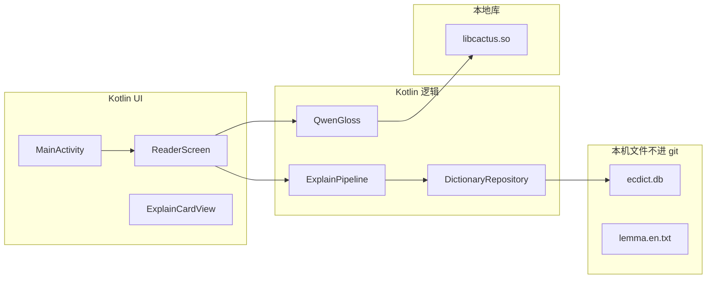

---
tags:
  - ir-guide
---

# 项目结构

← [[首页]]

> [!important] 打开哪个文件夹
> Android Studio 必须打开 **`c:\jarvis\mobile\ir-android`**，不是 `c:\jarvis` 仓库根目录。根目录是 Jarvis 大项目，Studio 不会把它当 Android App。

本教材在 `mobile/ir-guide\`，和工程分开，避免和 Gradle 搅在一起。

## 鸟瞰

```
c:\jarvis\mobile\
├── ir-guide\          ← 你现在读的笔记（Obsidian）
└── ir-android\        ← Android 工程（Studio）
    ├── settings.gradle.kts
    ├── build.gradle.kts
    ├── gradlew.bat    ← Windows 命令行构建
    ├── app\           ← 唯一的模块，真正的应用
    └── scripts\       ← 下载模型/词典的说明
```



## `app/` 里面（你真正会看的代码）

```
app/
├── build.gradle.kts          依赖、minSdk、只打 arm64-v8a
├── src/main/
│   ├── AndroidManifest.xml   启动 Activity、应用名 Y
│   ├── java/com/jarvis/ir/
│   │   ├── MainActivity.kt   入口：书架、设置、拷贝词典
│   │   ├── ui/               阅读界面、点词、卡片
│   │   ├── explain/          词典卡片和 Qwen 调用
│   │   ├── dict/             ECDICT、词形还原、义项切分
│   │   └── books/            TXT / EPUB / PDF 导入、切段、书架
│   ├── java/com/cactus/      加载 libcactus.so 的薄封装
│   ├── jniLibs/arm64-v8a/
│   │   └── libcactus.so      Qwen 运行时（gitignore）
│   ├── assets/
│   │   ├── sample.txt        空书架时的范文
│   │   ├── lemma.en.txt      词形表（gitignore）
│   │   └── ecdict.db         词典（gitignore）
│   └── res/                  应用名、主题
└── src/test/                 电脑上跑的单元测试（不需要手机）
```

## 按「我想改什么」找文件

| 你想改… | 去这 |
|---|---|
| 启动后默认那句话 | `app/src/main/assets/sample.txt` |
| 顶部按钮、打开文件 | `MainActivity.kt` |
| 点词手感、卡片样子 | `ui/ReaderScreen.kt`、`ui/ExplainCardView.kt`、`ui/WordSelector.kt` |
| 词典卡片 | `explain/ExplainPipeline.kt` |
| Qwen 提示词和翻译 | `explain/GlossPrompt.kt`、`explain/QwenGloss.kt` |
| 词典怎么查 | `dict/` |
| 一页大约多长 | `books/` 里的导入，大约 400 词；超长段落按句切开 |
| 模型打不开 | `explain/ModelOpenFailure.kt` |

## 不要手改、不要提交的

| 路径 | 原因 |
|---|---|
| `app/build/`、`.gradle/`、`app/.cxx/` | 编译垃圾，会再生成 |
| `ecdict.db`、`lemma.en.txt`、`libcactus.so` | 太大或是本机引擎；`.gitignore` 已忽略 |
| `.idea/` | Studio 本机配置 |

下载这些二进制 → [[12-资源文件从哪来]]。

## 版本（写进工程里的，不是随便升）

- Gradle 8.13
- Android Gradle Plugin 8.8.2
- Kotlin 2.1.x + Jetpack Compose
- compileSdk 36，minSdk 26，targetSdk 36
- NDK `27.2.12479018`，CMake `3.22.1`
- 只打 ABI：`arm64-v8a`

下一篇：[[05-选词如何工作]]
