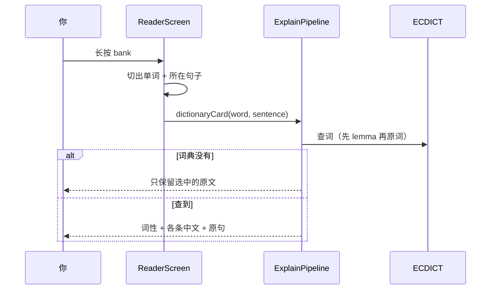

---
tags:
  - ir-guide
---

# 选词如何工作

← [[首页]] · 结构见 [[04-项目结构]]

你在屏幕上长按一个英文单词之后，词旁边会出现「词」「句」，有英文语音时还有「读」。Qwen 那一行的细节在 [[17-Qwen怎么用]]。下面这条流水线只讲词典卡片怎么来。



## 四条规则（设计时就定死了）

1. **词条只来自 ECDICT**。Qwen 可以在词条下面另写一句中文，但那一句不是词典字段。
2. **例句 = 你点的那个词所在的原句**，模型不准另编例句。
3. 词典没有这个词 → 卡片只留下你选中的原文，**不写「未收录」**。
4. 多词选择如果词典没有整条短语，同样只保留原文。点「词」时，Qwen 只解释这个词组本身。整句用「句」。

## 和范文的对应关系

启动范文：

```text
They sat on the river bank. The water was cold, and the grass was wet.
```

| 点这个 | 预期 |
|---|---|
| `bank` | 词典里有多条时，卡片把这些释义都列出来。Qwen 再写一句这个词在本句里的意思 |
| `water` / `grass` | 完整 ECDICT 里有，就出词条 |
| 空白处 | 没切出单词，没反应 |

模拟器装不上这个 arm64 包，见 [[10-为什么模拟器不行]]。导入失败的日志标签是 `Y`，见 [[11-Logcat怎么看]]。

下一篇：[[06-第一次打开工程]]
