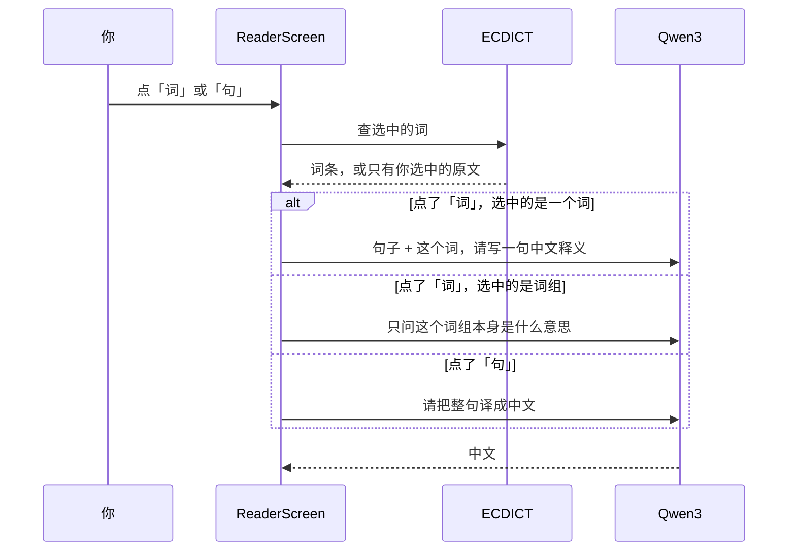

---
tags:
  - ir-guide
---

# Qwen 怎么用

← [[首页]] · 选词见 [[05-选词如何工作]] · 文件放哪见 [[12-资源文件从哪来]]

中文那一行是 **Qwen3** 在手机上写的。词典那一块仍是 **ECDICT**，不是模型编的。

## 屏幕上三个字

长按一个词之后，词旁边出现小按钮：

| 按钮 | 谁来写 | 做什么 |
|---|---|---|
| 词 | 词典 + Qwen | 一个词：上面是 ECDICT，下面一句中文是它在这句里的意思。选中的是词组（中间有空格）：只解释这个词组本身，不解释整句。词典有这条词组就仍显示词条 |
| 句 | 词典 + Qwen | 词还是查词典。Qwen 只做一件事：把**整个句子**译成一句中文 |
| 读 | 系统朗读 | 读出选中的词。不经过 Qwen。这份 ECDICT 没有音标，所以没有音标可显示。手机没有英文语音时，这个按钮不出现 |

点卡片外面只关卡片，高亮还在。在正文上双击，选区和卡片一起清掉。

## 设置里选哪个模型

设置里两个选项：

- `qwen3-0.6`，大约 575MB，更快
- `qwen3-1.7`，大约 810MB，更慢，句子通常更稳

选中后会马上写入应用自己的偏好，关掉设置再打开还是这个。下次启动 App 也还是这个。不会悄悄变回 0.6。

第一次用要点「下载」。权重在手机应用私有目录 `files/models/模型名/`，**不在 APK 里**，也不进 git。换模型时才会关掉旧的、打开新的；同一个模型会留在内存里，避免每次点词都重新加载。

## 程序怎么走到 Qwen



对应代码：

| 步骤 | 文件 |
|---|---|
| 按钮 | `ui/ReaderScreen.kt` |
| 卡片上词典和中文分行 | `ui/ExplainCardView.kt` |
| 提示词 | `explain/GlossPrompt.kt` |
| 打开模型、调用完成 | `explain/QwenGloss.kt` 里的 `CactusGlossEngine` |
| 引擎 | `jniLibs/arm64-v8a/libcactus.so`，函数 `cactus_complete` |
| 丢掉残留的思考标记 | `explain/GlossText.kt` |

一个词的系统提示是：只输出一句中文释义，不要英文，不要举例。用户提示先给整句，再点名要解释的那个词，最后一行是「中文：」。结果里没有汉字就再要一次。还是没有，就显示「这个词没解释成中文」，不把英文释义放上卡片。

词组只问一次：这个词组本身是什么意思。不把整句交给它，所以不会再写一句对句子的解释。整句翻译用旁边的「句」。没有汉字就再要一次。卡片上仍是一行，前面标「词：」。最多 80 个 token，并且只留第一句。

「句」把英文句子放在前面，最后一行是「中文：」。0.6 会顺着提示末尾的语言接着写；句子放在最后时，它就会用英文把句子改写一遍。如果结果里没有汉字，会再要一次。两次都没有汉字时，卡片写「这句没译成中文」，不把英文改写当成译文。

温度是 0。「词」和词组最多生成 80 个 token，「句」最多 120 个。生成提前结束就停，不会为了凑满上限一直写。

## 为什么有时要等一会儿

Qwen3 默认会先写一段 `<think>` 思考，再给答案。那段思考又长又慢，而且不是你要的中文。

现在的 `libcactus.so` 在助手开始生成之前，已经放了一对空的 `<think></think>`。模型应当直接写答案，不再先思考。万一它还是吐出思考标记，`GlossText` 会把 `</think>` 前面的内容丢掉，卡片上只留后面的中文。

所以慢**不是**因为还在思考。慢是因为推理走 **CPU**，没有用华为的 NPU。1.7B 比 0.6B 大约重三倍，同一句就要多等几倍时间。第一次点某个模型时，还要先把权重载入内存，那一下最明显。

想快一点，在设置里改回 `qwen3-0.6`。

## 下载完之后，Qwen 在手机上怎么起来

手机上没有 Ollama，也不需要装。Ollama 是另一台机器上的服务：它自己占一个进程，读模型文件，再等别的程序来问。Y 不是这样工作的。

Y 的安装包里已经有一个约 2MB 的本地库 `libcactus.so`。它是 Cactus 这个推理引擎，编译成手机的 arm64 代码，跟应用打在一起。第一次要用 Qwen 时，Kotlin 执行 `System.loadLibrary("cactus")`，Android 把这个库装进 **Y 自己的进程**。没有第二个 App，也没有后台服务在听端口。

设置里点「下载」，下来的是一个 zip，里面是 Qwen 的权重（0.6 或 1.7 的 int4 压缩文件）。解压到应用私有目录：

- `files/models/qwen3-0.6`
- `files/models/qwen3-1.7`

这时模型只是躺在磁盘上的文件，还没有在跑。

第一次点「词」或「句」，Kotlin 调用 `Cactus.create(那个目录)`。它再调用本地函数 `cactus_init`，把这个目录里的权重读进 Y 的内存。所谓「起来了」，就是这批数字已经在这个 App 的内存里，可以直接接着算下一个字。算的是手机 CPU，不是华为 NPU，也不是网上的服务。

这个已经读入内存的模型会留着。后面再点词，不再重新读盘。换成另一个模型时，先关掉现在这个，再读另一个目录。划掉 Y、进程被系统杀掉之后，内存里的模型没了，文件还在，下次打开会再读一次，不用重新下载。

## Kotlin 是怎么叫 Qwen 的

是。中文不是 Kotlin 写出来的。Kotlin 只做三件事：打开手机上的 Qwen、把两段话发给它、把回来的字贴到卡片上。

模型还没下载时，只显示词典，不会去叫 Qwen。

发出去的代码在 `explain/QwenGloss.kt`，就是这一段：

```kotlin
opened.complete(
    messages = listOf(
        Message.system("只输出一句中文释义。不要英文，不要举例。"),
        Message.user(userPrompt),
    ),
    options = CompletionOptions(temperature = 0f, maxTokens = 80),
)
```

`opened` 是已经打开的模型。文件在手机里的 `files/models/qwen3-0.6` 或 `files/models/qwen3-1.7`。打开一次就留着，不会每点一个词都重新加载。

`messages` 是交给 Qwen 的两段话：

- 第一段 `system` 规定它怎么答。解释一个词时用上面这句。解释词组，或点「句」时，换成「只写中文。不要写英文。」
- 第二段 `user` 是这次要它看的内容，写在 `explain/GlossPrompt.kt`。一个词会带上原句，最后一行是「中文：」，让它接着用中文写。词组只带词组本身，例如「词组：reminding him of」，不带整句。

`maxTokens = 80` 是这次最多写多长。点「句」时改成 120。`temperature = 0` 是让它少自由发挥。

`complete` 把这两段话编成 JSON，交给 `libcactus.so` 里的函数 `cactus_complete`。Qwen 写完的字在返回 JSON 的 `response` 里。旁边的 `error` 如果是空，表示这次成功。

回来的字如果先写了英文，从第一个汉字开始留。一个汉字都没有，就换一句更短的提示再问一次。还是没有，卡片写「这个词没解释成中文」「这个词组没解释成中文」或「这句没译成中文」，不把英文贴上去。

选中的文字中间有空格，就当成词组，只问这个词组是什么意思。想看整句的中文，点旁边的「句」。

## 和词典的分工

点「词」或「句」时，卡片上的词条来自 ECDICT。中文那一行只来自 Qwen。

下一篇：[[12-资源文件从哪来]]
