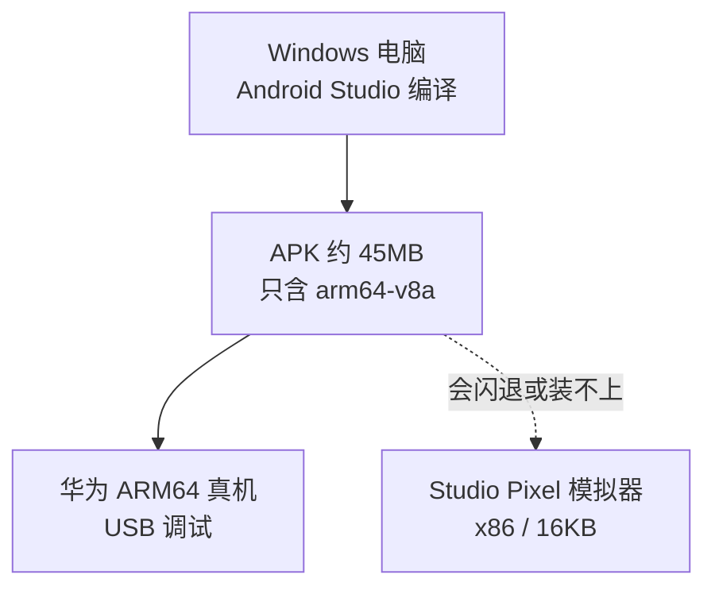

---
tags:
  - ir-guide
  - moc
---

# 精读 App 新手教材

这是 `mobile/ir-android` 的入门笔记。你是手机开发新手也可以按编号读；每篇只讲一件事，用 `[[双链]]` 跳转。

> [!tip] 在 Obsidian 里怎么打开
> 把文件夹 `c:\jarvis\mobile\ir-guide` 加成一个库（Vault），或打开整个 `c:\jarvis` 库后从这篇进。建议把本页设为启动页。

## 先建立三句话印象

1. 这是一个 **只做精读** 的 Android 应用：导入书 → 点单词 → 看词典释义，再用手机上的 Qwen 写一句中文或翻译整句。
2. 电脑（Windows + Android Studio）负责 **编译**。Qwen 的 `libcactus.so` 只有 **arm64**，要在真机上跑。
3. Studio 里默认的 Pixel 模拟器（x86）装不上这个只含 arm64 的包。

细节见 [[01-这是什么]]、[[10-为什么模拟器不行]]。

## 学习路径（按这个顺序）

### A. 概念（不碰电脑也能读）

1. [[01-这是什么]] — 这个 App 做什么、不做什么
2. [[02-术语表]] — APK、ABI、NDK、Gradle… 遇到就回来查
3. [[05-选词如何工作]] — 点一个词之后，程序内部发生了什么
4. [[17-Qwen怎么用]] — 词、句、朗读分别是谁做的，模型为什么慢

### B. 工程长什么样

5. [[03-你需要准备什么]] — 软件、手机、线、账号
6. [[04-项目结构]] — 每个文件夹是干什么的
7. [[12-资源文件从哪来]] — 模型、词典哪些要自己放、哪些不能提交 git

### C. 动手

8. [[06-第一次打开工程]] — 打开哪个目录、Sync 等多久
9. [[07-如何Build]] — Studio 绿按钮 和 命令行两种
10. [[08-如何测试-电脑单测]] — 不插手机也能跑的测试
11. [[09-如何测试-华为真机]] — 在真机上点词、翻译、翻页
12. [[11-Logcat怎么看]] — 崩了、假模型、成功加载分别长什么样

### D. 卡住了

13. [[10-为什么模拟器不行]] — 不是 Studio 坏了
14. [[13-常见问题]] — 对症查
15. [[14-新手容易踩的坑]] — 线、驱动、开错文件夹…

### E. 以后

16. [[15-iOS以后要什么]] — 苹果手机不能装现在这个包
17. [[16-下一步]] — 真机通了之后还可以做什么

## 一张图（全程）

## 和代码仓库的关系

| 路径 | 是什么 |
|---|---|
| `c:\jarvis\mobile\ir-android\` | 真正的 Android 工程，用 Android Studio 打开这个 |
| `c:\jarvis\mobile\ir-guide\` | 你正在读的教材（本文件夹） |
| `c:\jarvis\mobile\ir-android\` | 工程源码。词典、lemma、`libcactus.so` 不进 git |
